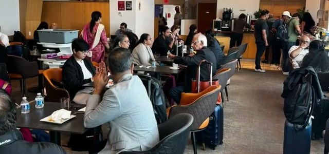
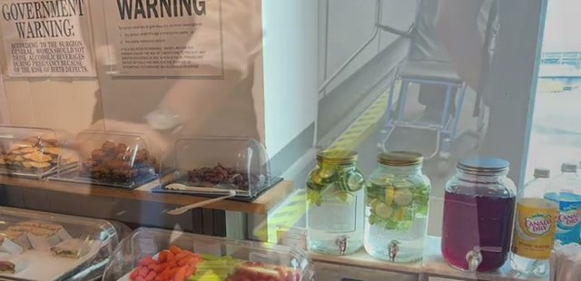
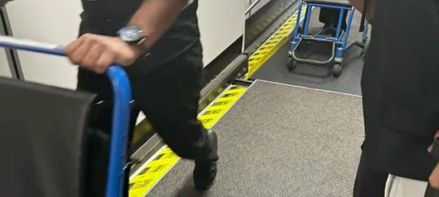
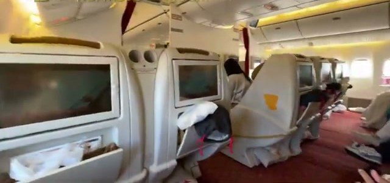
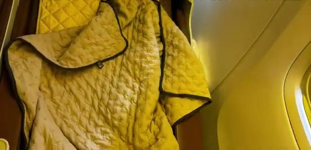
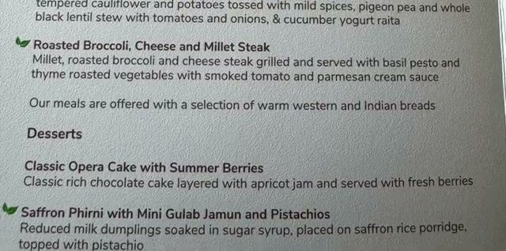



This one wasn't planned. Virgin Atlantic cancelled his Upper Class flight and rebooked him onto Air India business class — AI 116, the morning 11am departure from JFK to Mumbai. What he got was a study in contrasts: hardware that has seen better decades, and a crew that couldn't have been better. Here's the flight in two minutes.

## The T4 lounge: small but stocked

Air India's T4 lounge is, per the video, "pretty small" — and crowded. The snack bar keeps it functional though: pastries, fresh fruit and veggie platters, infused-water dispensers, and the usual drinks lined up against the wall.

## The call: a free switch to Emirates

Before departure, Air India called with an offer: a free switch to Emirates. He declined — he needed to get to Mumbai ASAP, and the Air India flight was the one that got him there. A nice gesture either way.

## The old aircraft: enormous legroom, ancient seats

An old aircraft was flying the route that day, and it shows. The seat shells are the classic old-style business class pod: enormous legroom, but poor, ancient seats. Chipped paint everywhere, and the screens don't work — some business class screens weren't working at all, so the crew pointed passengers at the Vista Wi-Fi network (vista.airindia.com) for entertainment on their own devices instead.

## Almost full-flat — but at an angle

The seat reclines to "almost full-flat but at an angle" — the angled-flat arrangement of a previous generation. Still, on this 14-hour flight, it was adequate for sleep.

## The food: Indian menu highlights

The menu itself is a bright spot. The main meal offers Paneer Makhani (Indian cottage cheese simmered in rich tomato sauce, served with pulao, tempered cauliflower and potatoes, pigeon pea and whole black lentil stew, and cucumber yogurt raita) or a Roasted Broccoli, Cheese and Millet Steak — with desserts like Classic Opera Cake with Summer Berries and Saffron Phirni with Mini Gulab Jamun and Pistachios. The lighter menu runs to Aloo Chana Chaat, ciabatta sandwiches (diced chicken with mango chutney and mayo; Tex Mex grilled vegetables), Malai fish and mushroom tikka, Beetroot Raisin Tikki — plus Blueberry and Lemon Cheesecake and Mini Rasmalai with Thandai. The wine list runs Bordeaux and Italian: a Saint-Émilion, a Bordeaux Chardonnay, a Piemonte Barbera.

## Verdict

The video's summary is the whole story in two sentences: they need to retire this aircraft configuration — but the service was extraordinary. Polite, courteous, helpful — before the flight and on it. The hardware is old, the people are not.

