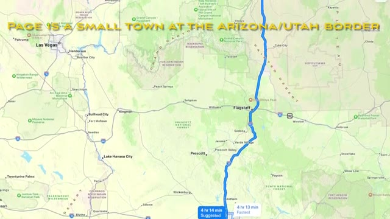
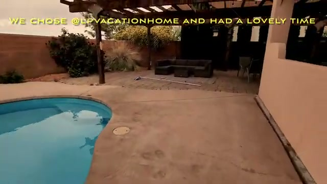
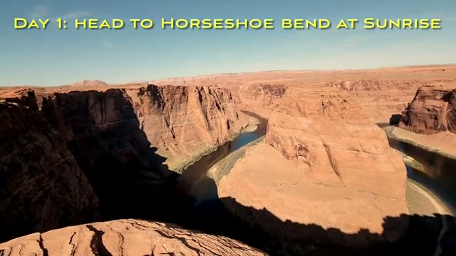
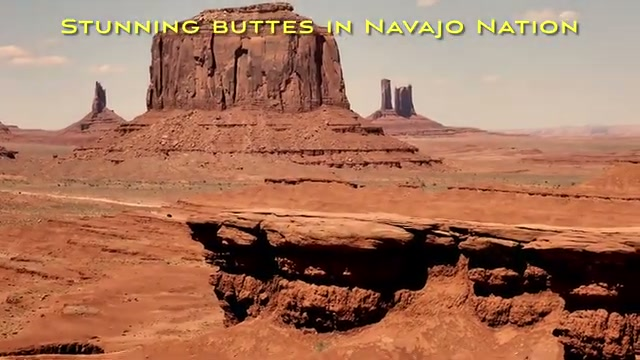
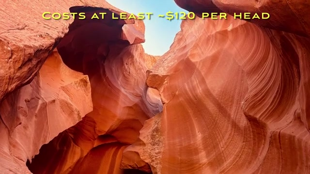
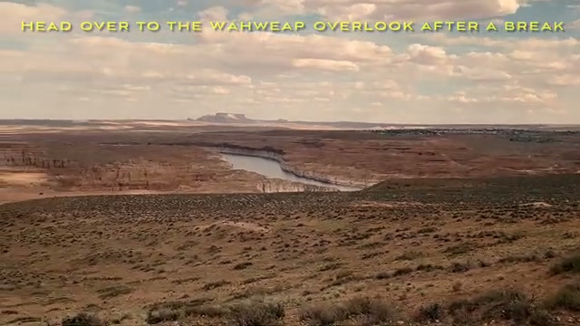
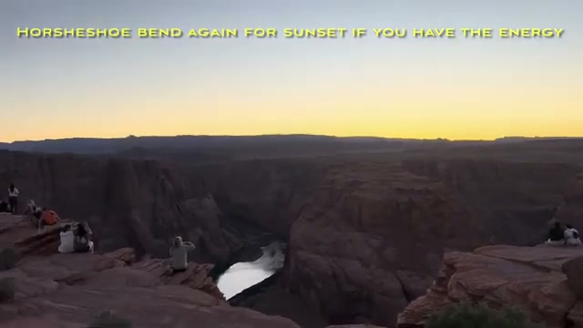
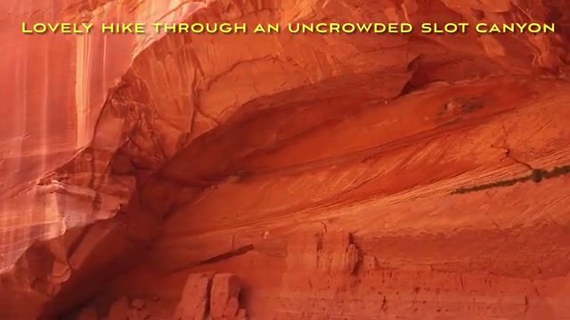
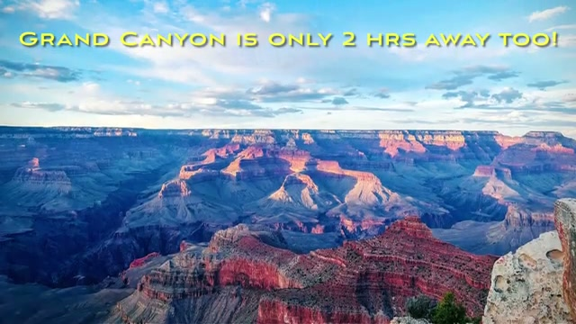



**Page is a small town at the Arizona/Utah border**, most famous as the location of **Glen Canyon Dam and Antelope Canyon**. It's the perfect base for 4 days of slot canyons, desert overlooks, and buttes — here's how we'd spend them.

## Getting There

We drove up from Phoenix via **Oak Creek Canyon Road — the scenic route** through Sedona's red rocks. Worth the detour if you're coming from the south.

## Where to Stay: Book a Vacation Rental with a Pool

**First up: book one of the rim-view Airbnbs with a pool.** Page gets hot, and having your own pool to come back to makes the trip. **We chose @upvacationhome and had a lovely time.**

## Day 1: Horseshoe Bend at Sunrise + Monument Valley

**Day 1: head to Horseshoe Bend at sunrise** — the light is soft, the crowds are thin, and the overlook is spectacular.

**Go deeper:** [Horseshoe Bend near Page, Arizona](https://youtu.be/oBXU6LYpLYo)

One caution: the walk to the overlook is **not for the elderly or if you have mobility issues** — it's an exposed sandy trail with no shade.

Then **buckle up for a long drive: approx 2 hrs east to Monument Valley**, with its **stunning buttes in Navajo Nation**.

**Go deeper:** [Monument Valley — majestic sandstone towers](https://youtu.be/z6nT_Uqthw0)

It's absolutely **worth the day-trip from Page** — an iconic American landscape.

## Day 2: Upper Antelope Canyon

**Day 2: late start with Upper Antelope.** A few things to know:

- Tours **cost at least ~$120 per head**
- **Best visited between 11am–12pm**, when the light beams shine into the canyon
- **Book early — these tours get sold out!**

**Go deeper:** [Lower & Upper Antelope Canyon near Page, Arizona](https://youtu.be/XyC0mAD9Vnw)

**Grab some lunch at Fiesta Mexicana** in town, then **head over to the Wahweap Overlook after a break** — a **scenic overlook across the lake and Grand Staircase-Escalante**.

**Stop by at the dam visitor center** to see Glen Canyon Dam up close, and if you have the energy, **Horseshoe Bend again for sunset** — it's a completely different scene in evening light.

## Day 3: Buckskin Gulch / Wire Pass

**Day 3: head over to Buckskin Gulch / Wire Pass** — a **lovely hike through an uncrowded slot canyon**. After Antelope's tour groups, the solitude here is the appeal.

**Go deeper:** [Wire Pass & Buckskin Gulch — Grand Staircase-Escalante](https://youtu.be/WNZPrkWlXp0)

It lies **within Grand Staircase-Escalante**, with **many options that will take you 2–4 hrs** depending on how far in you go.

## Day 4 (Optional): Grand Canyon

**Grand Canyon is only 2 hrs away too!** If you have a fourth full day, the South Rim makes an easy add-on.

**Go deeper:** [Grand Canyon South Rim day trip](https://youtu.be/Z5Aj9TeDgYo)

## Verdict

Four days in Page gives you the best of the desert Southwest without rushing: two world-class slot canyons, the most photographed bend in the Colorado River, Monument Valley's buttes, and an optional Grand Canyon finale. Book the Antelope tours early, chase the sunrise at Horseshoe Bend, and get the rental with a pool.
