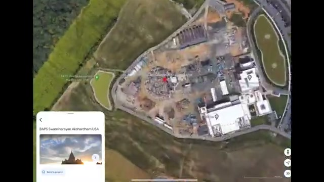
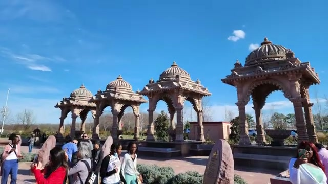
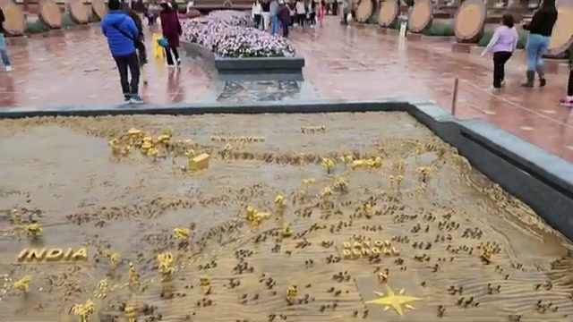
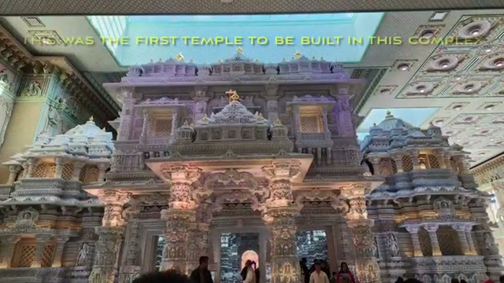
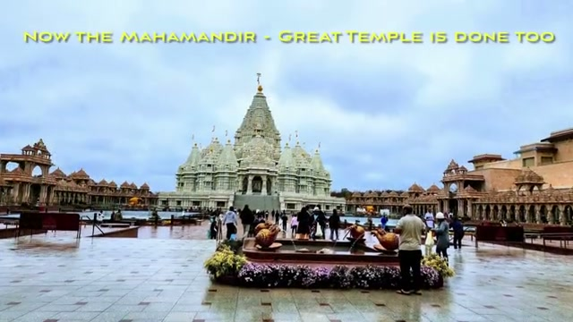
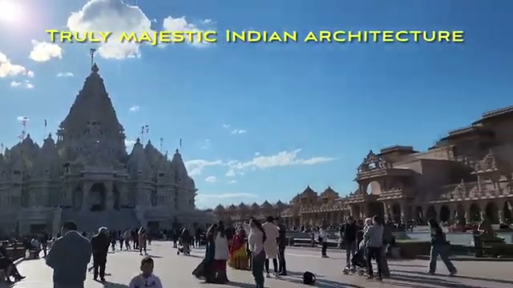
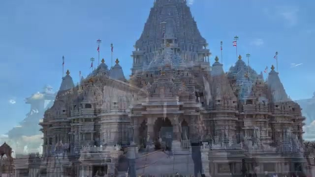
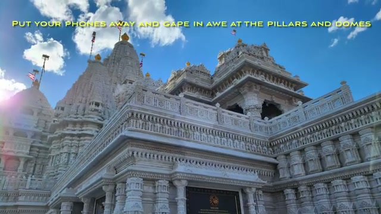
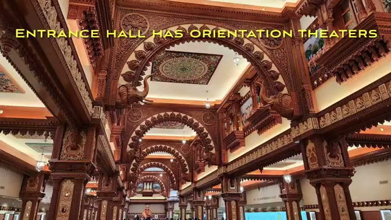
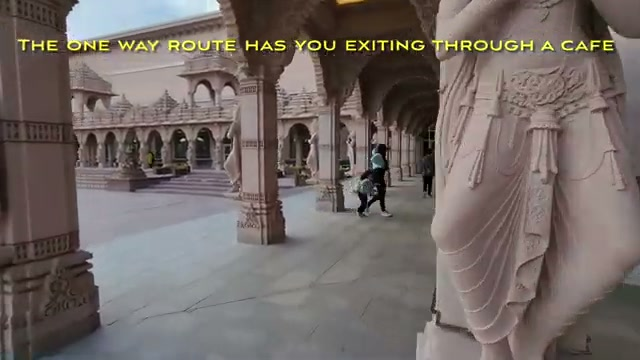



The BAPS Swaminarayan Akshardham temple complex in Robbinsville, NJ has been under construction for over a decade — and in late 2023 its main Mahamandir, the Great Temple, finally opened. We drove down to see it, and it's genuinely magnificent: a must-see attraction within easy reach of both New York City and Philadelphia.

## Arrival: parking, walkways, and a giant yogi

The complex is built for big crowds — the parking lot is massive, and the video's own caption calls it out: "massive parking lot to accommodate all the visitors."

From the lot, visitors walk along a fenced path toward the complex —

— and are greeted on arrival by a huge golden statue of a yogi, arms raised, in the courtyard plaza.

The grounds include stone chhatri pavilions (domed kiosks) where visitors gather,

and a large bronze relief map of India — labeled "INDIA" and "INDIAN OCEAN" — studded with golden temple markers.

Heads-up from the video: on good-weather weekends there can be crowds — but "don't let that deter you, well worth the trip."

## The first temple

Before the Mahamandir, the complex's first temple opened at this site several years ago, pre-COVID — an intricately carved white-marble temple. It's the one that put Robbinsville on the map for temple visitors long before the main opening.

## The Mahamandir: the Great Temple is done

Now the Mahamandir — the Great Temple — is done too, and it dominates the complex: a soaring carved shikhara (spire) ringed by smaller spires and flying flags, built, as the video notes, by the labor of tens of thousands of volunteers and workers.

Two things to know before you go inside. First, the entrance hall has orientation theaters, and the carved, painted interiors — pillars, domes, and intricate ceilings — are the highlight, so put your phone away and just gape in awe. Second: no photography is allowed inside the main temple, so the interiors are something you have to see in person.

## The one-way route exits through a café

The visit follows a one-way route — and, true to form, it exits through a café. The Shayona Café is a slick Indian food court with many counters: sweets and snack display cases, self checkout, and a roomy seating area.

And the sweet ending to your visit: soft-serve ice cream and milkshakes at the dessert counter.

## Wrapping up

A decade-plus in the making, the Akshardham complex is one of the most spectacular things we've seen anywhere near NYC or Philly. Arrive early on a good-weather weekend to beat the crowds, leave the camera in your pocket for the inner sanctum, and save room for ice cream.
