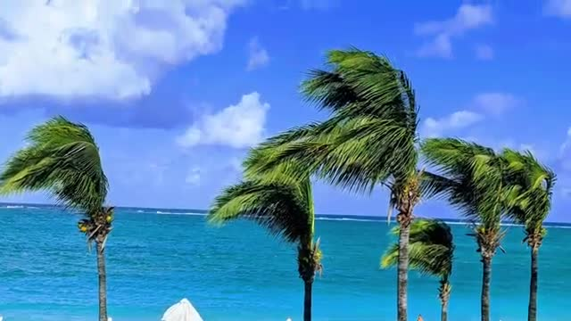
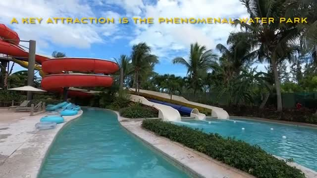
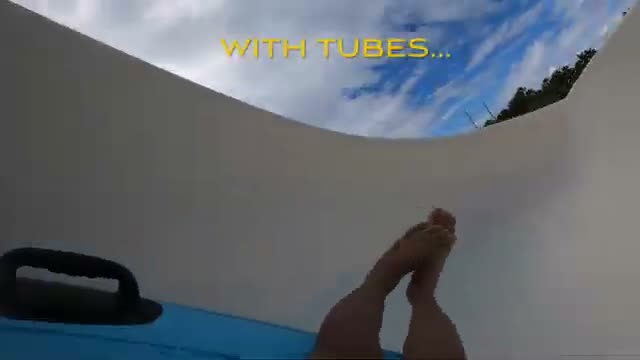
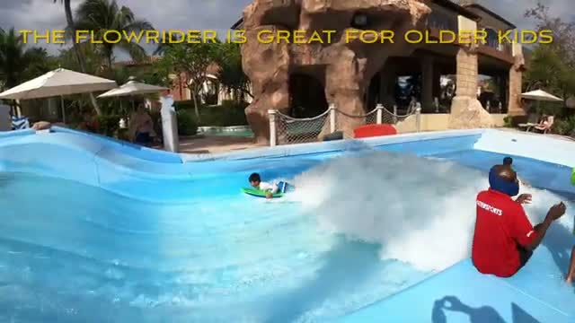
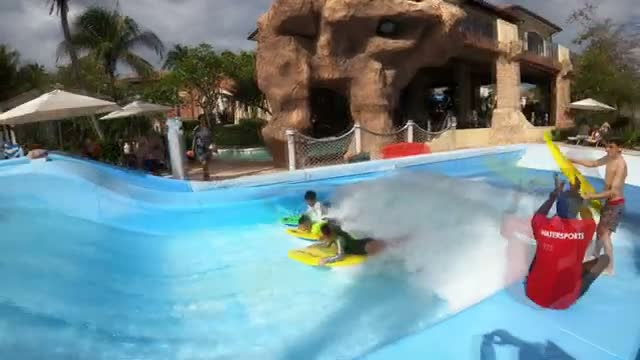
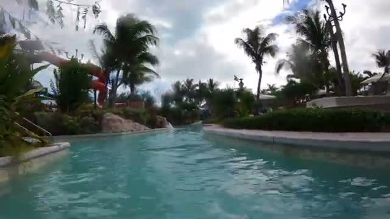
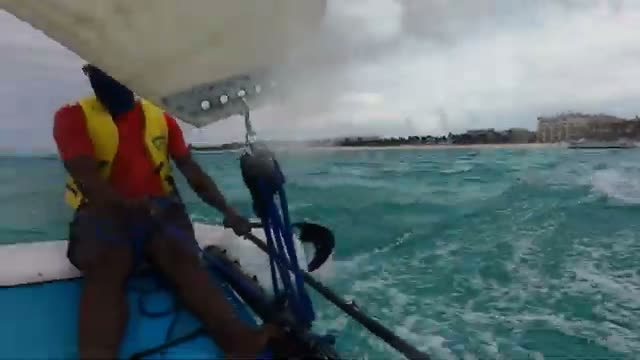
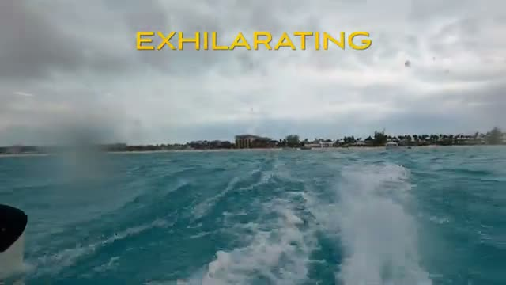
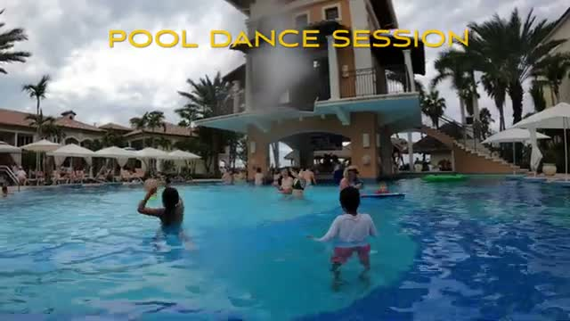
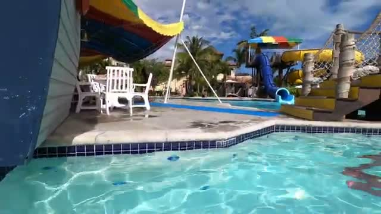



Beaches Turks and Caicos sits on Grace Bay in Providenciales — a luxury all-inclusive resort built squarely for families, where the headline is the water. This video tour skips the rooms and restaurants and goes straight for the fun: the water park, the FlowRider, the lazy river, and the beach.

## The Water Park: A Key Attraction

The water park is a key attraction of the resort — the video calls it "phenomenal." Big red tube slides tower over a lazy river that winds through the park, and the whole area sits right among the palm trees.

## Slides With Tubes

The big slides are ridden with tubes — the POV run shows a steep white slide ridden on a blue mat with handles, shot from the rider's perspective on the way down.

## The FlowRider Surf Simulator

The FlowRider is great for older kids — a stationary wave that kids ride on bodyboards while an instructor in a red watersports shirt coaches them. One rider wipes out, another gets up and goes; it looks like the kind of attraction kids line up to repeat.

## The Lazy River

Between the big attractions, the lazy river winds through the water park — calm water, rock edging, palm trees overhead, and the red slides crossing above it. It is the slow lane of the resort's water world.

## On the Beach: Hobie Cat Sails

Out on the beach, you can get a ride on a Hobie Cat — the video shows a crewed catamaran sail off Grace Bay, with the resort's buildings lining the shore behind. Turquoise water, sail up, and what the video calls an exhilarating run.

## The Pools: Dance Sessions and a Swim-Up Bar

The main pool is the social center — during the video they run a pool dance session with families following along in the water. A swim-up bar sits built into the tower at the pool's edge, so drinks never require leaving the water.

## The Kids' Pool

A separate shallow pool is set up for the younger kids, with small slides, a colorful sun shade, and loungers right at the water's edge — all easy to supervise.

## The Verdict

Beaches Turks and Caicos plays its family card through water: a serious water park with tube slides, a FlowRider that older kids will obsess over, a calm lazy river for downtime, Hobie Cat sails off a beautiful Grace Bay beach, and pools with organized activities like the dance session. If your family's vacation runs on water, this resort is built for exactly that.

*Watch the full video tour: [Beaches Turks and Caicos - Luxury Family All-Inclusive Resort - Water Park Fun](https://youtu.be/WklFYoFEGM4)*
