

Blue Mountain is the Poconos ski resort that joined the Ikon Pass in the 2023–24 season — and as the video puts it, "good to have another option in the Poconos," under two hours from both New York City and Philadelphia. This New Year's Eve ski day starts at the Comet Quad and works through the mountain's friendly trail network: Sky Top, Paradise, Connector, Vista, Yeti, Little Gap, and Burma Road — almost all greens, with a single blue (Tut's Lane) mixed in. Here's the day, trail by trail.

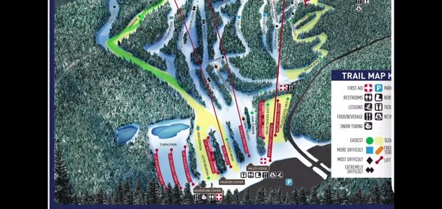

## The Comet Quad up

First lift of the day is the Comet Quad, which the video notes "gets you to Sky Top/Paradise." On the way up, the captions flag the two things that make this mountain interesting for city skiers: it partnered with the Ikon Pass in 2023–24, and it's another Poconos option within day-trip range. The GPS overlay reads 469M at the top of the lift.

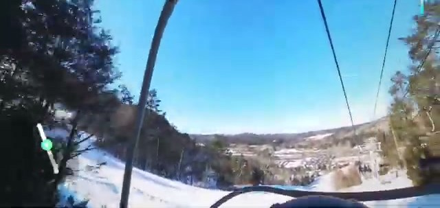

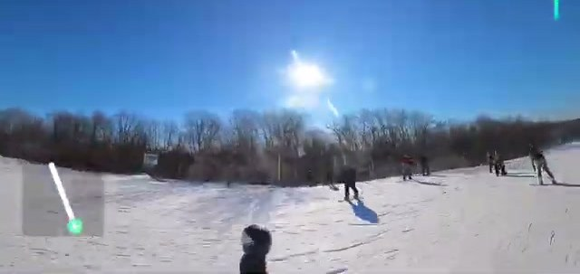

## Sky Top: the warm-up

Sky Top is a short green run right off the top — the leg-loosener before the longer runs begin.

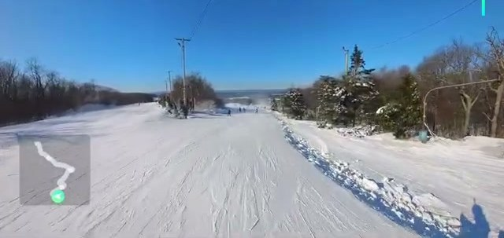

## Paradise: the long green cruiser

Paradise is the run of the morning — nearly eight minutes of skiing, descending from the summit area all the way down. It's a wide, groomed, gently pitched cruiser with skiers spread comfortably across it: the kind of run you lap without thinking.

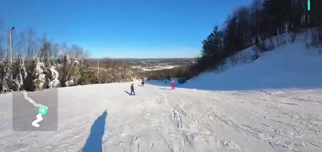

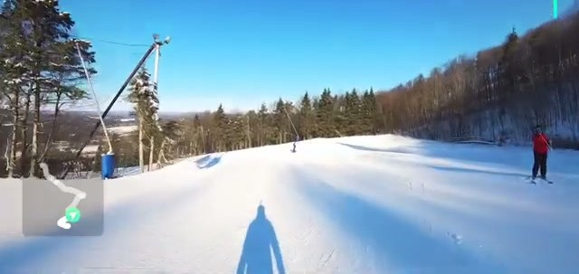

## Tut's Lane: the day's one blue

After a morning of greens, the video steps it up to Tut's Lane — the only blue run of the day. It's tree-lined on both sides and still comfortably groomed, a natural next step after Paradise.

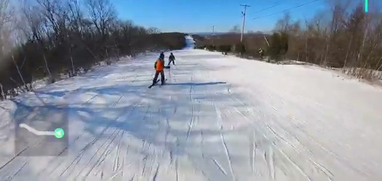

## Connector

The Connector green links things along — dappled tree shadows, a steady pitch, and an easy ride.

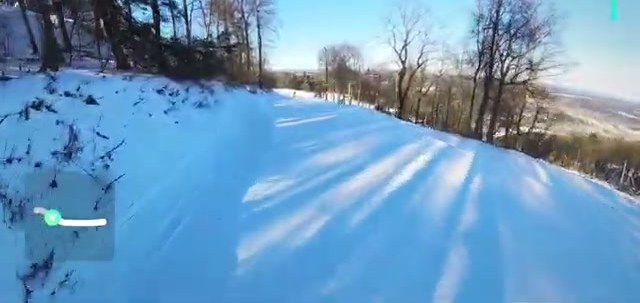

## Checking the route on the trail map

Midday, the video pulls up the trail map to show the route so far and plot the next targets: Vista, Yeti, and Little Gap.

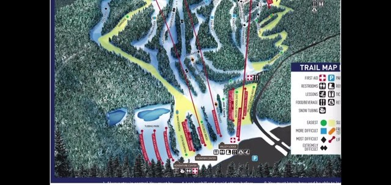

## Vista, Yeti, Little Gap

Vista is another wide-open green with good sightlines down the fall line. Yeti is labeled green/orange in the video, and Little Gap closes out the trio of afternoon runs.

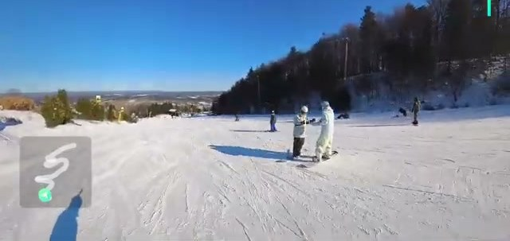

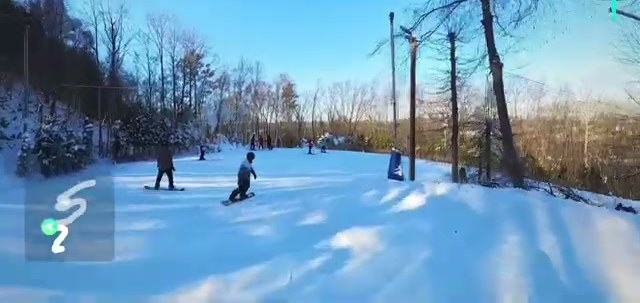

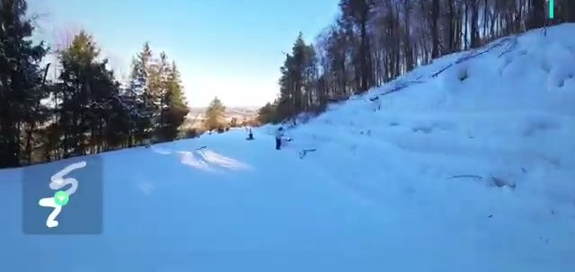

## Burma Road: mind the flat finish

Burma Road is the last named trail of the day, and the video flags its one catch in all caps: "Bottom of Burma Road is flat, maintain speed!" — carry your momentum through the bottom section or you'll be poling.

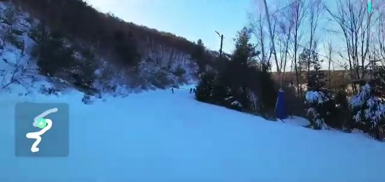

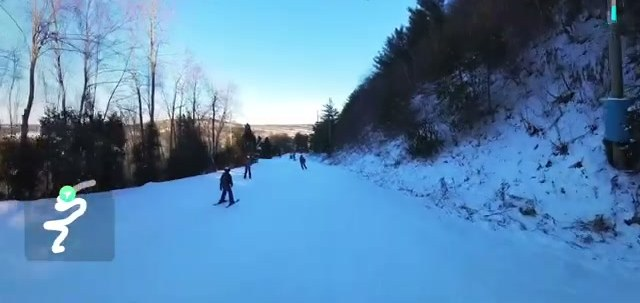

## Back up on the Main Street Express

To close the day, the video rides the Main Street Express to ski back to the Summit Lodge — past the lift base and ticket booth, then down wide groomers under a clear blue sky.

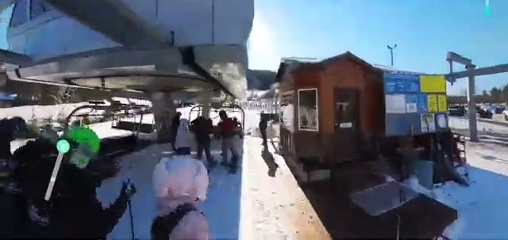

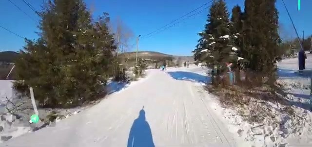

## End of day at the base

It was New Year's Eve, and the base area shows it — a busy end-of-day crowd at the bottom.

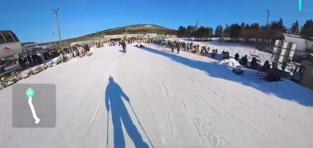

## Verdict

Blue Mountain reads exactly as the title promises: a practical Poconos day trip — under two hours from NYC and Philly, on the Ikon Pass since the 2023–24 season, and stacked with friendly green cruisers. Paradise is the pick of them, and the honest warning about the flat bottom of Burma Road is the kind of detail that saves a run. This particular day stayed on the easy side — Tut's Lane was the only blue — so stronger skiers will want to look beyond the greens. For a low-friction day trip from the city, it's a solid option.
