

MLK Day 2025 brought a cold, sunny ski day to Camelback Mountain Resort in the Poconos — the Ikon Pass resort closest to New York City. Temperatures hovered around 15°F, the trails were groomed, and the mountain was packed. This video is a full day on skis: green cruisers top to bottom, three lifts, a lodge food stop, and the one piece of lift infrastructure Camelback does better than any other resort near the city — the enclosed Black Bear 6 bubble chairlift.

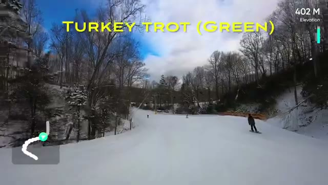

## The day on the hill

The video follows the runs in order, with the on-screen labels and trail map overlay confirming each one:

- **Laurel Glade (Green)** — first run of the day, top of the mountain (~505 m on the GPS overlay)
- **Meadows Chairlift** — short ride up
- **Meadows (Green)** — easy cruising
- **Lodge Restaurant** — food stop
- **Black Bear 6 Bubble Chairlift** — the enclosed six-pack
- **Upper Marc Antony (Green)** — long top-to-mid cruiser, with one "painful slow flat section"
- **Honeymoon (Green)** — more cruising
- **Sunbowl (Green)** — labeled as the green/bunny area
- **Stevenson Express** — back up
- **Little Caesar (Green)** — "very slow flat exit at the top"
- **Julius Caesar (Green)**
- **Near East (Blue)** — the one blue run of the day
- **Upper Moore's Ramble (Green)**
- **Turkey Trot (Green)** — the closing run

## Laurel Glade: first run, fresh conditions

The day opened on Laurel Glade, a green from the top. Skiers were spread out across a wide groomed trail, and conditions looked excellent — cold packed powder under blue sky. This was the morning after the holiday-weekend crowds, and the snow was in great shape for a mid-January MLK Day.

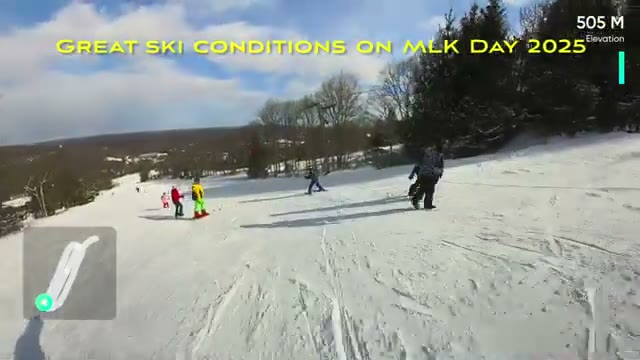

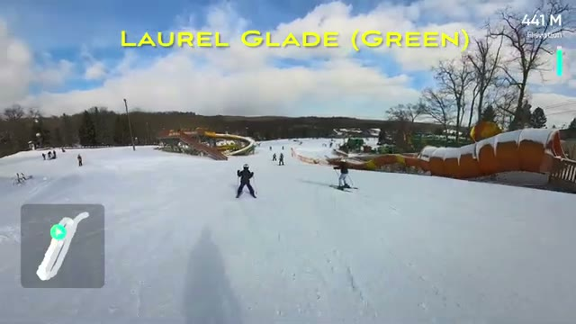

## Meadows: chairlift and trail

After the first run, it was up the Meadows Chairlift and back down the Meadows trail (Green) — straightforward cruising, easy terrain, the kind of run that's perfect for warming up legs or skiing with mixed-ability groups.

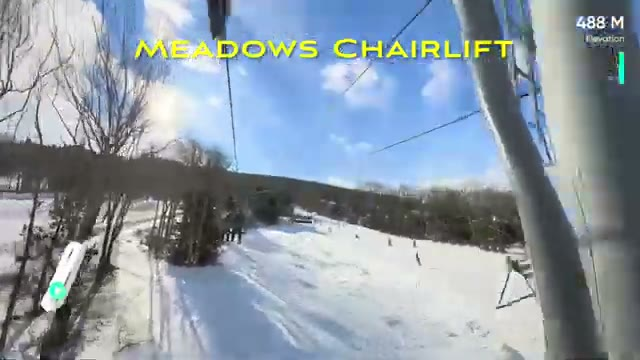

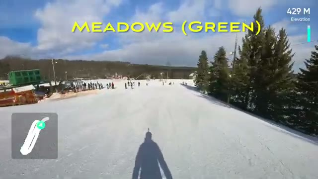

## Lodge food stop

Midday meant a stop at the lodge restaurant — a cafeteria setup with grab-and-go food. Visible on the menu boards: mozzarella sticks, mac & cheese, hot dog & fries, and a veggie burger, with warming trays of food ready to serve. Typical mountain lodge fare for a quick refuel between runs.

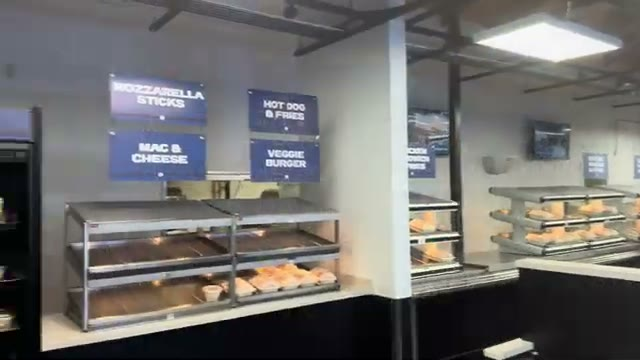

## Black Bear 6: the bubble chairlift

The standout of the day. The on-screen caption says it all: Camelback is "the only resort in the NYC vicinity to have an enclosed bubble" lift, and it was "PERFECT FOR A 15F/-15C DAY!" — the original caption's own words (its F/C conversion is a bit loose; 15°F is about −9°C). Riding inside the tinted bubble with the wind kept out on a bitter January day made a real difference, and the lift also shows how full the mountain was on the holiday.

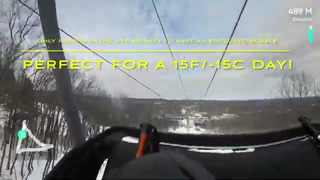

## Upper Marc Antony (Green): long cruiser, one flat spot

Upper Marc Antony (Green) was the longest run of the day — a top-to-mid cruiser with treed sides and plenty of room to turn. The one catch, flagged right on screen: a "PAINFUL SLOW FLAT SECTION" partway down. On a green cruiser day that's just part of the rhythm — keep your speed up before the flat stretch.

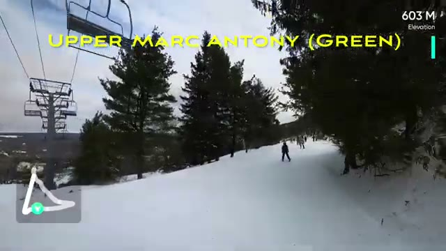

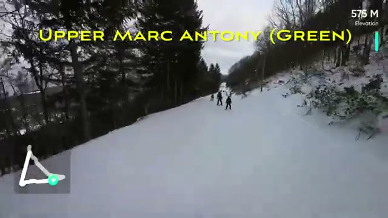

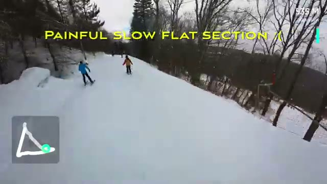

## Honeymoon and Sunbowl

Honeymoon (Green) kept the cruising going — wide, gentle, and well groomed. Then Sunbowl (Green), which the on-screen label marks as the green/bunny area — beginner-friendly terrain.

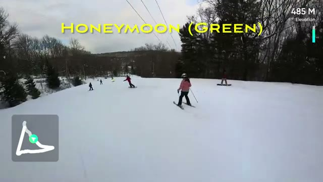

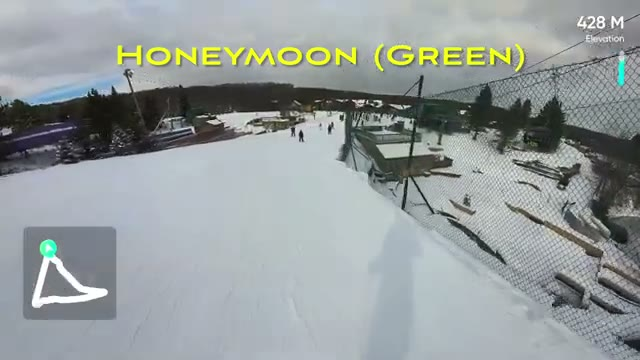

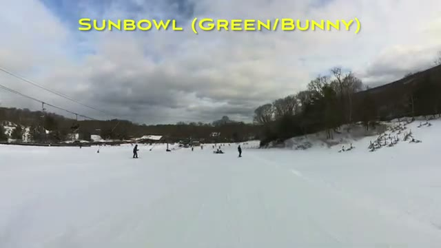

## Stevenson Express and the Caesars

The Stevenson Express carried the ride back up, leading into the Little Caesar (Green) run — which comes with its own warning: the on-screen label notes a "VERY SLOW FLAT EXIT AT THE TOP." Another case of a trail that's easy but flat at the start, so skiers should plan their speed accordingly. Julius Caesar (Green) followed.

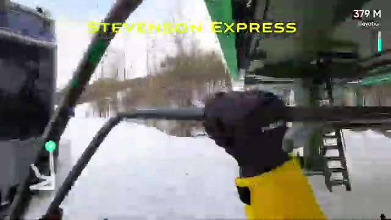

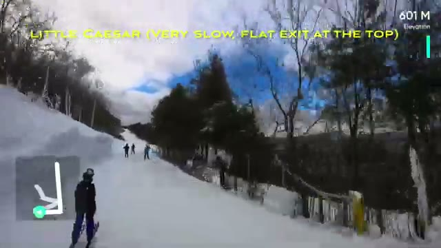

## Near East (Blue): the one blue run

Near East (Blue) was the day's one step up in difficulty — still comfortably cruisable but a touch steeper than the greens. Other skiers and snowboarders shared the trail, with the Pocono ridges visible in the distance.

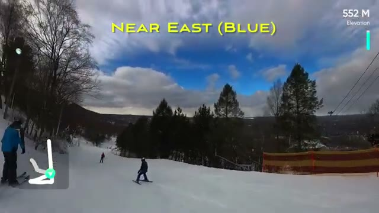

## Turkey Trot (Green): closing run

The day closed on Turkey Trot (Green) — a wide groomed trail under blue sky, skiers finishing their holiday day out. After nearly 19 minutes of skiing, from Laurel Glade at the top to Turkey Trot at the bottom, the verdict was simple: great ski conditions on MLK Day 2025.

## Practical takeaways

- **Ikon Pass near NYC:** Camelback is the closest Ikon Pass resort to the city, which is why it was packed on the MLK holiday.
- **Bring layers:** 15°F is no joke. The Black Bear 6 bubble chairlift helps, but exposed runs will chill you fast.
- **Watch the flat spots:** Upper Marc Antony and Little Caesar both have slow flat sections — carry speed into them or be ready to skate.
- **Green-heavy day:** This was almost entirely green terrain, with only Near East (Blue) as a step up — Camelback is very friendly to beginners and intermediate cruisers.
