

This is the whole thing in one unbroken descent: up the Vizelle gondola, then Lac Creux to Pralong to Bellecote, all the way down to Courchevel 1850 — a 17-minute top-to-bottom POV with on-screen captions marking every junction and landmark. The on-screen elevation readout drops from about 2660 m at the top to about 1805 m at the finish, and it really is the easy cruise it promises: mostly wide blues and greens you can ski at your own pace. Here are the notes we took along the way.

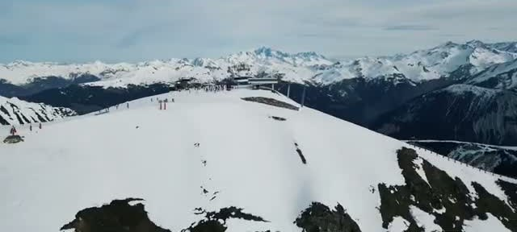

## The route: Verdons to Vizelle

The video's first instruction is the only real planning you need: take the Verdons lifts up to the Vizelle gondola. From there the route runs Lac Creux – Pralong – Bellecote, top to bottom. The video overlays the line on the piste map early on — it's one long continuous blue/green thread down to Courchevel 1850, passing the altiport's Cap Horn restaurant roughly two-thirds of the way down.

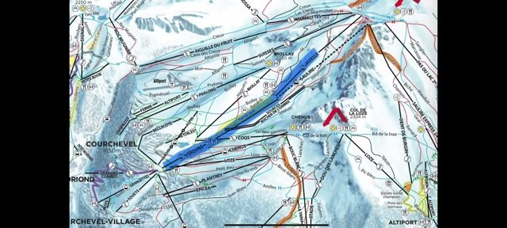

## Setting off from the top

At the top of Vizelle the caption calls it "the easiest cruise down from the top of Courchevel," and that sets the tone for the whole video. There's a wooden mountain hut right at the start area, and plenty of skiers funneling off in different directions — it feels like a proper high-alpine crossroads up here.

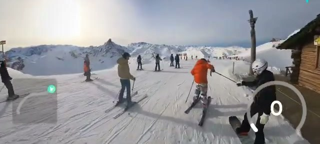

## Lac Creux: the wide upper section

The first junction comes early and it's a good one to get right: left to Courchevel, right to Méribel. There's a proper "COURCHEVEL" sign at the split — the caption warns you, but the signage does its job too.

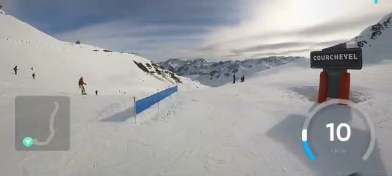

The opening stretch of Lac Creux is wide and open, with views across the peaks and lots of room to turn. Honest caption on this part: "the beginning is more wide red than blue" — it's not steep, but it's broad and fast enough to feel more like a confident red than a nervous blue.

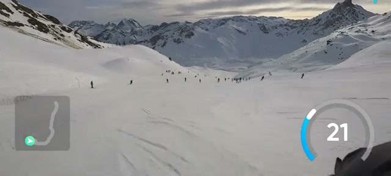

## Staying left for Courchevel 1850

A bit further down comes the junction the video flags explicitly: "stay left for the blue to Courchevel 1850." The right-hand line heads off elsewhere, so this is the decision point for the long top-to-bottom route. Stay left and the piste just keeps rolling on.

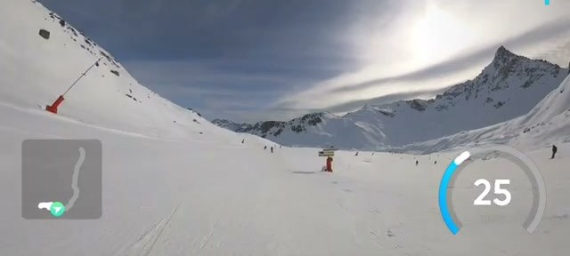

## Mont Blanc views and easy cruising

This middle stretch is where the run earns its "easiest cruise" billing. The caption promises Mont Blanc views throughout — and on a clear day the big dome of the massif sits on the skyline for a long while. The piste here is freshly groomed corduroy, easy blue/green, and the speed gauge on the overlay shows a relaxed 25–30 km/h: the kind of pace where you're just enjoying it.

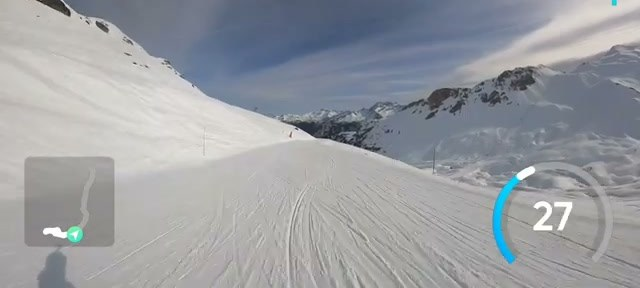

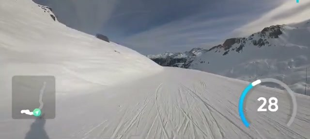

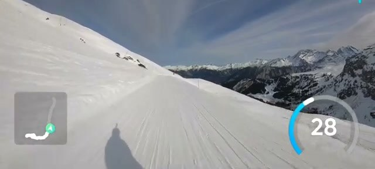

## Passing the altiport

Around the two-thirds mark the route passes the Courchevel altiport — the famous mountain airport — and the caption points out the Cap Horn restaurant there, one of the resort's better-known lunch spots. This is a good mental milestone: you've left the high alpine behind and you're into the lower mountain now, with the gradient staying gentle but the pace picking up — the overlay touches 44 km/h on this stretch.

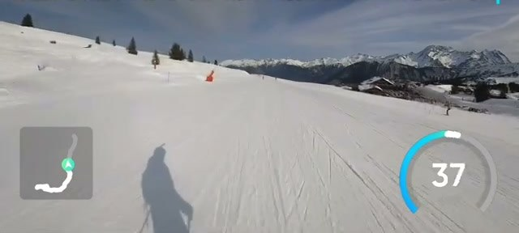

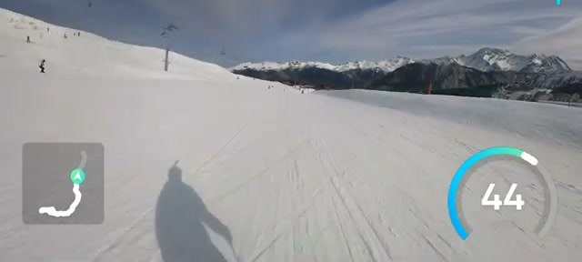

## Merging onto the Bellecote green

The last section merges onto the Bellecote green run for the final descent into the resort. Greens in France are the easiest grade, and it shows: the piste flattens out, skiers of all levels share the wide slope, and the trees close in on both sides.

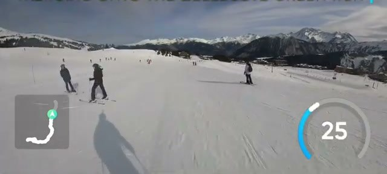

## Skiing into Courchevel 1850

The run finishes the way it should — skiing right into Courchevel 1850, past the chalets and hotels, and arriving at the Hotel Carlina. If you're staying in the village, this is the dream: a full top-to-bottom run that ends at your hotel door, no lifts or shuttles required.

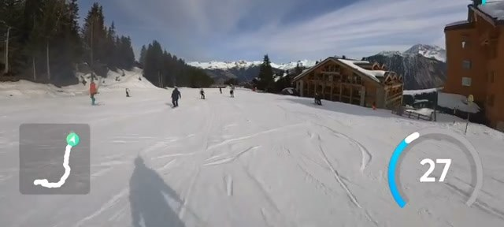

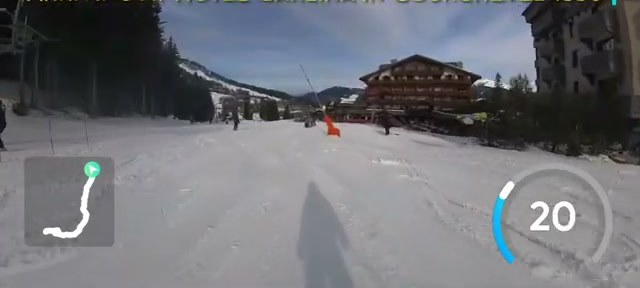
