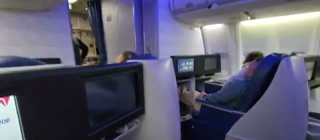
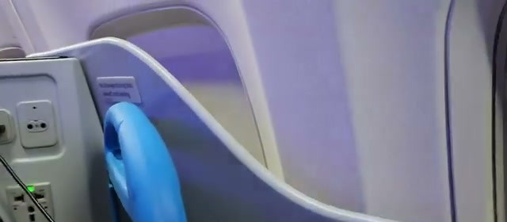
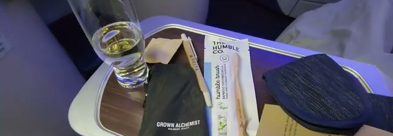
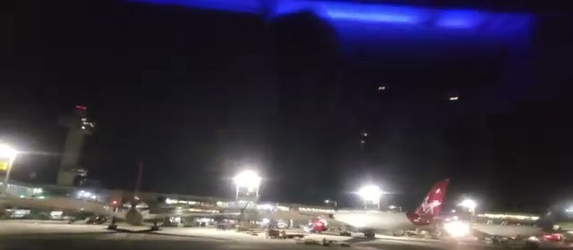
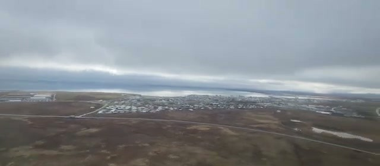
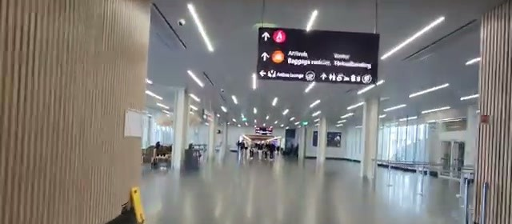
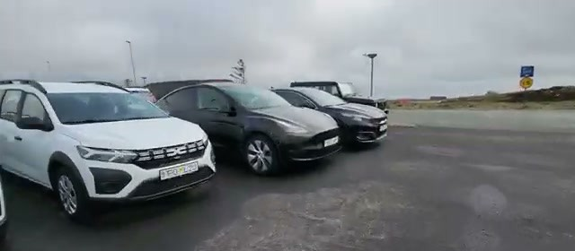



Delta flies a narrowbody 757 to Iceland — a long way in a single-aisle jet, but in lie-flat Delta One up front the cabin is the same premium seat the airline puts on much longer routes. This short trip video covers the whole journey: JFK Terminal 4 and the Delta Sky Club, the Delta One 757 seat and its trade-offs, the night flight across the Atlantic, landing into low clouds and rain at Keflavik, and the Europcar rental pickup — a Tesla Model Y.

## JFK Terminal 4 and the Delta Sky Club

The trip starts at JFK Terminal 4, Delta's home terminal. Before the flight there's time in the Delta Sky Club — and the lounge is large, with a full bar, plenty of seating, and a buffet spread. It's a comfortable place to wait out the evening before an overnight crossing.

## Boarding the 757

Boarding is through the jet bridge for the narrowbody 757 — Delta One is up front, of course. It's a striking thing about this route: no widebody, just the 757 stretched across the North Atlantic.

## The Delta One seat: lie-flat, but limited storage

The Delta One cabin on this 757 is the lie-flat business seat — proper bed mode for an overnight flight — set up in the usual narrowbody premium layout. The trade-off the video calls out directly: limited storage, and a very basic amenity kit. There's a side console with power outlets and USB to keep things charged, but cubby space for personal items is tight.

## Amenity kit and onboard service

The amenity kit is a Delta-branded pouch with the basics: a Grown Alchemist skincare pouch, a Humble Co. bamboo toothbrush, and an eye mask. Nothing lavish — but it covers the overnight essentials. On the tray table there's a pre-departure drink and the meal service to follow.

## Departure from JFK, on time

Pushback and takeoff happen on time — the caption in the video makes a point of it. The 757 taxis past the lit-up Terminal 4 ramp and climbs out into the night over New York.

## Arrival into Keflavik: low clouds and rain

Morning arrival into Keflavik comes with classic Icelandic weather: low clouds hanging over the lava fields and steady rain on the window. The descent shows the wide, empty Keflavik peninsula below — a stark contrast to the New York skyline left behind.

## Getting through KEF: immigration, bags, customs

Keflavik is a compact airport and the walk-through is straightforward. The video's captions walk the sequence: get through immigration, head down to arrivals — note that baggage claim is through the gift shop, a very KEF touch — and then finally cross the border at customs.

## Europcar pickup: a Tesla Model Y

For the Iceland road trip, the rental is a Tesla Model Y from Europcar. Iceland is one of the best places in the world to rent an EV — cheap, abundant geothermal electricity and a solid charging network — so an electric crossover is a natural pick for a Ring Road trip.

## Verdict

The narrowbody 757 is a smaller jet than you'd expect on a transatlantic, but Delta One up front makes it a genuinely comfortable overnight: a real lie-flat bed, on-time departure, and the lounge start at JFK. The honest downsides are the ones the video flags — limited seat storage and a basic amenity kit. On the ground, Keflavik is easy to navigate and the Europcar Tesla Model Y pickup gets the Iceland road trip started right away.
