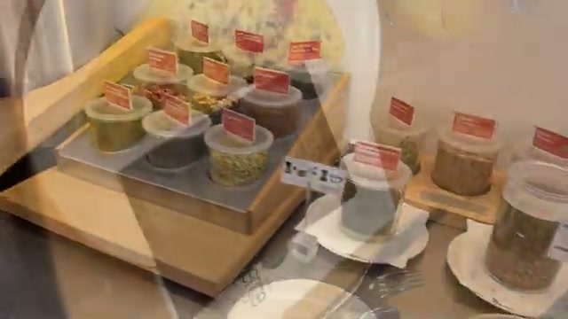
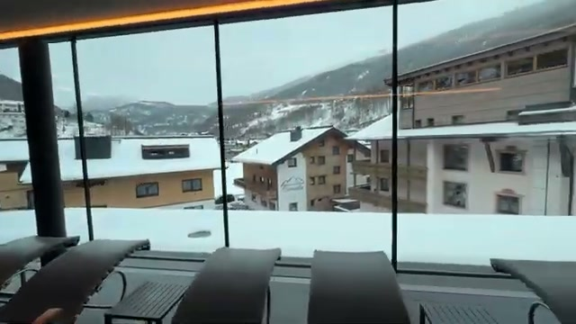
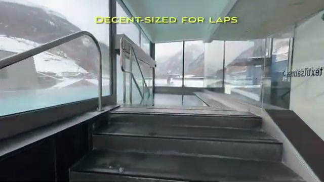
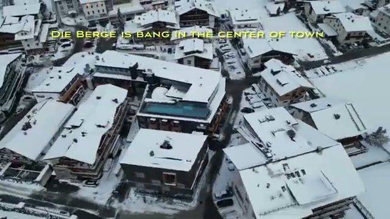



If you’re planning a ski trip to the Austrian Alps and want modern comfort right in the center of the action, **Die Berge Lifestyle-Hotel** in Sölden is an excellent choice.

During our recent winter visit to the Ötztal Valley, we stayed at **Die Berge Lifestyle-Hotel Sölden**, a stylish four-star property known for its spectacular heated rooftop pool and convenient location near the ski lifts.

Here’s what the experience was like.

---

## First Impressions

The hotel has a modern alpine aesthetic—clean architecture, lots of glass, and panoramic views of the surrounding mountains. Despite being right in the center of town, it feels calm and relaxed, with easy access to everything you need for a ski holiday.

The lobby and common areas are sleek and contemporary, setting the tone for a comfortable stay focused on both skiing and relaxation.

---

## The Room: Double Room L with Balcony

Our room was the **Double Room L with Balcony**, and it struck a great balance between style and practicality.

Highlights included:

* Spacious layout with modern alpine décor
* Large, comfortable bed after long ski days
* Private balcony with mountain views
* Clean and functional bathroom design

The balcony is a particularly nice touch in winter—stepping outside and seeing the snow-covered Alps first thing in the morning is unforgettable.

*View from the room balcony over Sölden.*

*Mountain views from the room window—room 208.*

*Clean and functional bathroom design.*

---

## Breakfast Worth Waking Up For

Breakfast at the hotel was excellent and well above the typical ski-resort buffet.

*Breakfast buffet with yogurts, cereals, and toppings.*

The spread included:

* Fresh breads and pastries
* Local cheeses and meats
* Eggs and hot breakfast options
* Fresh fruit and yogurt
* Coffee and juices

It’s the kind of breakfast that fuels a full day on the slopes.

---

## The Highlight: Outdoor Heated Pool & Spa

The **rooftop outdoor heated pool** is the signature feature of the hotel.

*The signature heated rooftop pool, seen from above—steam rising over the snow-covered rooftops of Sölden.*

Imagine swimming in **31°C water while snow falls around you**—with panoramic views of the surrounding mountains.

*Spa relaxation area with loungers facing the mountains.*

*Steps down into the heated outdoor pool—decent-sized for laps.*

The spa area also includes:

* Sauna facilities
* Relaxation areas
* Mountain-view terraces

After a day skiing in the Alps, this is exactly the kind of place you want to unwind.

---

## Perfect Location for Skiers

One of the best things about the hotel is its location in the heart of Sölden.

*Die Berge sits right in the center of town.*

From the hotel you can easily reach:

* The main ski lifts
* Restaurants and bars
* Ski rental shops
* The central village area

For skiers, convenience is everything—and Die Berge delivers.

---

## Ski Lockers and Equipment Storage

The hotel makes skiing logistics easy with:

*Ski lockers, drying room, and ski room on the ground floor.*

* Dedicated ski lockers
* Heated boot storage
* Easy access to nearby rental shops like Intersport

Being able to store gear safely and dry boots overnight makes early morning ski starts much easier.

---

## Dining and Parking

Although the hotel offers breakfast, there are plenty of restaurants within walking distance for dinner.

You’ll find everything from traditional Austrian alpine food to modern European cuisine right in the village center.

*The underground parking garage—a lifesaver with feet of snow outside.*

Parking is also available at the hotel, which is helpful if you’re driving through the Ötztal Valley.

---

## A Great Base for Exploring the Region

While most visitors come to ski in Sölden, the surrounding region also offers incredible alpine destinations such as Obergurgl—another beautiful ski village further up the valley.

*Sölden's town center—the Gaislachkogl gondola is at the south end of town.*

That makes Die Berge a great base for exploring multiple ski areas during your trip.

---

## Final Thoughts

**Die Berge Lifestyle-Hotel** combines modern design, a fantastic location, and one of the best heated outdoor pools in the Austrian Alps.

If you’re looking for a stylish and comfortable base for skiing in Sölden, this hotel offers:

* Excellent central location
* Beautiful modern rooms
* Great breakfast
* Outstanding spa and rooftop pool

For travelers who want a bit of luxury alongside their ski adventure, it’s an easy recommendation.

---

*Have you skied in Sölden or stayed at Die Berge? Let us know your experience in the comments.*
