

We drove down from **Riga** to stay at **Esperanza Lake Resort**, a **Marriott Design Hotel** on the shores of Ungurys Lake in the Lithuanian countryside, about 45 minutes from Vilnius and a short drive from Trakai. The verdict up front, as the video puts it: *"Luxurious spa hotel in gorgeous Lithuanian countryside"* — and *"Loved it.. excellent for Marriott Platinums."*

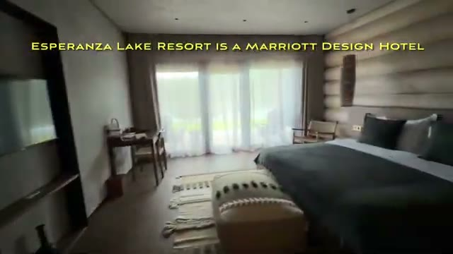

## Getting There: Riga to the Lake District

The drive from Riga takes you south past the Latvian–Lithuanian border. We **stopped for lunch in Pasvalys near the border** — a small town with a pretty church and, as the video notes, *"multiple pizza places in the town center."*

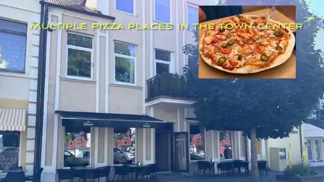

The final stretch gets off the highway and into the lake district, and the resort feels tucked away in the forest — a hidden lakeside compound.

## Arrival & Check-In

Parking is a walk from the main building, but **a golf cart ferries you from parking to reception**. The reception has an elegant boutique look — all wood, glass walls, and views straight out to the lawns.

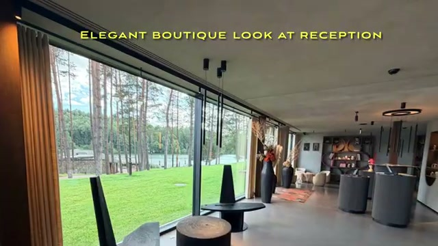

## Booking on Points

We'd booked **2× Signature Lakefront Rooms** and **used 85K Amex certificates even though the rooms were pricing at 56K points**. As the video says: *"But as you'll see, it is worth 85K elsewhere in Europe"* — the cash rates at comparable luxury resorts in Western Europe would be far higher.

**Platinum perks we actually received:** complimentary breakfast (more on that below) and a late checkout.

## Room Tour: Signature Lakefront Room

The rooms follow a luxury lodge aesthetic — *"wood everywhere"* — and feel more like a high-end cabin than a standard hotel room.

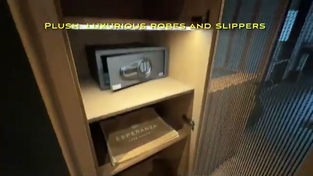

- **Plush, luxurious robes and slippers** waiting in the room
- Water, **Nespresso machine with pods**, and a **paid minibar**
- Safe and plenty of storage

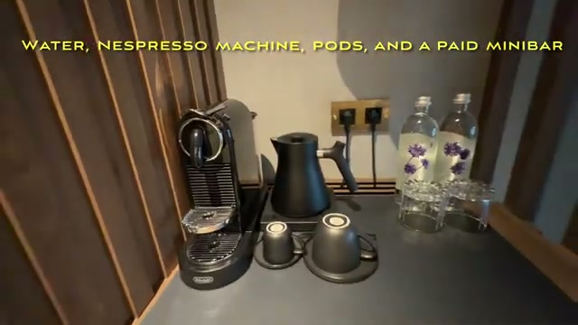

**Lakefront rooms have a nice patio facing the water**, and you can walk straight out to the lawns, the restaurant, and the lake paths.

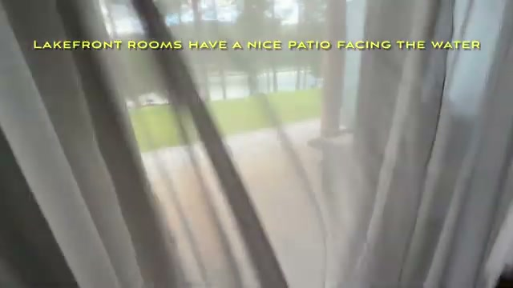

- **King-sized beds with bedside charging** — outlets and USB right where you need them
- The bathroom is well-equipped but all combined: **toilet with bidet, shower, but no tub**

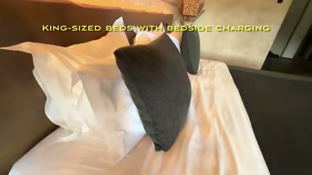

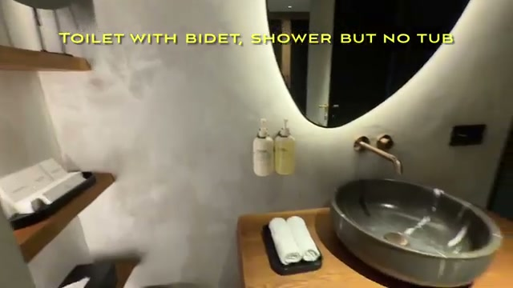

## Dinner: Japanese Restaurant on the Lake

We **had dinner at the Japanese restaurant on the lake** (Mizu). The spread included:

- Popcorn shrimp and edamame
- Cheese ball bites and a green bowl
- Chicken tsukune and tebasaki
- Mizu mochi and strawberry sorbet for dessert

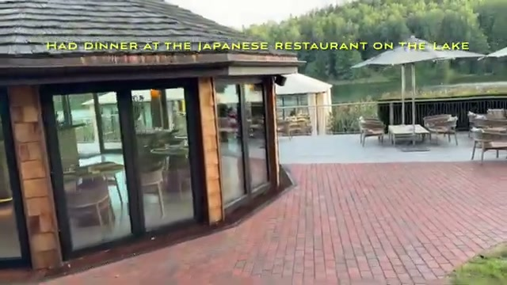

*"All the food was delicious and well presented."*

## Breakfast at Olea — Free for Platinums

This was the standout elite perk: *"Pleasantly surprised with complimentary breakfast for Platinums — **not usually the case at Design Hotels**."* Design Hotels properties frequently exclude elite breakfast, so this was a genuine win.

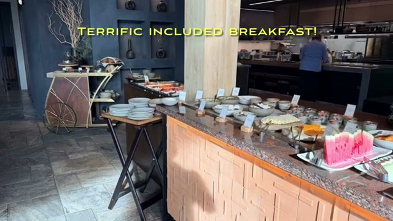

Breakfast at **Olea** is both buffet and à la carte — tamago sando, eggs benedict with guanciale, smoked salmon, and more. *"Terrific included breakfast"* and *"lovely to start the day."*

## The Spa: The Main Attraction

*"One of the main attractions is the wonderful spa building."* You head down to the changing area — **they provide their own robes and slippers** — then up to the pool and facilities:

- **Large lakeside heated pool with whirlpool**
- A path of **alternating hot and cold showers**
- **A steam hamam**
- **Bucket showers** (*"weren't freezing though"*)
- **A Finnish sauna with a lake view**
- An infrared sauna too
- Salt room

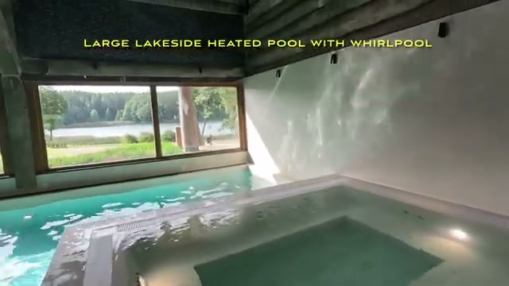

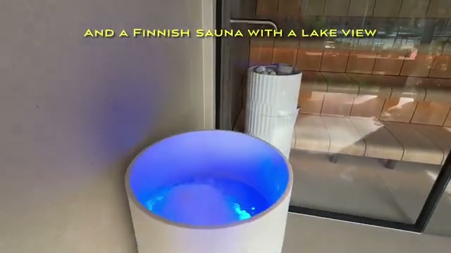

## Activities: Tennis, Play Area & Alpacas

There's plenty to do beyond the spa — *"we spent a lot of time playing too"*:

- **Tennis courts** — you can borrow rackets and balls at reception (we even played some cricket on them)
- **Kids had a blast in the play area**
- **Kids had a fun time feeding the alpacas** — yes, the resort has alpacas

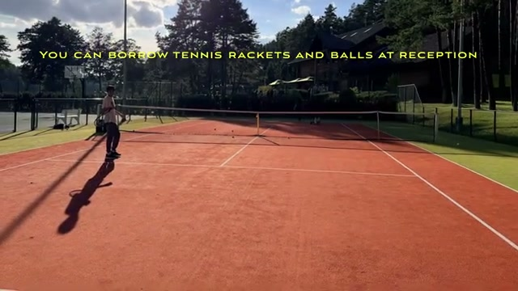

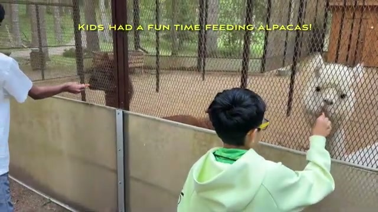

One note: it was **too cold for the lake at the end of August**, so the heated spa pool was the way to go.

## Evening: Fireworks & Weddings

There **happened to be fireworks that night** — must've been celebrations for a wedding earlier in the day. As the video observes: *"This resort must be an ideal fancy wedding spot for Vilnius' elite."*

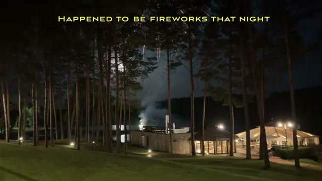

## Checkout & Trakai

**After a late checkout we headed to Trakai for a late lunch** — the island castle is only about 15 minutes away and worth the stop on your way out.

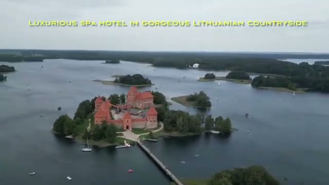

## Verdict

Esperanza Lake Resort is a genuinely luxurious countryside escape: stunning spa, excellent food at both Mizu and Olea, thoughtful platinum recognition, and plenty for kids. Well worth the points — and the drive from Riga.
