# Geneva Airport Car Rental: Save Money on the French Side (With Caveats)



Geneva Airport is unusual: it sits right on the French-Swiss border, and the rental car companies have counters on **both** sides. Renting from the French side is often significantly cheaper than the Swiss side - but there are caveats that can bite you if you don't plan for them. Here's the full walkthrough, from baggage claim to the motorway.

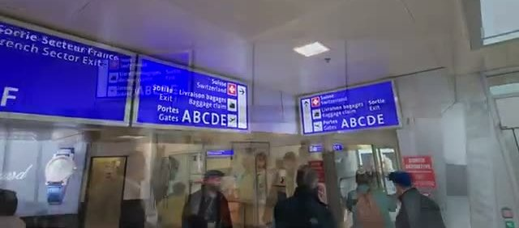

## Why the French side is cheaper

It's cheaper to rent in France than in Switzerland - the same companies, the same airport, but French-side rates are often substantially lower. That price gap is the whole reason to bother with the French sector. Everything else in this post is about making sure the savings don't evaporate into fines or wrong turns.

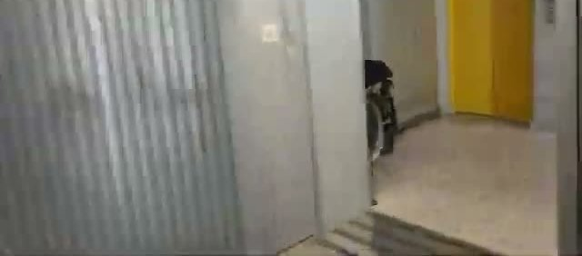

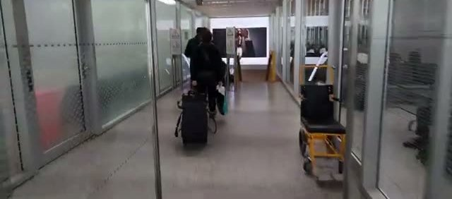

## A very confusing airport design

Fair warning: Geneva Airport has a very confusing design. We arrived on a connecting flight from Paris, and even with the signage it's easy to end up on the wrong side. Keep your boarding pass handy - you'll need it to navigate between sectors.

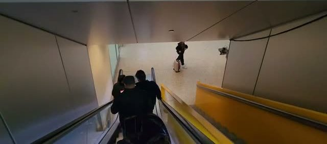

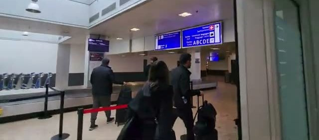

## Finding the French rental counters

Head for the **Sortie Secteur France / French Sector Exit** signs. There's a special baggage carousel closer to the French exit, and that belt is very close to the French rental counters - convenient if your bags cooperate.

Two things to know: customs is on the Swiss side, and oversized bags (e.g. skis) arrive on the Swiss belts, so if you're traveling with ski gear you'll be collecting on the Swiss side regardless.

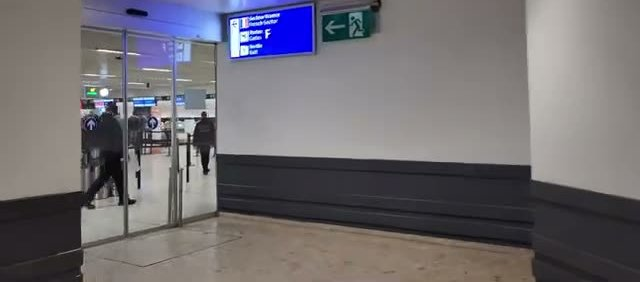

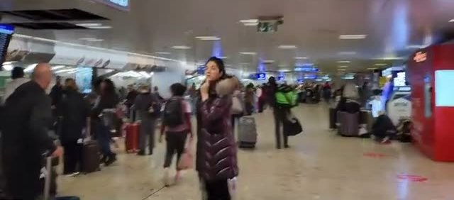

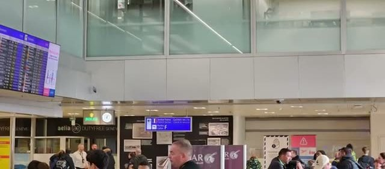

## The rental car lot

From the French counters it's a long, dingy, covered walk to the rental car lot - follow the "Location de voitures / Car rental" signs. The lot itself is a bit chaotic, with all the car companies operating in the same space, so give yourself extra time at pickup.

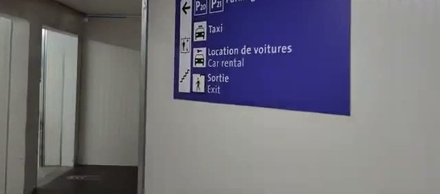

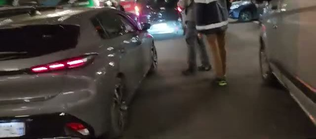

## The caveats

Here's where the savings can unravel. **French rentals won't have Swiss motorway toll stickers** - the vignette required to drive on Swiss motorways. And in winter, French-side cars won't come with winter tires or chains, which are required in the mountains.

So: after exiting the airport, **don't get on the motorway**. Either take local roads to the French border, or stop at a gas station to buy a vignette before touching a Swiss motorway. Driving a Swiss motorway without one risks a fine that wipes out everything you saved.

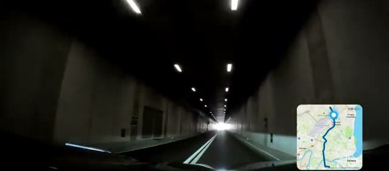

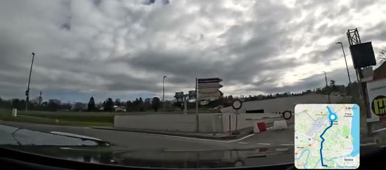

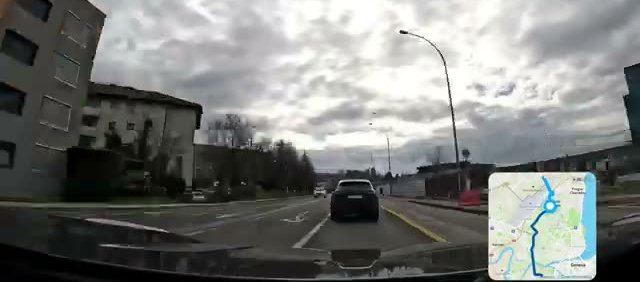

## Practical notes

- **GVA straddles the border:** rental counters exist on both the French and Swiss sides; French prices are often cheaper.
- **Navigating the airport:** follow "Secteur France / French Sector Exit" signs, keep your boarding pass handy, and note that customs and oversized baggage (e.g. skis) are on the Swiss side.
- **The French-side car:** no Swiss motorway vignette, and in winter no snow tires or chains.
- **After pickup:** don't get on the motorway - take local roads to the French border, or buy a vignette at a gas station first.
- **Bottom line:** real savings on the French side, as long as you handle the vignette before driving Swiss motorways.
