

Gran Paradiso is a blue ski run just off the Sella Ronda near Plan de Gralba in Val Gardena, in the Italian Dolomites — skied directly beneath the towering rock walls of Sassolungo (Langkofel). This video is the full run: the chairlift ride up, the summit, and the long cruise back down, with a GPS speed and route overlay the whole way.

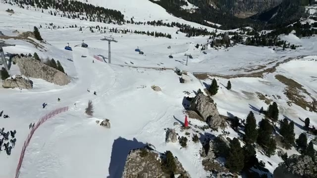

## The chairlift ride up

The day starts at the Gran Paradiso chairlift base station, boarding a covered chair. The lift climbs past rocky outcrops and snow-covered slopes, with the big Dolomite cliffs rising alongside — the scenery starts immediately, not just on the way down.

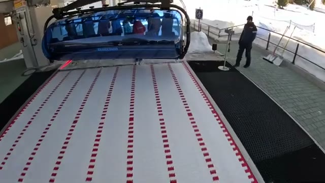

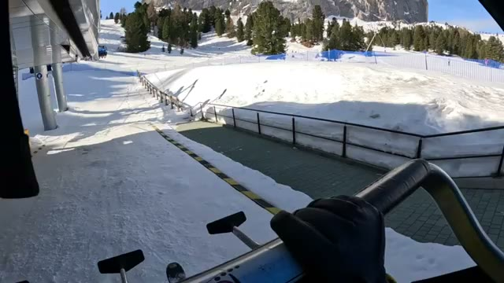

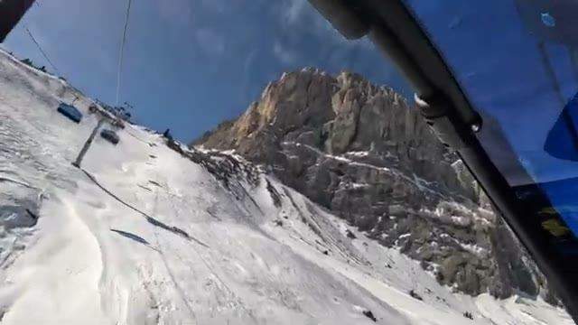

## The summit

The top of the run is a busy spot — the video was filmed on a bluebird day and the summit area is full of skiers getting ready to drop in, with a dramatic rocky peak looming over everyone. If you're coming off the Sella Ronda, Gran Paradiso makes a natural detour: a mellow, scenic run before rejoining the circuit.

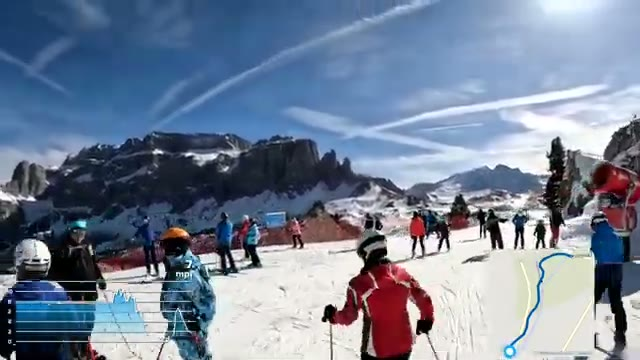

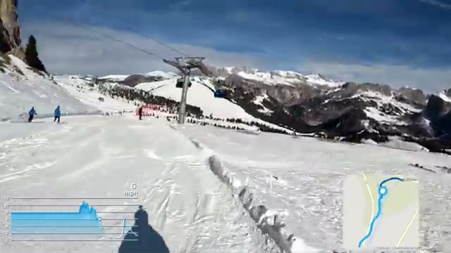

## The descent: a blue run made for cruising

Gran Paradiso is wide, groomed, and gentle — the kind of blue you ski with your poles down and your camera out. The on-screen GPS overlay shows relaxed cruising speeds through most of the run, with the route map tracing a long, easy line down the mountain. The pitch never gets steep, which is exactly why this one is better skied slowly: the views are the point.

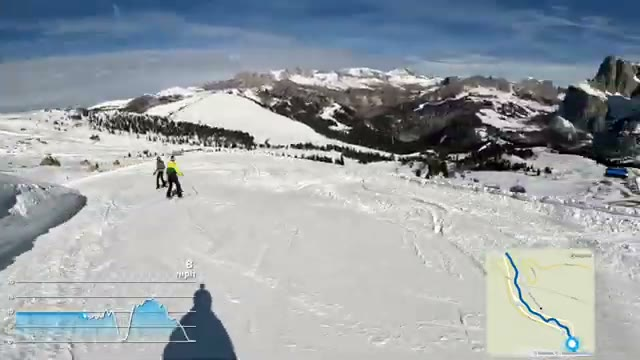

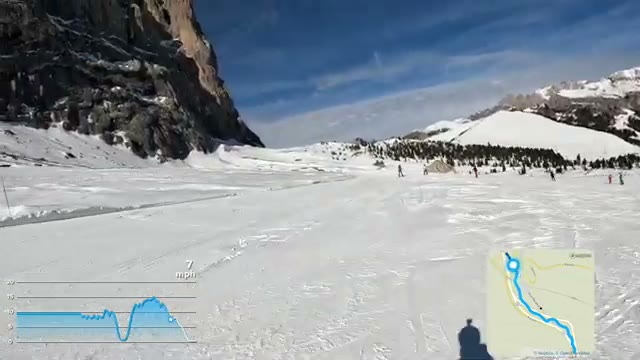

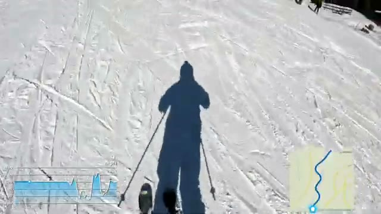

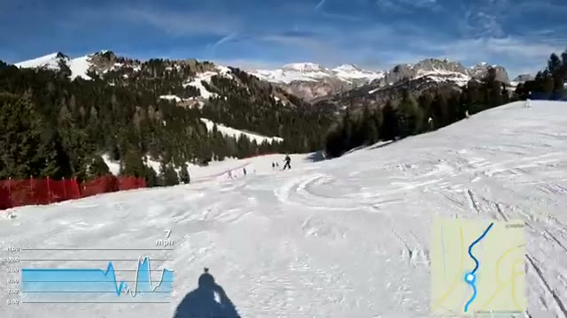

## The scenery along the way

What earns Gran Paradiso its "most scenic blue" claim is how much the landscape changes on the way down: sheer rock towers at the top, a rocky bowl and scattered boulders mid-mountain, then pine forest and distant snow-capped peaks lower down. Looking back up from the lift or across the valley, the lift network and pistes spread out below against the cliffs.

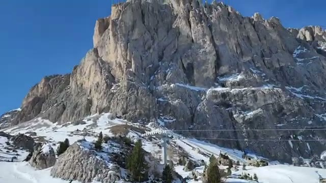

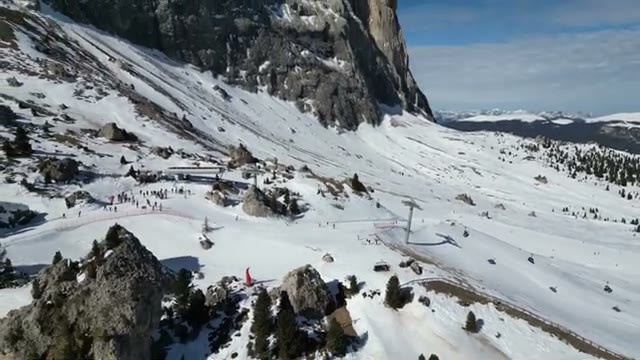

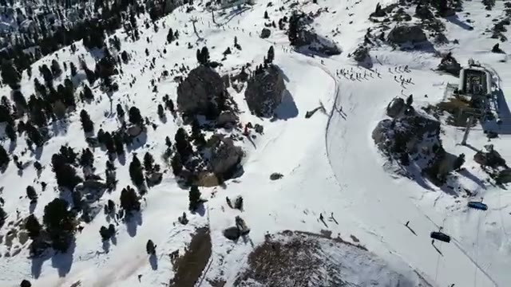

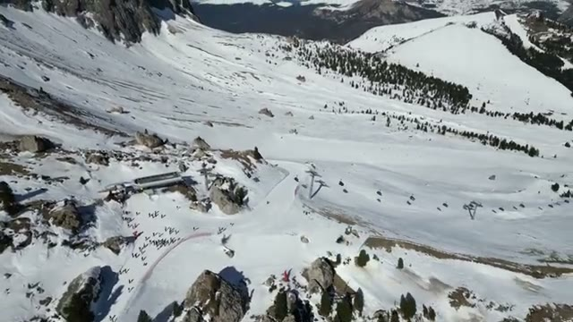

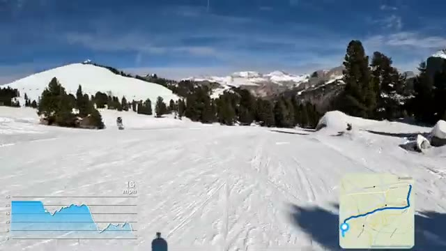

## Wrapping up

The run ends back in a lively base area — crowds of skiers, lift stations, and the usual end-of-run bustle near Plan de Gralba. If you're skiing Val Gardena and the Sella Ronda, don't blow past this one: Gran Paradiso is the blue run to slow down for, ski under the Sassolungo walls, and let the Dolomites do the work.

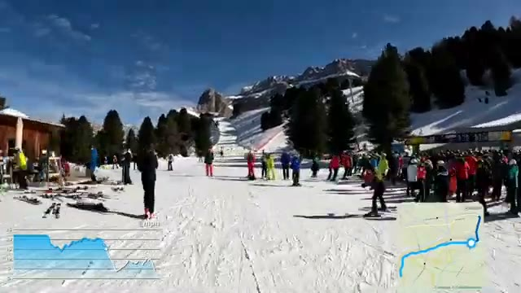
