# Grand Hotel Kempinski High Tatras: Lake Views, Balcony Suites and a Standout Spa



We spent **three nights at Grand Hotel Kempinski High Tatras in Štrbské Pleso**, and it was our favorite luxury hotel of this European trip. The setting does a lot of the work: a mountain lake on one side, a broad valley on the other, and forested slopes rising toward the peaks. But the hotel gives you plenty of reasons to linger, from balcony suites to a spa that makes the most of its position right beside the water.

For our family, this was a base for hiking and day trips with somewhere special to come back to. It is worth leaving time in the itinerary to enjoy the hotel itself.

## A Grand Hotel Beside Štrbské Pleso

The approach takes you through the scenery of the High Tatras, and the hotel feels very much part of that landscape. From above, you can see its buildings following the edge of the lake, with trees almost wrapping around them.

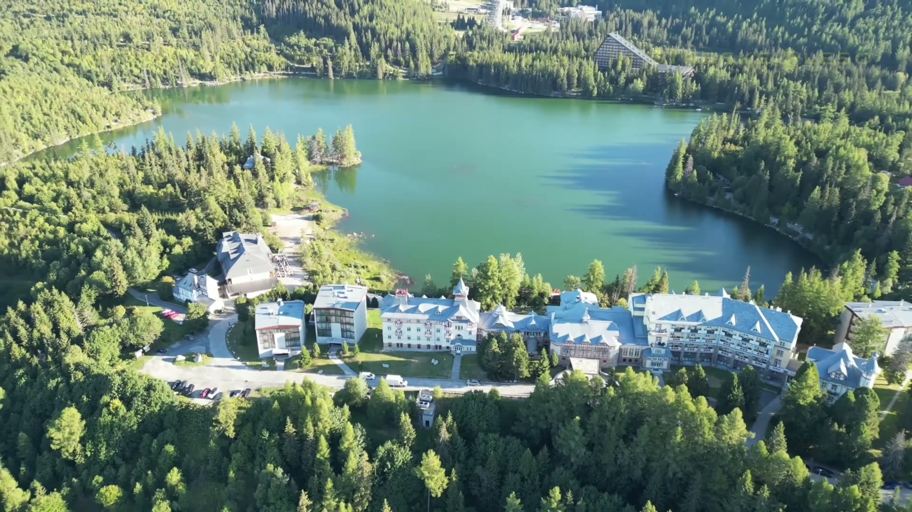

Inside, the mood is classic grand hotel: patterned carpets, rich colors, flowers and a sweeping staircase in the lobby. It has a more traditional feel than the contemporary mountain hotels we have stayed in, which suits the setting.

There was also an unexpected collection of supercars outside during our stay. A touring group happened to be visiting at the same time, so the entrance came with quite a display. That was a coincidence of our visit rather than a regular hotel attraction.

## Two Rooms, Two Balcony Suite Upgrades

We had booked **two rooms, one with a lake view and one with a valley view**, and both were upgraded to balcony suites. I had obtained GHA DISCOVERY Platinum status before the trip, and this stay made that feel worthwhile. Those were the upgrades we received on our visit; I would book the room and view you actually want rather than count on the same outcome.

Our suite had a sitting area with a sofa, armchairs and a coffee table, along with welcome fruit, chocolates and wine. Warm wood, patterned upholstery and a slatted divider gave the room a comfortable, traditional feel.

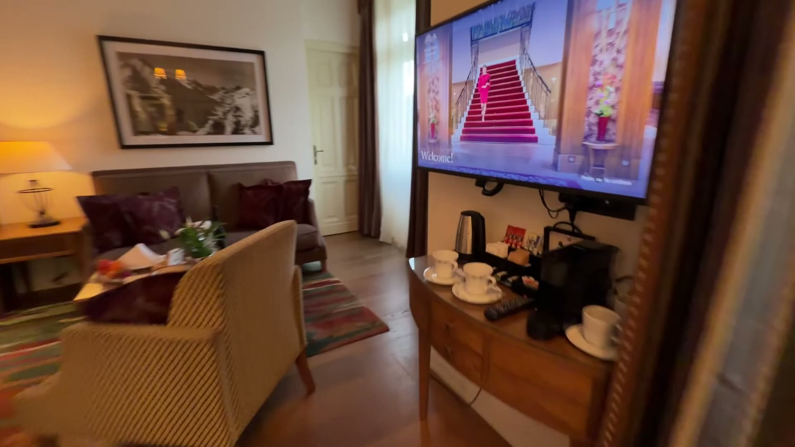

The large king bed had a striking geometric wooden headboard. There was also a desk, a stocked minibar and the sort of space that makes a longer stay feel easy, especially when you are unpacking for several days of outings.

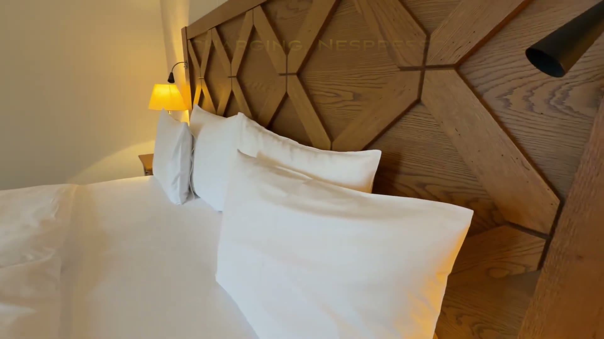

The bathroom had **a separate shower and tub**, with robes and slippers provided. Even here, the view was part of the experience: the window beside the tub looked out toward the lake and mountains.

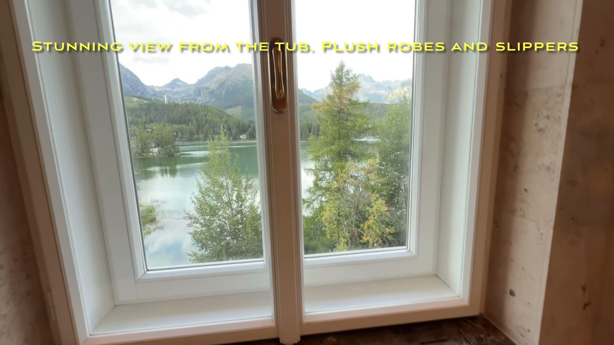

## The Balcony Is the Highlight

The lake-facing balcony was the feature that made our suite memorable. You step outside and have Štrbské Pleso below you, forest beyond it and the peaks forming the backdrop. The changing light gives you a good reason to keep looking up from whatever else you are doing.

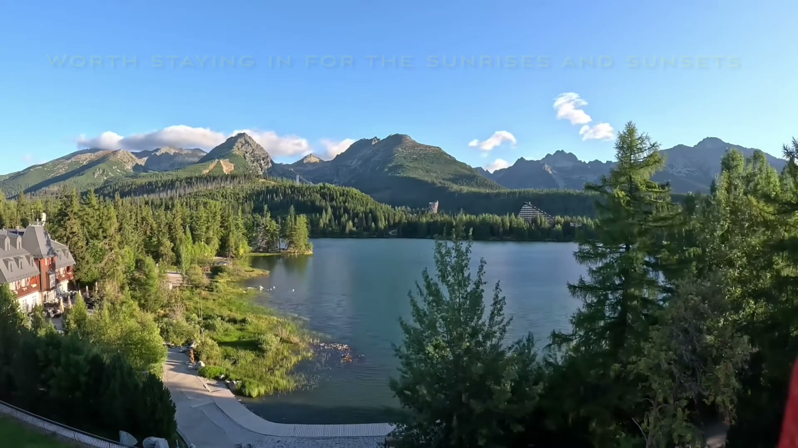

The valley-facing suite offered a different perspective, looking out over trees toward open countryside and distant hills. Having one room on each side let us appreciate both settings, although the lake view would be my first choice for a return visit.

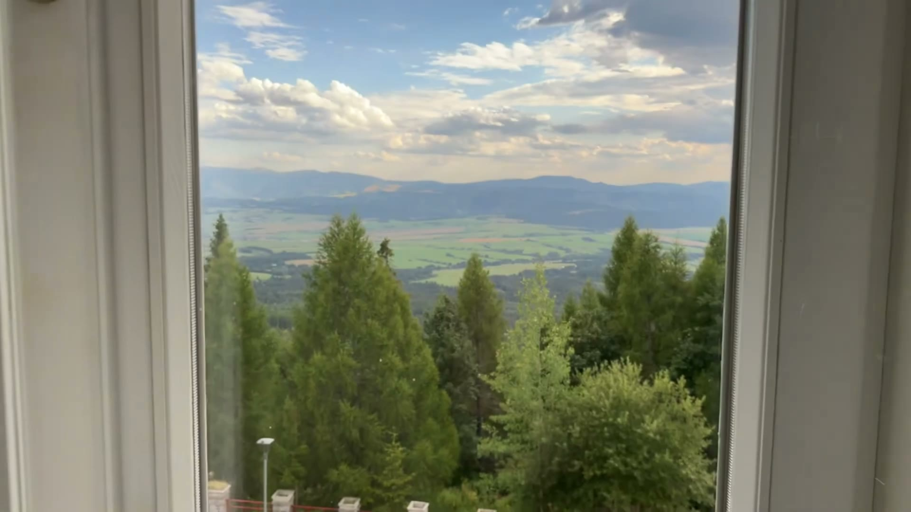

## Thoughtful Touches for the Kids

The children's suite came with **welcome candy and children's robes**, along with its own sitting area and a similar shower-and-tub arrangement. Those small touches made the welcome feel personal to them too.

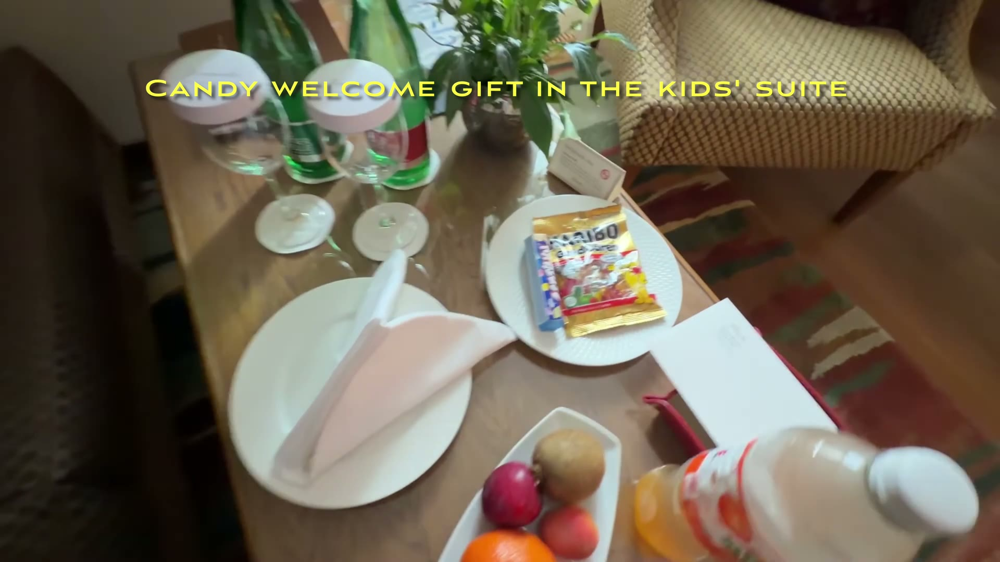

Beyond the rooms, there was a small games area with foosball, a pool table and chess. The library-style space, with its bookshelves and purple chairs, provided another place to spend time between outings.

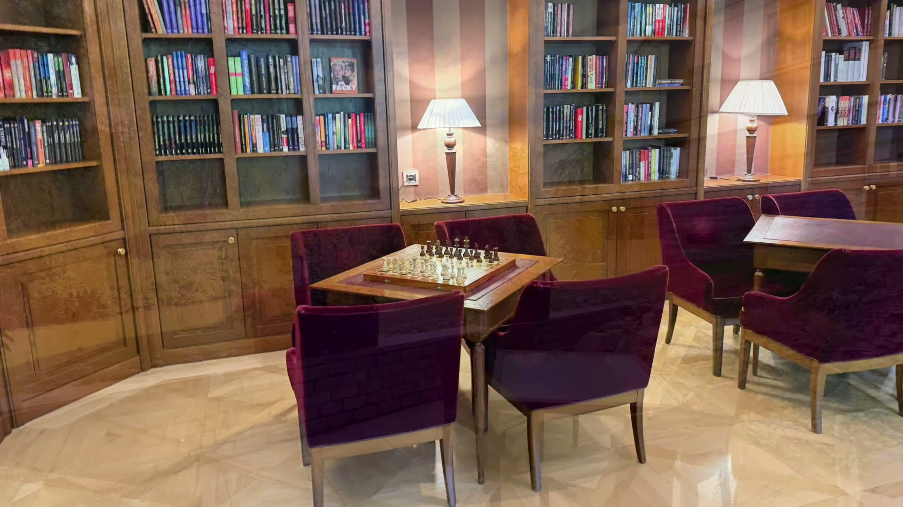

## A Spa With the Lake Right Outside

The **spa was one of the strongest parts of the stay**. The indoor pool sits beside large windows, with the lake and mountains just beyond the loungers. It is an unusually scenic place to swim or sit quietly for a while.

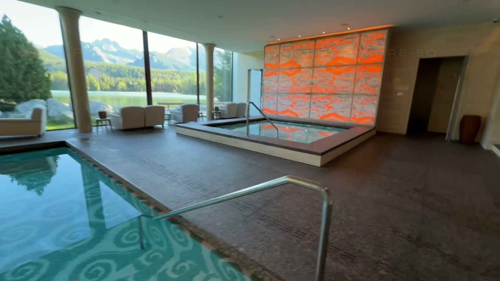

During our visit, the pool felt mildly heated, while the Jacuzzi was warmer. The seating around the windows was just as appealing as the water: you could settle in with the lake almost at eye level.

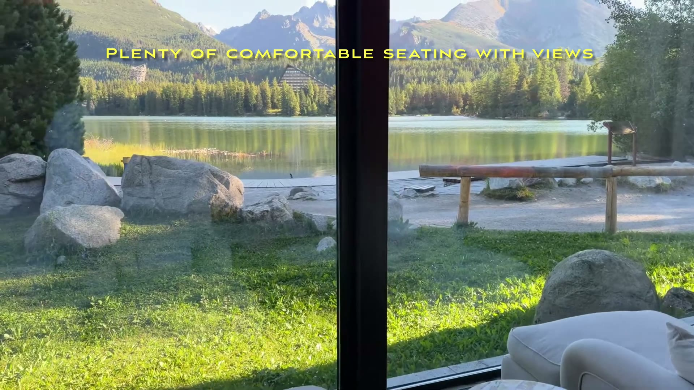

The separate wellness area was adults-only during our stay. The facilities shown on our tour included a steam room, Kneipp pools, an infrared sauna, an ice fountain, an arctic bath and a Finnish sauna. There was a gym too. For us, the combination of facilities and the lakeside setting made this much more than a quick stop for a swim.

## Breakfast and Evenings at the Hotel

Breakfast had a broad selection of breads, pastries and juices, plus an à la carte menu and an omelette station. We also found vegan and gluten-free options, and there were cappuccinos and lattes to go with everything.

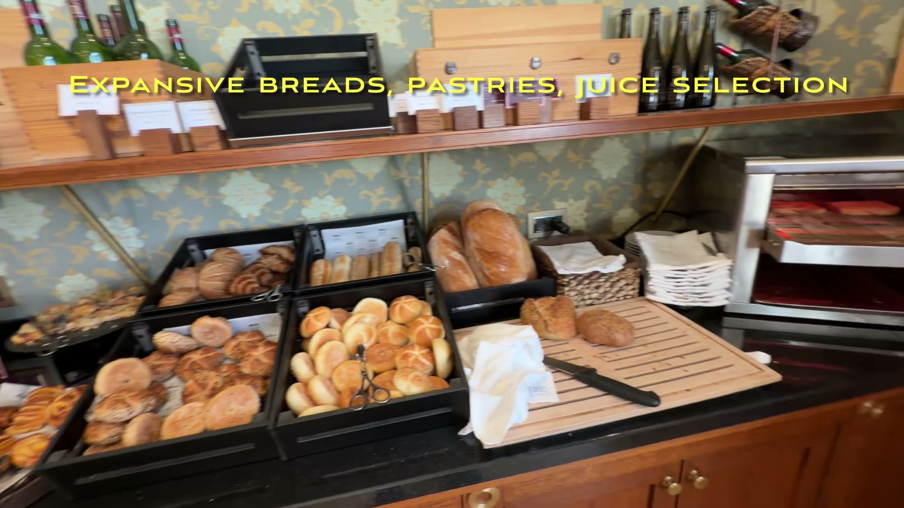

It was a good start before heading into the mountains. In the evening, the lobby bar worked well for a nightcap and dessert, giving us another reason to spend some time at the hotel after a day out.

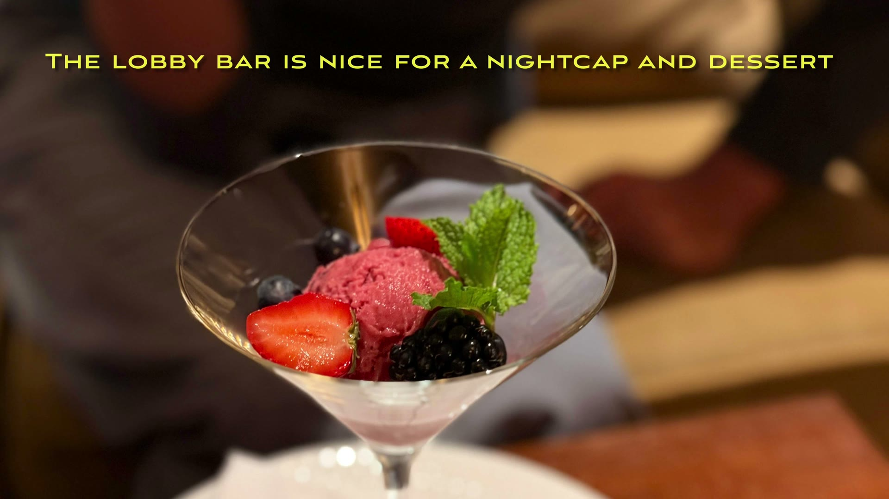

We also had dinner one night at **Hotel Solisko next door**, where the lakeside restaurant had heat lamps and blankets available. That made a pleasant change of scene without taking us far from the lake.

## Exploring the High Tatras

We used the Kempinski as a base for time outdoors as well as relaxing at the hotel. **Popradské pleso** was one of the highlights: a mountain lake with a chalet on the shore and forest rising behind it.

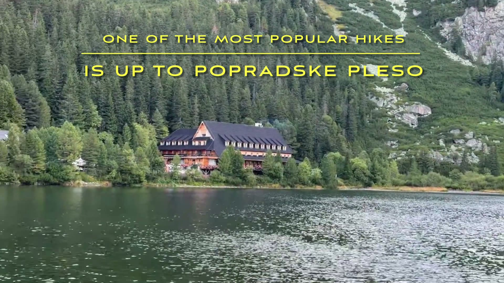

Our video shows both the rocky red trail and the paved blue route. They offer quite different walking experiences, so it is worth choosing a route that suits your group. We also featured the outing toward **Jamské pleso**, with views of Kriváň and a gentler feel than the rocky trail.

The wider trip included **Spiš Castle** and time on the Polish side of the Tatras, including **Kasprowy Wierch**. There is enough variety here to combine mountain scenery, family activities and sightseeing, but I would resist filling every hour. The balcony and spa deserve some of that time too.

## Would We Stay Again?

Absolutely. The lake-facing balcony and the spa are the two things I remember most, with the spacious suites and touches for the kids making the stay work particularly well for our family.

A few details would shape how I booked a return visit:

- **Choose the view carefully.** Both sides have scenery, but the lake-facing suite was the standout for us.
- **Allow time at the hotel.** Three nights gave us room for outings as well as enjoying the spa and balcony.
- **Treat upgrades as a bonus.** Our two balcony suite upgrades were a highlight of this visit, not something to assume for every booking.
- **Keep the wellness area in mind when traveling with children.** The separate wellness section was adults-only during our stay.

Grand Hotel Kempinski High Tatras brought together the things we most enjoy on a mountain trip: scenery, outdoor time and a comfortable hotel that feels like part of the destination. For this stay, it more than earned its place as our favorite luxury hotel of the trip.
