

Lake Bled, Slovenia, is one of the most photogenic spots in the Julian Alps — and if you want to stay right on the water, there is really one choice: the Grand Hotel Toplice, the only luxury lakefront hotel in Bled.

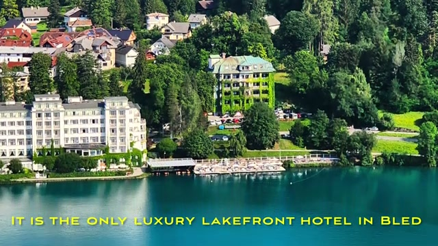

The hotel sits directly on the shoreline, with the emerald lake on one side and the Karawanks mountains behind. This is the view that sells the stay.

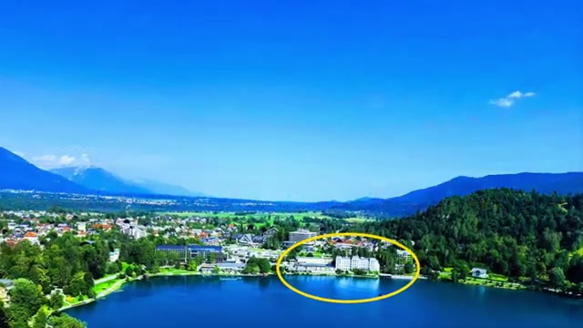

## The Room: A Lake View Suite

We booked a lake view suite — and the lake view is the whole point.

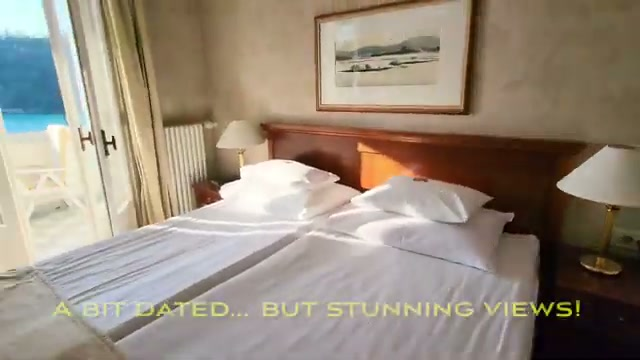

The honest verdict from our stay: the suite is a bit dated, but the views are stunning.

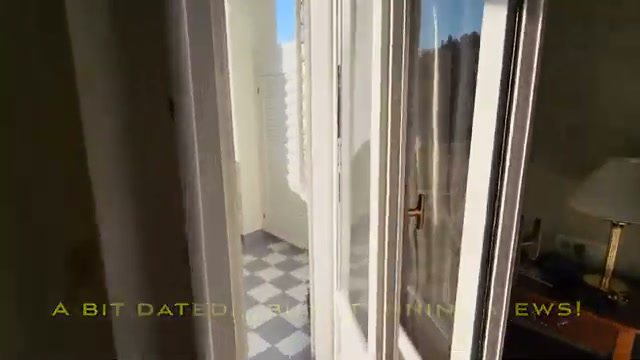

The decor is classic old-Europe grand hotel rather than modern boutique, but for a family trip it worked well — there was enough room for the family, with a separate sitting area and a comfortable bed.

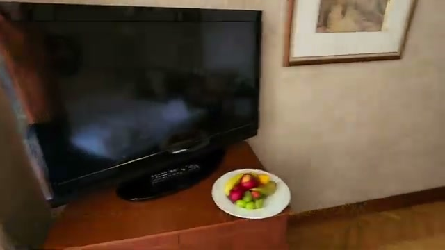

## The Views: Bled Island, Mt Triglav, Bled Castle

The balcony is where you will spend most of your time. From the room you look straight out over the lake to Bled Island with its church, Mt Triglav in the distance, and Bled Castle perched on the cliff.

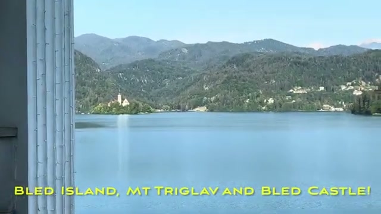

Bled Castle, dramatically sited on a 130-metre cliff above the lake, is the landmark you keep coming back to with the camera.

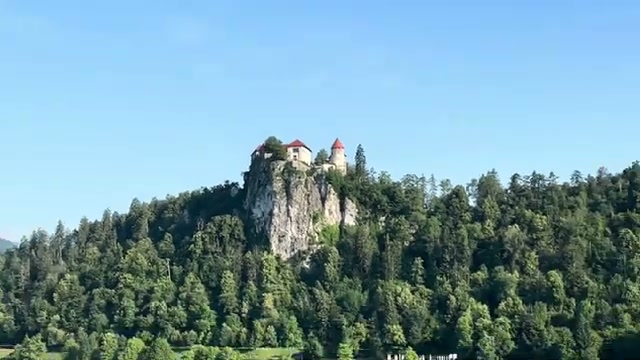

## The Lake: A Private "Beach" Front

One of the hotel's biggest advantages is that it has its own "beach" front — a private stretch of shoreline with loungers right on the water.

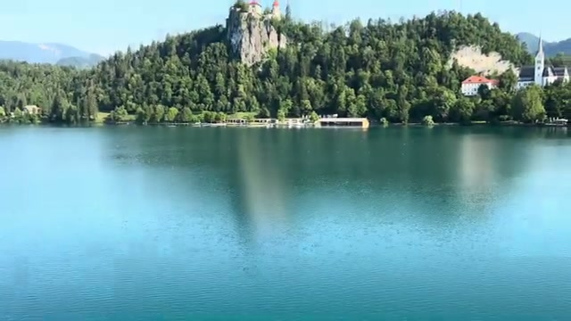

The lake is extremely calm, which makes it perfect for swimming — and the wooden dock is great for cannonballs too.

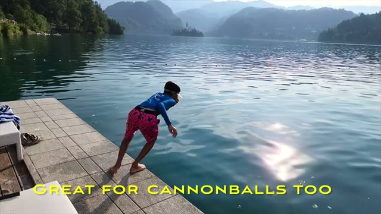

## The Indoor Pool

There is also an indoor pool, though fair warning: the indoor pool is freezing! The lake in summer was the better swimming option.

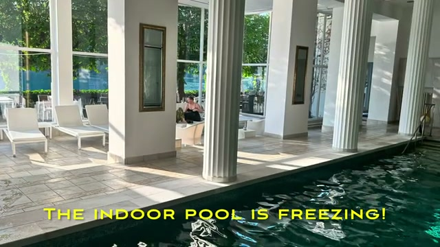

## Breakfast With a View

Breakfast is a highlight — there are delicious options at the buffet, served in a huge breakfast restaurant with a view over the lake.

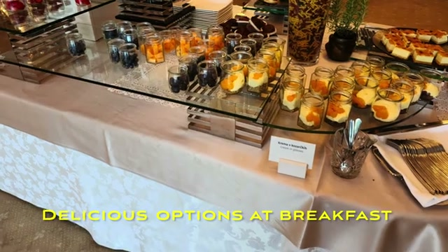

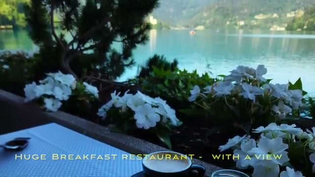

## Out on the Lake

You can take the hotel's boat out on the lake — the traditional wooden boats are perfect for a slow loop past Bled Island and the castle.

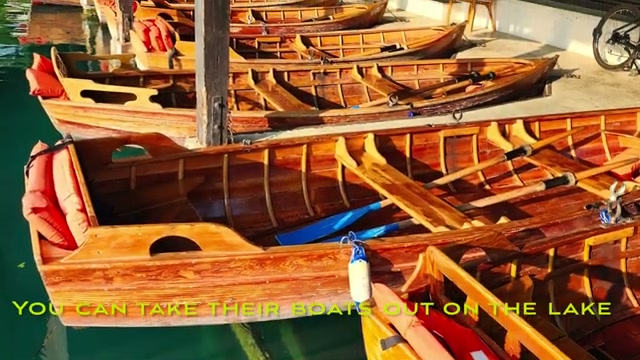

## A Grand Tour Connection

Fun fact for car-show fans: if you are a Jeremy Clarkson fan, you will appreciate that The Grand Tour ended one of their road trips here at the Grand Hotel Toplice.

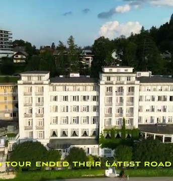

## The Verdict

A grand old hotel with dated rooms but an unbeatable location: private lakefront, stunning balcony views, a great breakfast room, and boats at your disposal. As a base for exploring the Julian Alps, it is hard to beat.

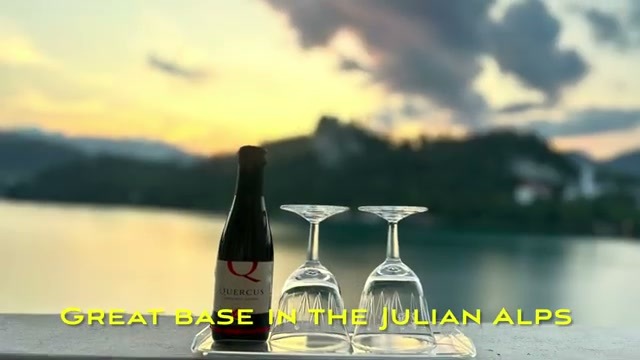

*Watch the full video tour: [Grand Hotel Toplice \*\*\*\*\* in Lake Bled Slovenia — Best stay in the Julian Alps](https://youtu.be/q_avqBCVuhM)*
