# Hakone & Mt Fuji: Pirate Ships, Black Eggs, and Sakura at Chureito Pagoda



Two days, one very cooperative mountain, and a route that packs in just about everything the Hakone and Fuji area does best: a giant suspension bridge, a zipline through the forest, a pirate ship across a caldera lake, volcanic black eggs, a floating torii gate, and a five-storied pagoda framed by cherry blossoms. This is the 2-day loop we ran, stop by stop, with the practical details you'd want if you're building a similar trip.

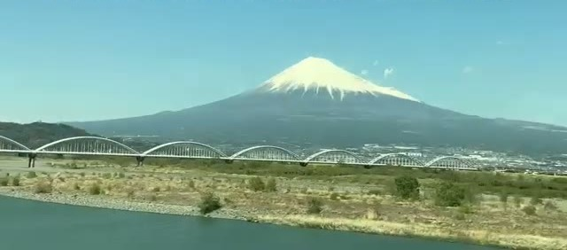

## Day 1: Kyoto to Hakone via Mishima

We started off on the **bullet train from Kyoto**, and Mt Fuji made an appearance almost immediately - a good omen for the two days ahead. From Mishima station it's a short ride up into the mountains to the first stop.

**Mishima Skywalk** is, by its own admission, a man-made tourist attraction: a 400-meter pedestrian suspension bridge built purely for the views. But the views are the real thing - from one side you look straight at Fuji, and from the other the land drops away toward the shimmering Suruga Bay. Walk the full length and keep going to the viewpoint above the activities area on the far side.

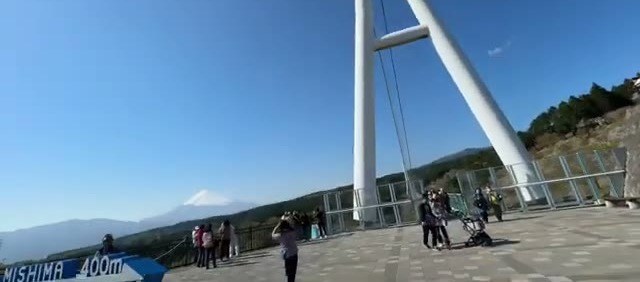

Right next to the Skywalk is a forest adventure park, and we couldn't resist the **round-trip zipline**. Practical notes from the staff briefing: on the way out keep your legs tucked up against the brake, and on the way back you'll need to use the brakes yourself to slow down for the landing platform. The return leg flies you back over the valley the way you came.

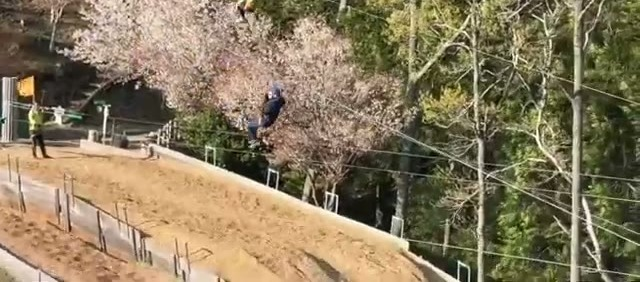

From Mishima it's a **quick 26-minute drive to MotoHakone** on the shores of Lake Ashi. We checked into a lakeside Rakuten Stay just in time for a **beautiful sunset over the lake**, with Fuji silhouetted behind the far shore and the shrine's red torii gate visible down the waterfront. Hard to beat as a first evening.

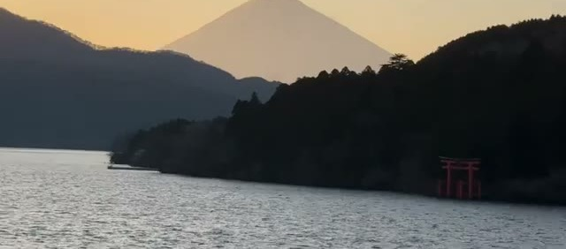

## Day 2: The Hakone Loop - Pirate Ship, Ropeway, and Black Eggs

The next morning started with the **pirate ship ride across Lake Ashi**. These are full-size replica galleons, and they're as fun as they look. Worth knowing: **first class boards first**, and the first-class cabin sits right at the front of the ship with big windows - plus there's a dedicated outdoor viewing area up front, which is where you want to be when Fuji comes into view over the bow.

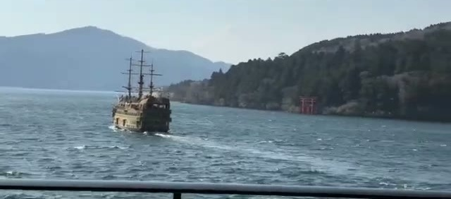

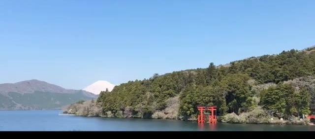

From the far shore, the **Hakone Ropeway** climbs up to Owakudani. Go **first thing in the morning - the lines are short**, and the light is better. Get off at the top of the mountain and walk the viewpoint loop: the views from up here are genuinely magical, with Fuji dead ahead across the valley.

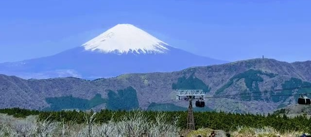

Owakudani is famous for its **black eggs** - eggs boiled in the volcanic hot springs, which turn the shells black (local legend says each one adds years to your life). While you're up there, the other store by the station sells **black ice cream**, which is more of a visual experience than a flavor one, but you have to try it once.

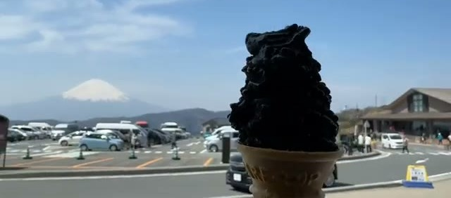

Ride the ropeway back down the other side for long views over the steaming volcanic valley, then it's back on the pirate ship for the return crossing - the afternoon light on the lake is completely different from the morning.

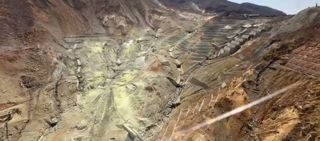

## Hakone Shrine and the Floating Torii Gate

Back at lake level, **Hakone Shrine** is a short climb up from the water through ancient cedar trees - a peaceful shrine in a genuinely serene setting, well away from the tour-bus crowds.

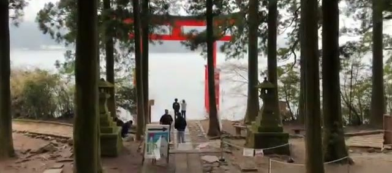

Then walk back down to the famous **torii gate standing in the lake** - the "floating" gate with Fuji behind it is one of the classic Hakone photos. The trick is timing: **go early in the morning and there are no crowds**, just the gate, the water, and the mist. From the gate you can see the hotels across the bay, and there's a waterfront pathway that leads back into town.

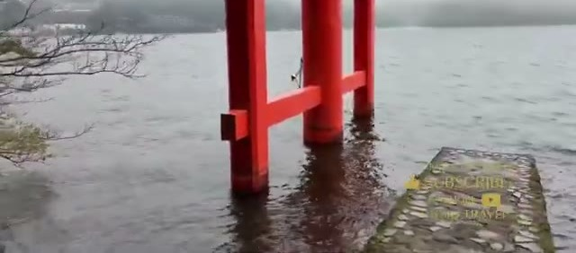

## Ashinoko Skyline to Fujiyoshida

Leaving Hakone, the **Ashinoko Skyline** toll road winds up over the caldera rim. The highlight: you emerge from a tunnel straight into stunning Fuji views, and from there the mountain looms **imposing all the way to Fujiyoshida** - it fills the windshield for most of the drive.

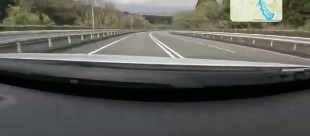

## Chureito Pagoda in Sakura Season

The reason for the whole detour: **Chureito Pagoda** at the height of cherry blossom season. Walk over to the base of the pagoda hill - and note that there's an **accessible back route with ramps** all the way up if stairs aren't your thing.

The sakura here are truly magnificent - the whole hillside is pink. You'll queue briefly at the top viewpoint ("it's our turn" is part of the experience), and then you get it: **the most iconic photo in all of Japan**, the five-storied pagoda framed by cherry blossoms with the town spread out below. Worth every minute of the drive to Fujiyoshida.

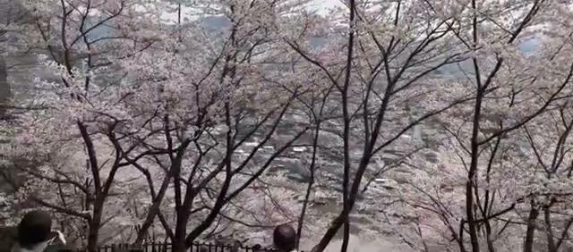

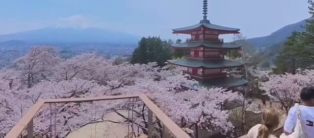

## Lunch in Fujiyoshida

After sightseeing, we headed into Fujiyoshida's city center for lunch at a small **dosa restaurant** - a cute local business with genuinely friendly owners. South Indian food in a Japanese mountain town wasn't on the itinerary, but the dosas were excellent and it ended up being one of the most memorable meals of the trip.

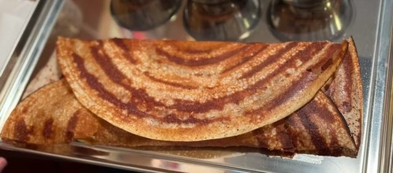

## Wrapping Up

That's two days around Hakone and Fuji: bullet train in, Skywalk and zipline at Mishima, sunset on Lake Ashi, the full Hakone loop of pirate ship, ropeway, and black eggs, the floating torii gate at dawn, and a sakura-season finale at Chureito Pagoda. It's a packed two days, but everything is close together and the logistics are easy - which leaves you free to just look at the mountain.

## If You're Planning This Yourself

A few practical notes for anyone building a similar route:

- **Ride the pirate ship first class.** It boards first, the cabin is at the front, and the outdoor deck up front has the best Fuji views on the lake.
- **Do the ropeway first thing in the morning** for short lines and the clearest views from Owakudani.
- **Visit Hakone Shrine's torii gate early.** No crowds before the tour buses arrive, and the morning mist on the lake is worth it on its own.
- **At Mishima's zipline**, remember the briefing: legs tucked against the brake on the way out, use the brakes yourself on the way back.
- **Chureito Pagoda has an accessible ramp route** to the viewpoint - you don't have to climb the main stairs.
- **Stay lakeside in Hakone if you can.** A Lake Ashi sunset with Fuji on the horizon is the single best free sight of the trip.
