*Visited February 2023 • Selva di Val Gardena, Italy*

You can watch our full hotel tour and experience here:



## Overview

During our ski trip to the Dolomites, we stayed at Hotel Granbaita, a 5-star property right in the heart of Selva di Val Gardena.

Selva di Val Gardena (Gröden) sits beneath some of the most dramatic peaks in the Dolomites and is one of the anchor resorts of the Val Gardena ski area. A 5-star stay here sets expectations high — and Granbaita is clearly built to deliver.

This review breaks down what the hotel offers, section by section.

---

## 📍 Location

The hotel sits right in the village, and the video's location note says it all: the Nives/Kinderland Ski Area is a 100m walk away.

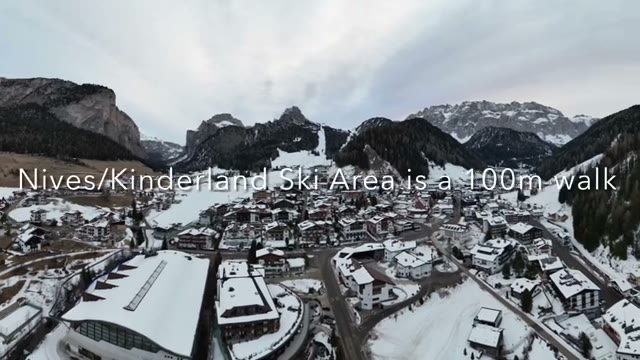

Being in the center of Selva means restaurants, shops, and the slopes are all within easy reach — no shuttle logistics to think about on a ski morning.

---

## 🏨 Superior Room

We stayed in a Superior Room, and the tour covers the full setup — starting with the bathroom.

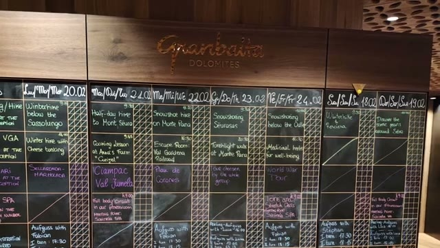

The bedroom itself is modern and warm, with wood finishes that fit the alpine setting.

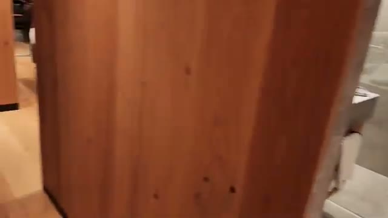

Storage is generous — the video highlights "plenty of closet space," which matters when you're unpacking ski gear for a week.

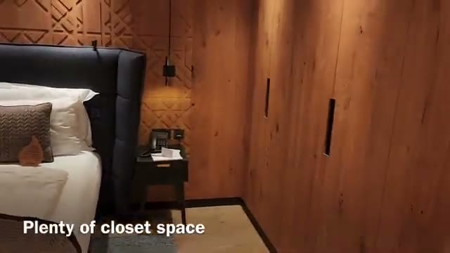

The room also offers extra beds for the kids, making this a genuinely workable setup for a family ski trip.

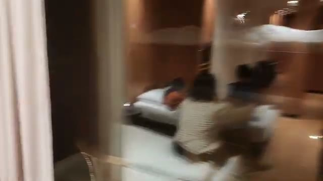

---

## 🌙 Outdoor Patio

At night, the hotel's outdoor patio area glows against the snow, with the lights of Selva village below.

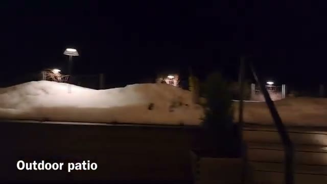

---

## 🛋️ Lounge & Bar

The lobby lounge is one of the hotel's most striking spaces — dramatic arched wooden columns, a sculptural fireplace, and deep armchairs arranged for après-ski evenings.

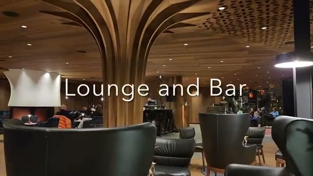

The bar area comes alive in the evening: live music plays every evening, per the hotel's program shown in the video.

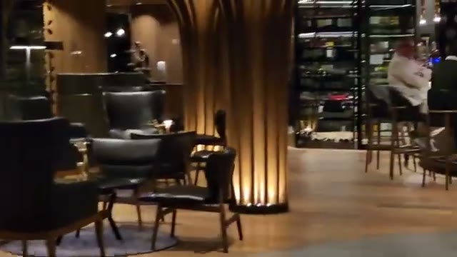

---

## 🍽️ Dining — Buffet, Dinner & Desserts

Food is a strong theme at Granbaita. There's a daily buffet selection at both breakfast and dinner.

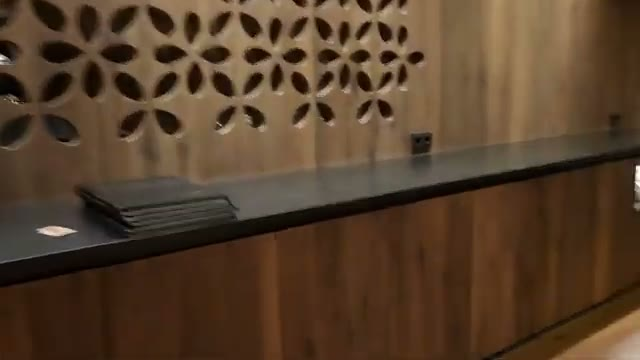

Dinner includes properly plated dishes — this one a composed starter with a fresh, modern presentation.

And the desserts earn their own highlight in the video: "Fantastic Desserts."

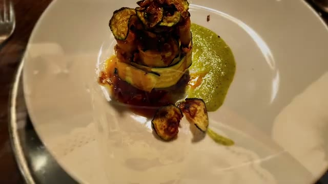

---

## 🎿 Ski Room

The ski room is clearly built for the purpose: numbered lockers, boot warmers, and — as of the video — ski rentals now available in-house too.

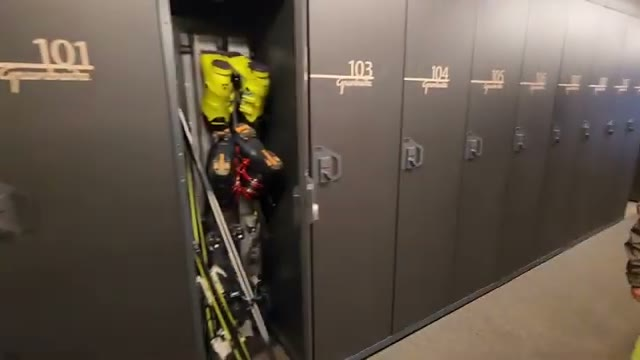

Walking straight from warm boots to the slopes is one of those small luxuries that defines a good ski hotel.

---

## 🏊 Indoor/Outdoor Heated Pool & Spa

The wellness area is a standout: a large indoor/outdoor heated pool, plus sauna and hot tub.

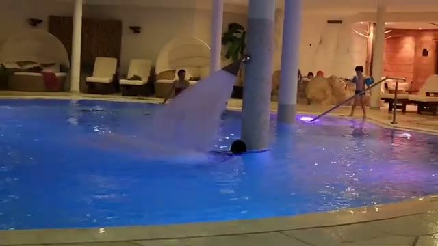

A heated outdoor pool with snow on the ground outside is hard to beat after a day on the slopes — and the drone shot of the turquoise pool against the snow-covered grounds says it all.

---

## ⚖️ Final Verdict

Hotel Granbaita delivers the classic 5-star Dolomites ski hotel package: a central Selva di Val Gardena location steps from the Kinderland ski area, a comfortable and family-friendly Superior Room, a striking lounge and bar with nightly live music, strong dining from buffet to desserts, and a heated indoor/outdoor pool with sauna and hot tub.

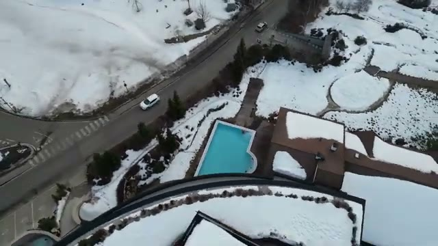

### Bottom Line

If you're planning a Val Gardena ski trip and want a true 5-star base in the heart of Selva, Hotel Granbaita is well worth a look.

---

## 🎥 Video Review

If you'd like to see the experience visually, check out our full walkthrough on YouTube (linked above).

---

*For more luxury travel reviews, follow along on our journey.*
