*Visited summer 2023 • Dubrovnik, Croatia*

You can watch our full hotel tour and experience here:



## Overview

On our trip to Dubrovnik, we stayed at Hotel More — a luxury hotel in the Lapad area, just outside Dubrovnik's Old Town.

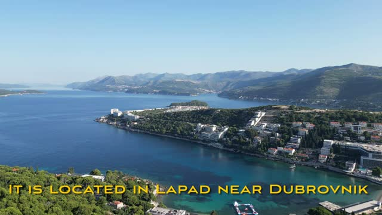

The property is made up of **3 buildings, all with pools**, and we stayed in **Villa Malo More** — a 2-bedroom villa with a kitchenette. The verdict from the video up front: great for families, with gorgeous views.

---

## 🏨 The Villa — Villa Malo More

We stayed in Villa Malo More, a 2-bedroom villa with a kitchenette.

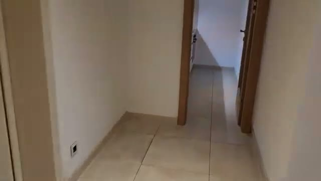

The kitchenette is compact but functional — a sink, a dishwasher, and a stocked coffee-pod station, handy for a longer family stay.

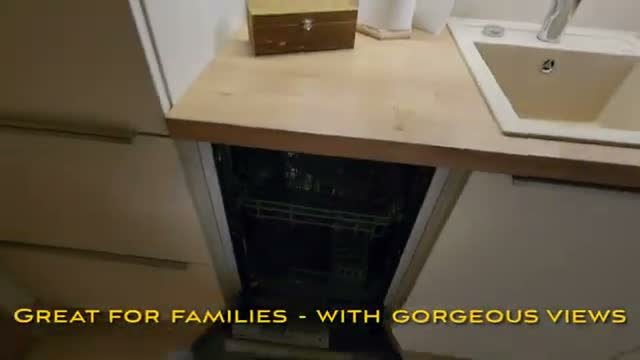

The main bedroom is comfortable with wooden floors, and the glass doors open straight onto the terrace with a sea view.

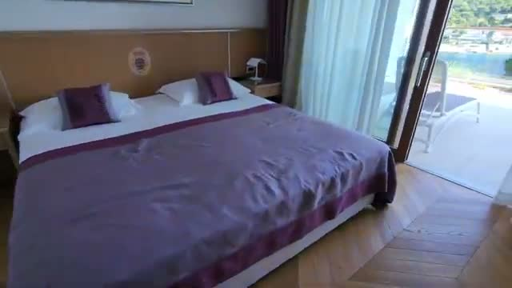

There's a second bedroom too — perfect for kids or a second couple.

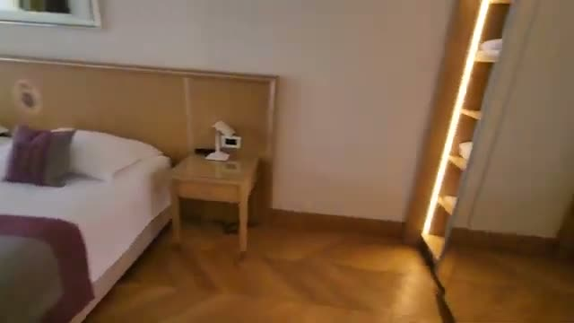

The bathroom comes with both a bathtub and a separate shower, a heated towel rail, and a clean, modern finish.

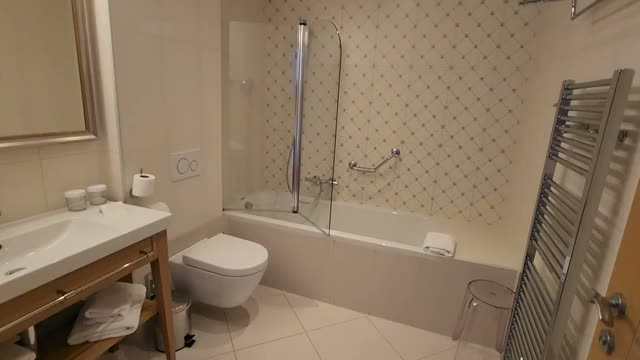

---

## 🌅 The Views & Terrace

The views are the star of the stay. From the terrace you look straight out over the bay to the green hills across the water.

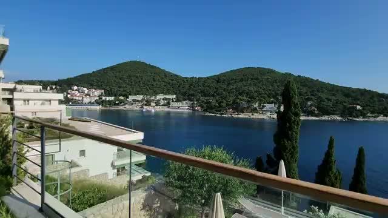

---

## 🏊 The Pools

All three hotel buildings have their own pools — and the one at our building is an infinity pool that seems to spill straight into the sea below.

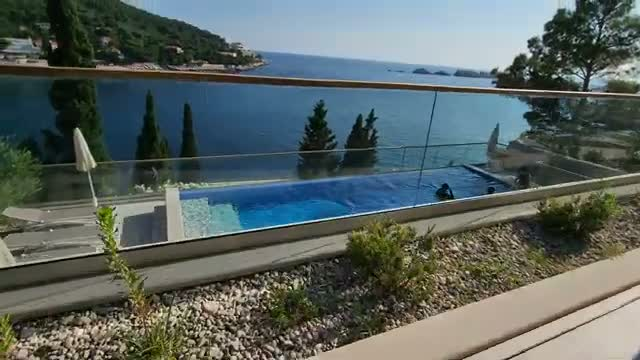

From the air, you can see the buildings tucked into the Lapad hillside, each with its pool.

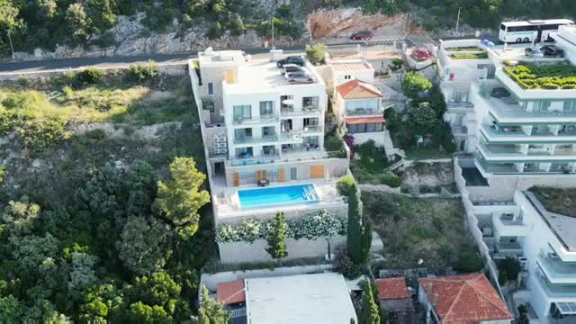

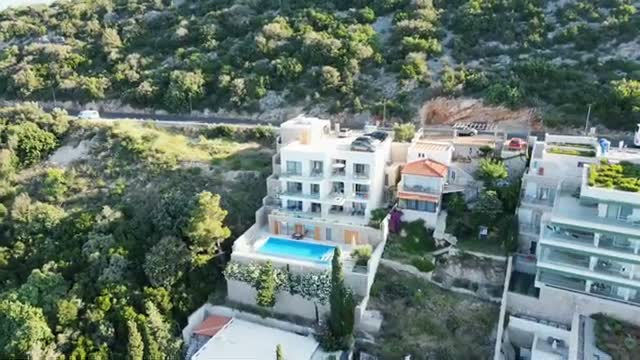

---

## 🏖️ The Beach & Cave Bar

The hotel sits right on a rocky beach. You can jump straight into the bay from their "beach" — and they also have a cave bar on the beach for drinks with your feet practically in the water.

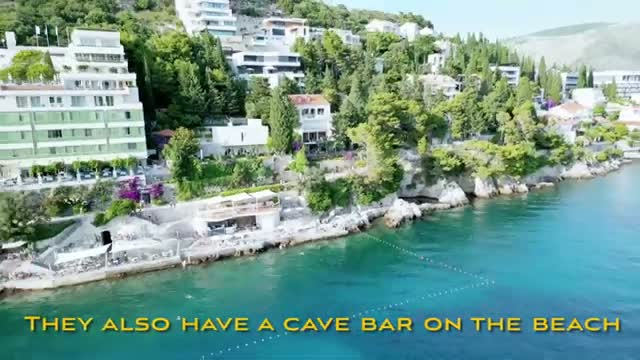

---

## 🍳 Breakfast

Breakfast earns an "excellent" in the video: a great spread with table service, enjoyed with a view over the sea.

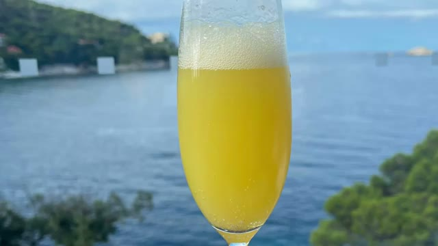

---

## ⚖️ Final Verdict

Hotel More is a family-friendly luxury pick in Dubrovnik. A 2-bedroom villa with a kitchenette, pools in every building, a swimmable rocky beach with a cave bar, an excellent breakfast — and that view from the terrace.

### Bottom Line

**Highly recommended** for a stay in Dubrovnik — especially for families.

---

## 🎥 Video Review

If you'd like to see the experience visually, check out our full walkthrough on YouTube (linked above).

---

*For more luxury travel reviews, follow along on our journey.*
