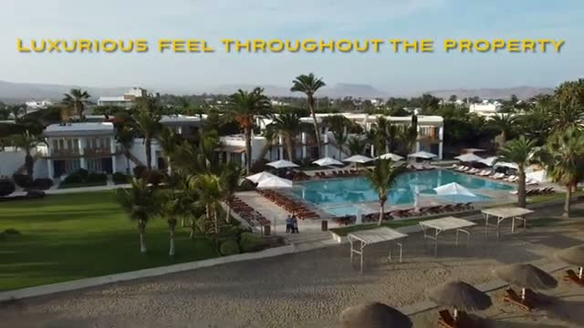
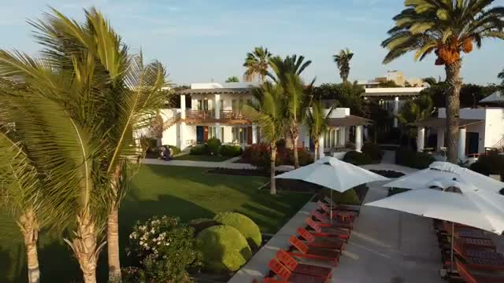
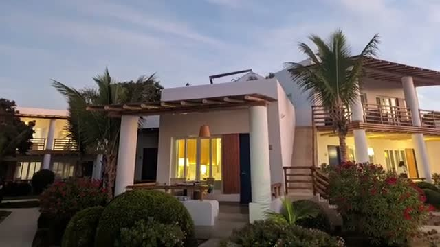
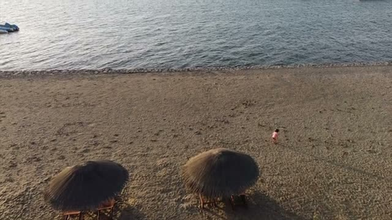
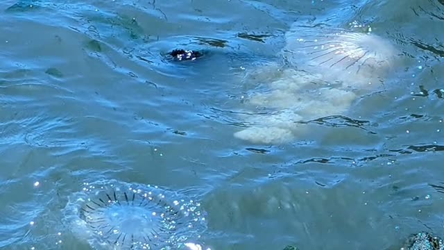
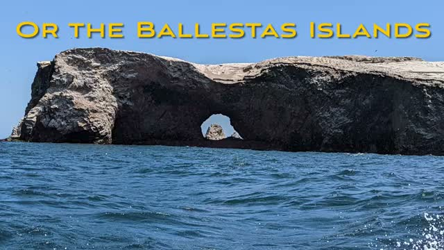
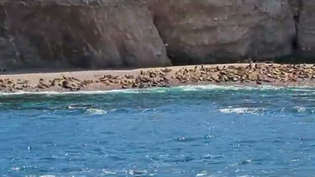

*Visited April 2023 • Paracas, Peru*

You can watch our full tour of the property and the surrounding sights here:



## Overview

Hotel Paracas is a Luxury Collection resort (part of Marriott) set on the desert coast of Paracas, Peru — the launch point for the region's two biggest attractions: the Nazca Lines and the Ballestas Islands.

The property has, as the video notes, a "luxurious feel throughout" — low-slung modern buildings with pergolas and terraces, set among palm trees and manicured lawns between the desert and the Pacific.

---

## 🏊 Pools & Grounds

The pools are the centerpiece of the resort: a large main pool lined with red loungers and white umbrellas, plus a smaller pool beside it, all fringed with palm trees and opening straight onto the beach.

An aerial view shows just how closely the pools sit to the shoreline — you can go from lounger to sand in a few steps.

The grounds are immaculate — palms, flowering bushes, and green lawns between the villa buildings, with rows of loungers and shaded umbrellas around the pool deck.

---

## 🏨 Villas

The accommodation is in low-rise villa buildings with wooden pergolas, terraces, and warm lighting — all of it photographed at dusk, when the property looks its best.

---

## 🏖️ Beach

The resort sits directly on the beach — but this is not a beach for swimming, and the video is explicit about it.

> "Don't recommend this as a swimming beach."

The reason is visible in the water itself: jellyfish close to shore.

That said, the beach is still a pleasant place to walk, and there's a pier nearby — which is how you leave for the Ballestas Islands.

---

## 🍽️ Dining

The on-property restaurant is presented as a nice spot for lunch — and the pisco sours are clearly a highlight.

---

## 🗺️ Day Trip: The Nazca Lines

The video's headline recommendation is using the hotel as a base for the Nazca Lines — the ancient geoglyphs etched into the desert.

From the boat trip toward the Ballestas Islands you also pass the hillside geoglyphs of the Paracas coast — a bonus sight on the same excursion.

---

## 🦭 Day Trip: The Ballestas Islands

The boat trip to the Ballestas Islands is the other must-do: rocky islands with dramatic arches and cliffs, home to colonies of sea lions.

The ride out is quick and scenic — and given the jellyfish situation on the hotel's own beach, it's the best way to get in (and around) the water.

---

## ⚖️ Final Verdict

Hotel Paracas is exactly what it looks like: a polished Luxury Collection resort with beautiful pools, manicured grounds, and a great location for the two excursions that define this corner of Peru.

The honest caveat from the video is the beach — don't come expecting to swim off the hotel's sand. For everything else — pools, grounds, lunch, and the Nazca Lines and Ballestas Islands on the doorstep — it's a strong pick.

---

## 🎥 Video Review

If you'd like to see the experience visually, check out our full walkthrough on YouTube (linked above).

---

*For more luxury travel reviews, follow along on our journey.*
