# Hotel U14 Helsinki: A Marriott Autograph Collection Gem by Market Square



We spent a few nights at **Hotel U14** in Helsinki, a Marriott Autograph Collection property tucked one block in from the harborfront. Between the location, the boutique design, and a couple of excursions we booked around the stay, this turned into one of our favorite city hotel experiences in a while.

## Getting There and Getting Oriented

From the airport, the taxi stand runs a **fixed rate of about 38 EUR to the city center** - good to know going in so you're not surprised by the meter.

Hotel U14 is one of **2 Marriott properties in town** - the other, St. George, is a Design Hotels property rather than Autograph Collection. That distinction matters more than you'd think, and we'll come back to it at the end.

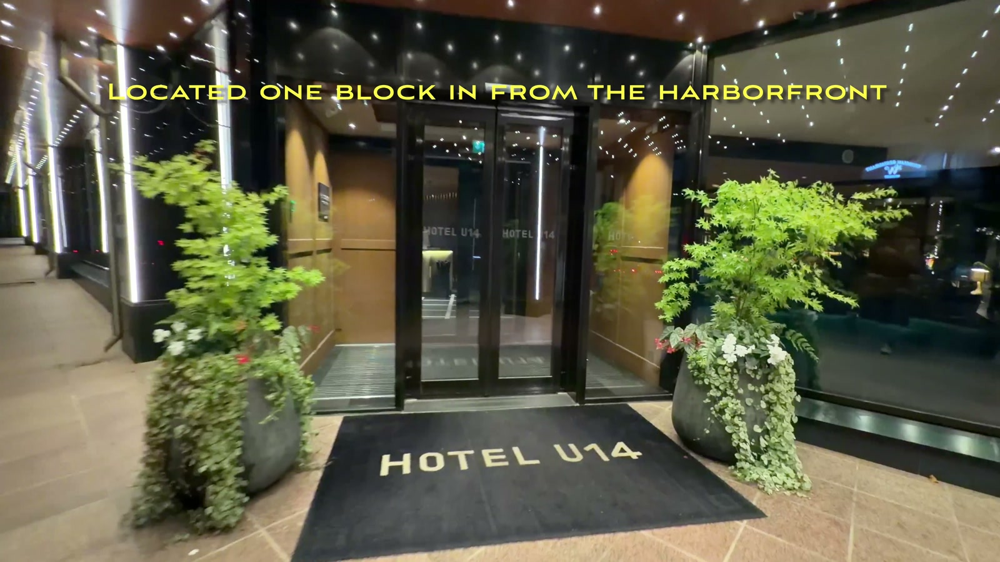

The hotel is **located one block in from the harborfront**, and it's also **just a block from Market Square** - Helsinki's historic waterside market with its fountain, ferris wheel, and food stalls.

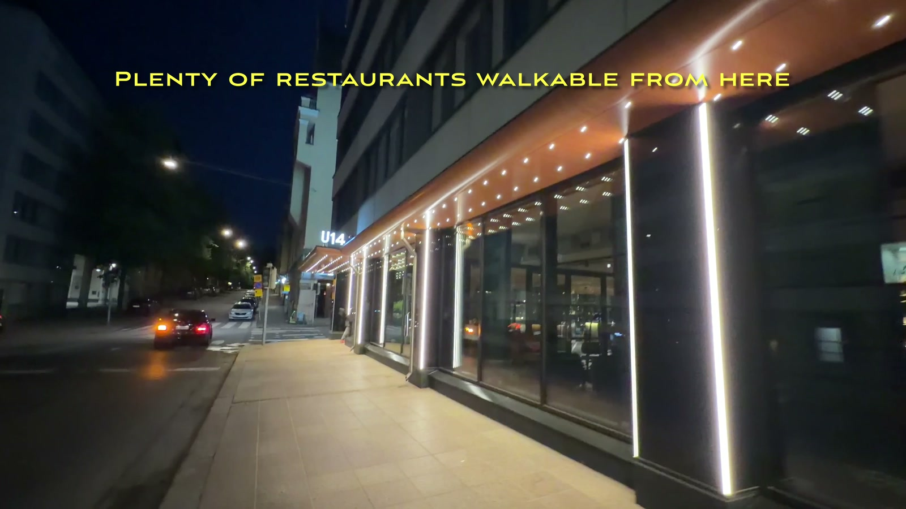

There are **plenty of restaurants walkable from here**, so you're never far from dinner options regardless of what you're in the mood for.

## Chic, Boutique Lobby

The lobby sets the tone immediately - genuinely **chic and boutique**, with green velvet seating and striking geometric window screens that filter light in during the day.

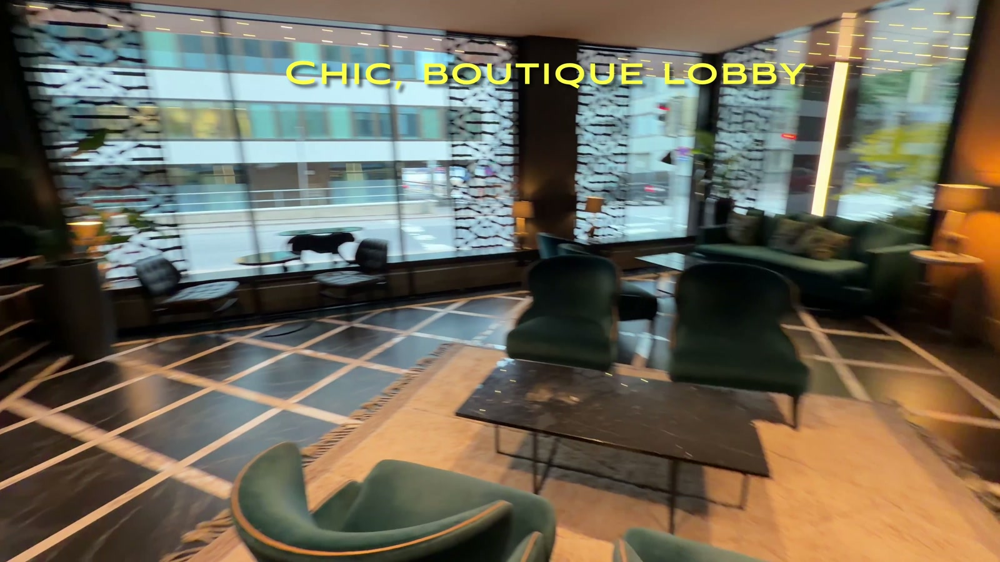

## The Room: Trendy, With Two Double Beds

We booked a **"Trendy Guest Room" with two double beds**, and there was **enough space for luggage** without the room ever feeling cramped - a black upholstered bed frame, a zebra-print rug, and a moody, well-designed color palette throughout.

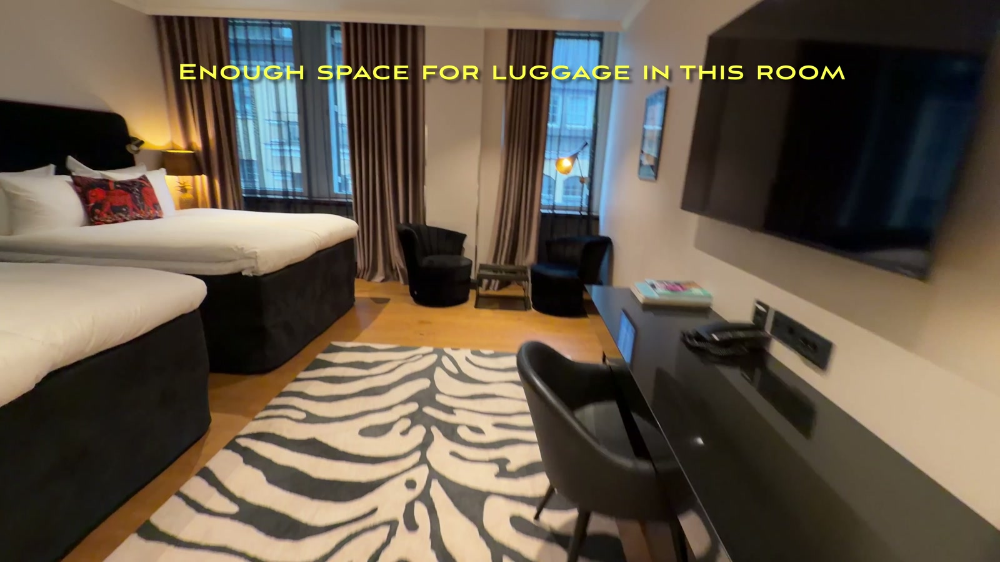

A few nice details:

- **Robes and slippers** are provided in the closet.
- **Wine is part of the minibar menu** - a nice touch alongside the usual snacks.
- Bedside you'll find **light controls and an outlet with USB ports**, next to a quirky brass pineapple lamp.
- The **TV has no apps but supports HDMI devices**, so bring a streaming stick if you want your own content.
- **Not much of a view, but the high floor helps** - we didn't book this hotel for the skyline, and that was fine.

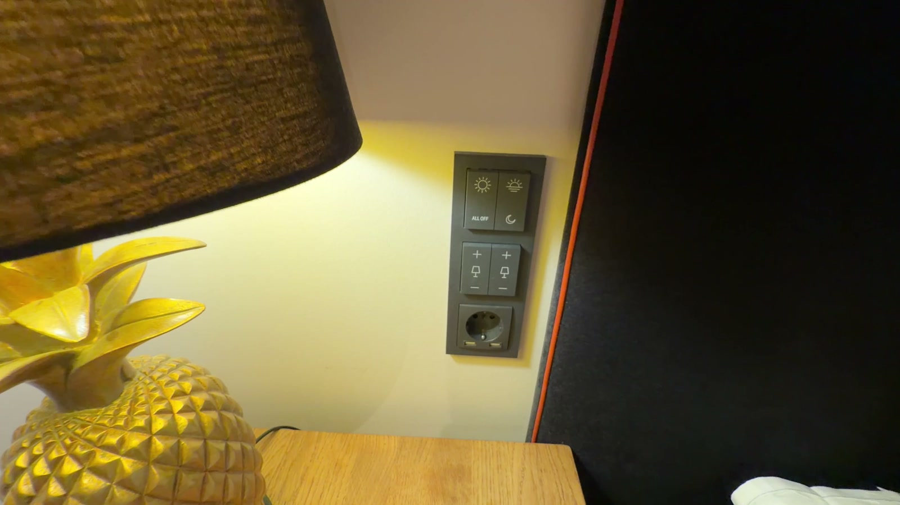

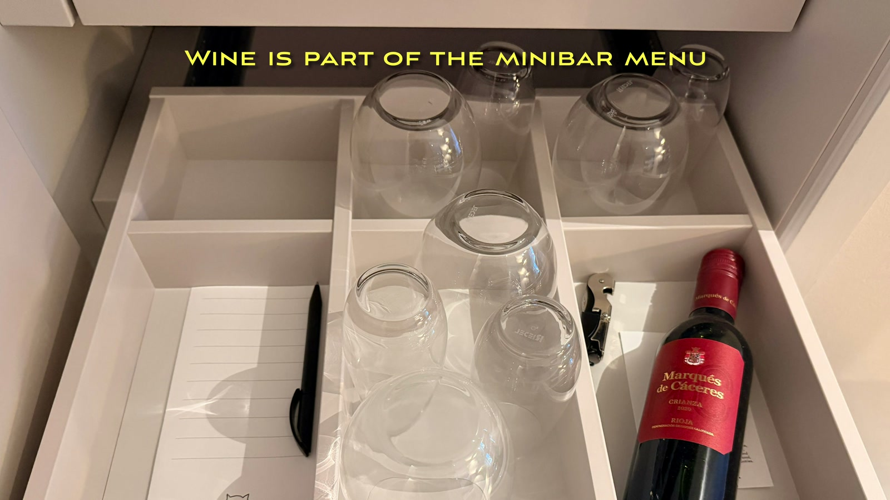

## Bathroom

The bathroom has a **shower stall - no tub** - and otherwise **all the usual amenities**, set against striking geometric black-and-white floor tile.

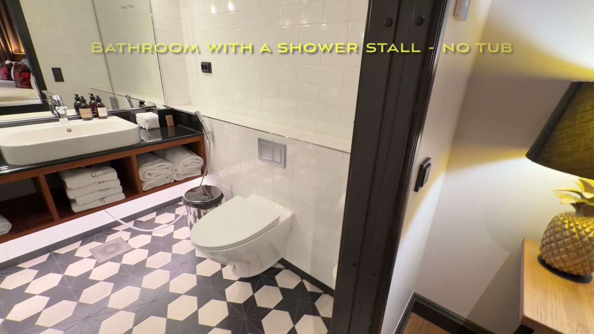

One local quirk worth flagging: the **bidet faucet seems to be standard in Finland**, so don't be surprised to find one built into the sink.

## Gym and Sauna

**Floor -1 has a small gym that's open 24 hours** - not large, but enough equipment (treadmills, a cable machine, free weights) to get a workout in without leaving the building.

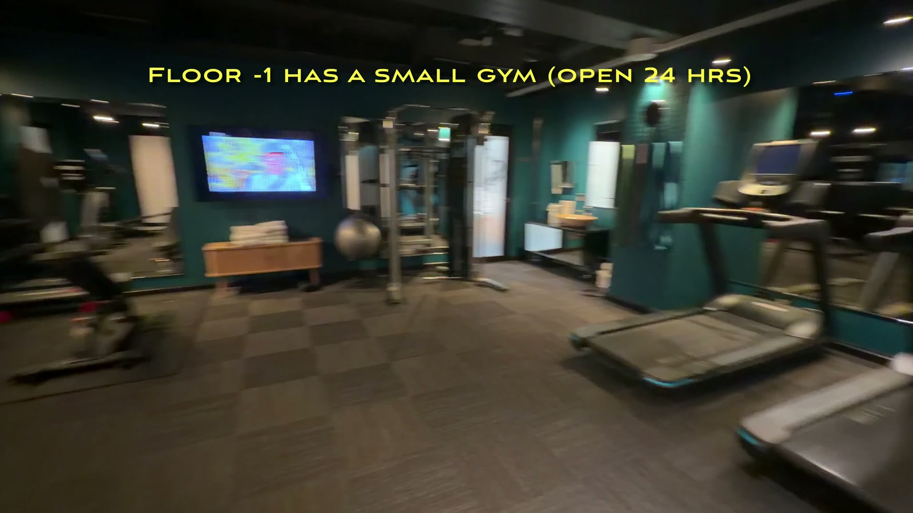

And, this being Finland, there's **a sauna of course** - unisex, with posted opening hours and instructions for first-timers.

## Breakfast at Version

Our **room rate included the splendid breakfast**, served in the hotel's own restaurant, called **Version**. The buffet spread included fresh fruit, salads, pastries, and all the usual breakfast staples.

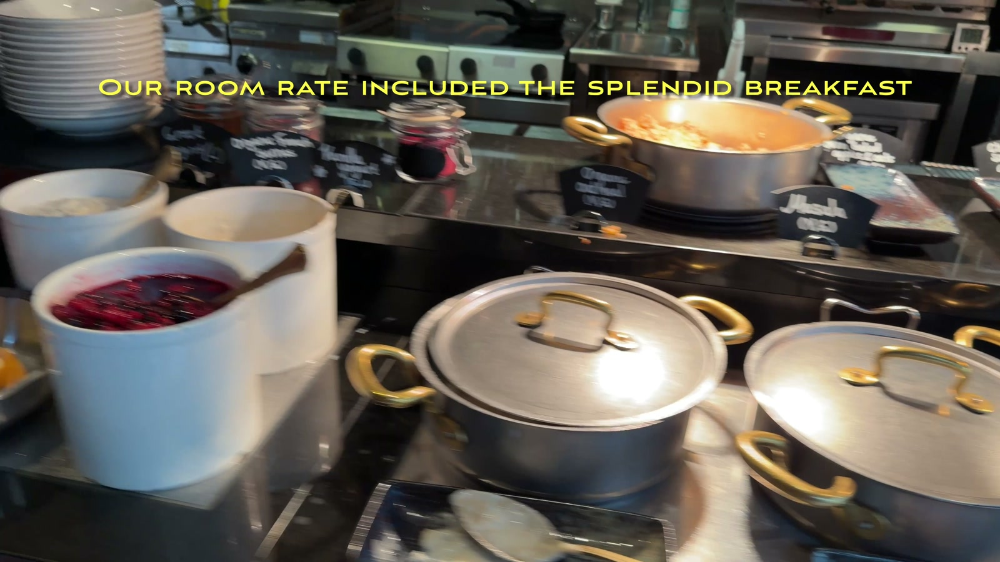

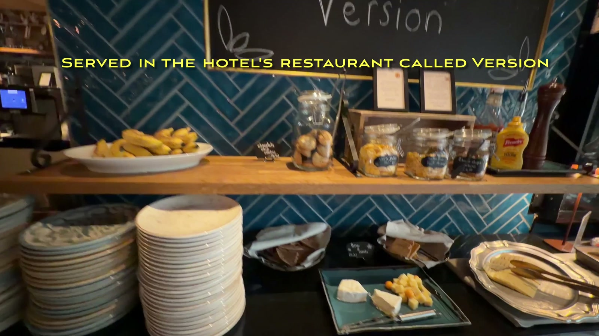

There's also a proper **coffee, tea, and juice station - and yes, marshmallows too** - with automatic espresso machines branded for the restaurant.

## A Day Out: Suomenlinna by Private Boat

While we were there, **we booked a private boat charter for the morning** out to **Suomenlinna and the archipelago with Helsinki Cruise Charters**. It's an easy, scenic way to see the sea fortress and surrounding islands without dealing with public ferry schedules.

## Sunset Dinner at Loyly

Later that evening we had a **beautiful sunset dinner at Loyly**, the well-known waterfront sauna-and-restaurant complex. Between the sea views, the pink evening sky, and the deck seating right over the water, it's a memorable way to spend an evening in Helsinki.

Worth noting if you want to make a full evening of it: **they also have a sauna, plus the option to dip in the sea** right off the deck.

## Bottom Line

We'd absolutely **recommend Hotel U14** - and specifically, we'd recommend it over the other Marriott in town. Because **U14 is Autograph Collection while St. George is a Design Hotels property, U14 comes with meaningfully more Marriott Bonvoy Platinum perks** - a detail worth knowing before you book if you carry status. Add in the boutique lobby, a genuinely well-designed room, a good breakfast, and a location that puts Market Square and the harborfront a block away in either direction, and this was an easy stay to enjoy.

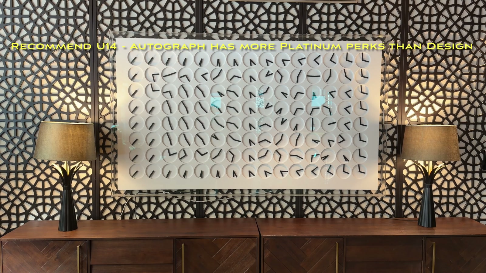
