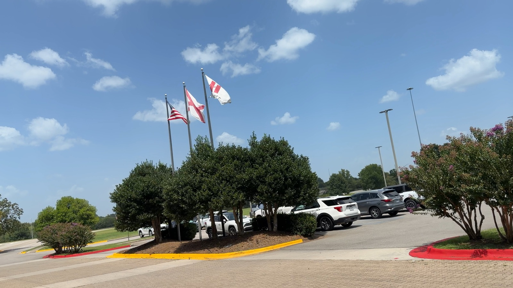
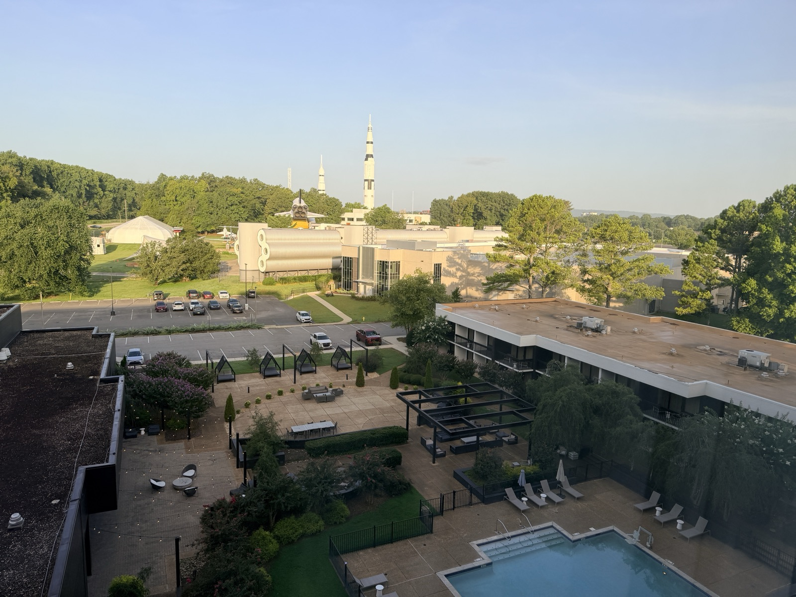
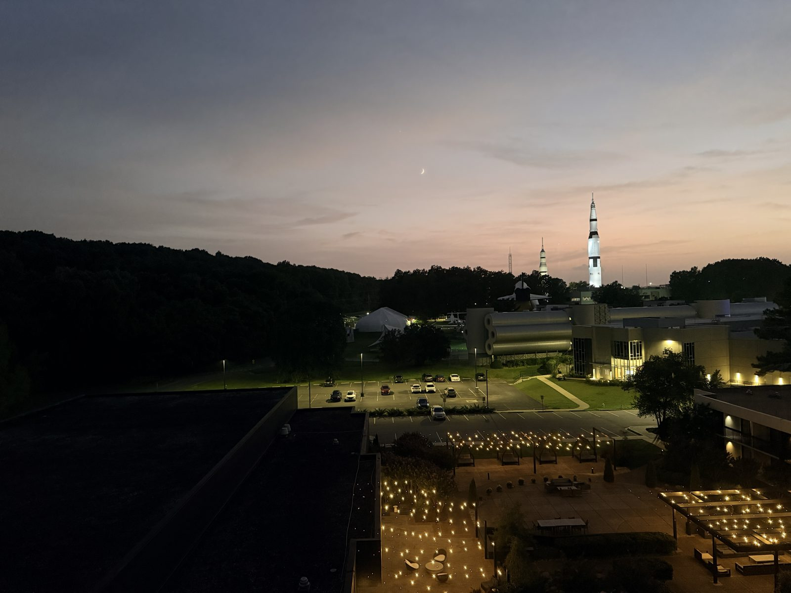
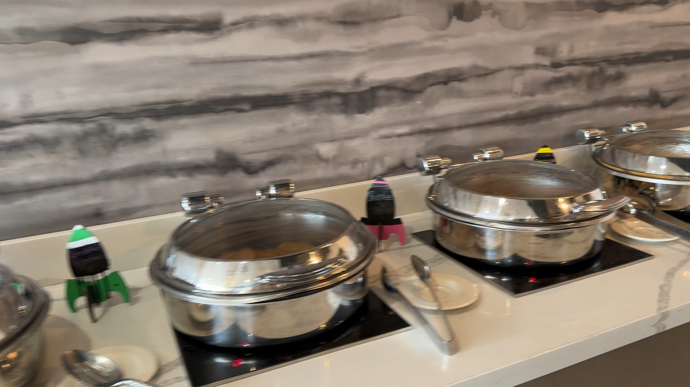
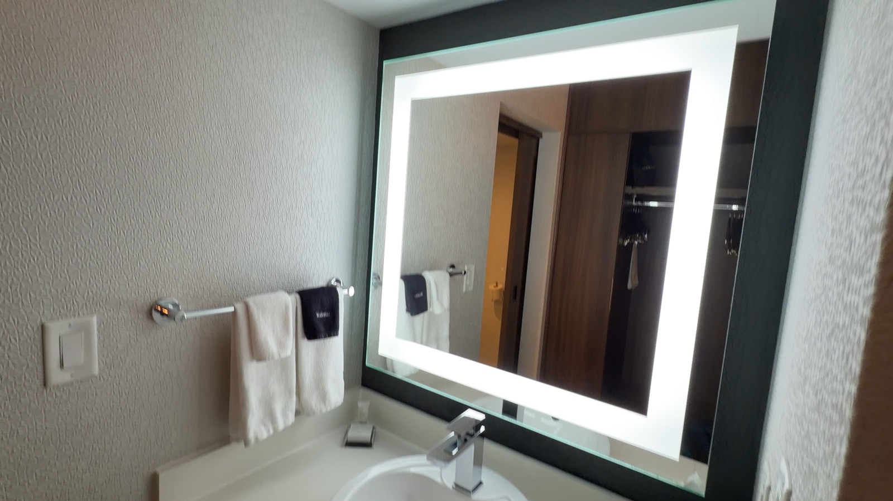
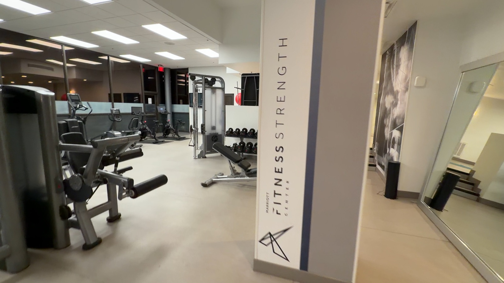

# Huntsville Marriott Space & Rocket Center: A Great-Value Family Stay



We spent a recent weekend at the **Huntsville Marriott at the U.S. Space & Rocket Center**, and it turned out to be one of the better value stays we've had in a while  -  especially if you're carrying Marriott Bonvoy Platinum status. Here's the full rundown.

## Right on the Rocket Center Property

The biggest draw of this hotel is simply where it sits: **inside the Space & Rocket Center property itself**, alongside the museum and the Space Camp facilities. If you're visiting the museum, you can walk over. If you have a kid at Space Camp, this is about as convenient as pickup and drop-off gets  -  no shuttle, no off-site drive, just a short walk across the grounds.

## The Room Upgrade & Those Rocket Views

As a Platinum Elite, we were upgraded to a **high floor room with a straight-on view of the rockets** on the museum grounds  -  including the Saturn V replica lit up after dark. It's a genuinely striking view, especially around sunset when the sky turns pink behind the rocket.

That same photo above also shows the **outdoor pool**, which looked very inviting for an Alabama summer  -  clean, well-kept, with plenty of loungers on the surrounding deck.

## Breakfast, Comped for Platinum

Breakfast was **comped for Platinum via a voucher**. It was myself and two kids, and the hotel only billed for one adult  -  which was then covered by the voucher, so breakfast for the three of us ended up being free. The breakfast staff were extremely nice, and service throughout was genuinely great, not just going-through-the-motions polite.

## Room Amenities

The room itself covers everything you'd expect from a mid-tier Marriott: toiletries, a hair dryer, iron, coffee maker, bedside chargers, and a mini fridge with a small freezer compartment. Nothing fancy, but everything worked and nothing was missing.

**Late checkout was no issue at all** as a Platinum member  -  requested it and it was approved without any back and forth.

## Gym & Laundry

The gym is a nice size for a hotel this category  -  not a cramped afterthought. Free weights, cable machine, a couple of bikes and cardio machines, and enough floor space to actually move around.

There's also a **self-serve guest laundry**, which is a nice bonus for a weekend trip that runs a day or two longer than your packing list accounts for.

## The Parking "Fee" That Wasn't

The Marriott app will prompt you to **pre-pay $12 for parking** when you check in digitally. Don't bother  -  when we checked in at the desk and asked about parking, they simply asked a couple of questions and handed us a tag to hang on the dashboard. No charge. It's worth asking at the front desk before you pay anything through the app.

## Also an Events/Conference Hotel

Worth knowing going in: this property also hosts events and conferences. It's not a massive property, so it never felt overwhelming or crowded with conference traffic during our stay, but don't be surprised if you see a meeting or two happening in the lobby area.

## Bottom Line

This was a **great value stay**, and an excellent one if you have Marriott Bonvoy Platinum status  -  the room upgrade and comped breakfast alone make a real difference. The location on the Space & Rocket Center grounds is the standout feature, whether you're there for the museum or dropping a kid off at Space Camp. Honestly, I went in braced for the negative reviews I'd seen on TripAdvisor, and I'm not sure what those were about  -  our experience didn't match them at all.
