

**If you only have 3 nights in Iceland**, this is the itinerary we'd suggest: the South Coast's waterfalls and black sand beaches, the glacier lagoon at Jokulsarlon, and the Golden Circle — a loop of about 13 hours 50 minutes of driving across 11 stops.

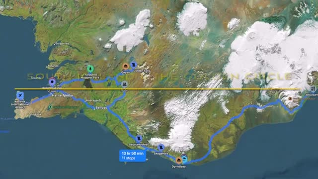

## Arrival: Rent a Car, Skip Reykjavik

Land at Keflavik and **pick up a rental car on arrival** — you need your own wheels for this trip. And here's the key tip: **don't stay in Reykjavik!** Head straight out to the countryside; you'll loop back through the capital on your way home.

**Go deeper:** [Tesla Model Y Europcar rental — Iceland scenic road trip, chargers and costs](https://youtu.be/cTaKdOwjHCc)

## Day 1: South Coast Waterfalls

**Drive along the south coast to Seljalandsfoss** — the first of many gorgeous waterfalls you'll experience on this trip.

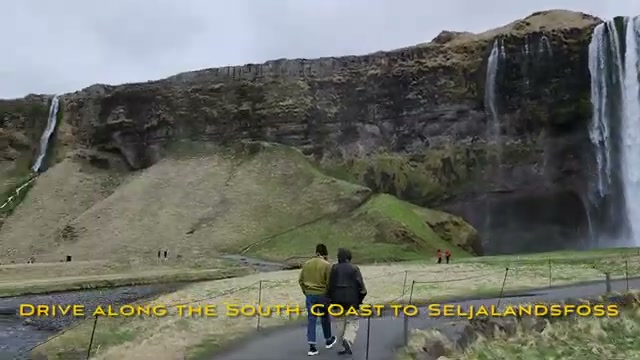

**A few miles down the road is Skogafoss**, wider and more powerful. **A hike to the top has wonderful views of the falls and the ocean** — worth the climb.

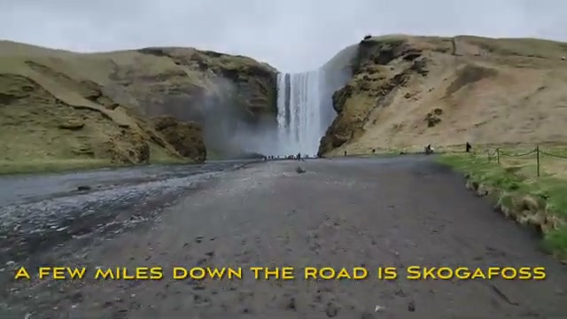

**Go deeper:** [South Iceland scenic drive — Seljalandsfoss, Skogafoss & Black Beach Suites in 4K](https://youtu.be/2v3onIe_oaY)

End the day by driving over to **check into Black Beach Suites near Vik**, your base for the night.

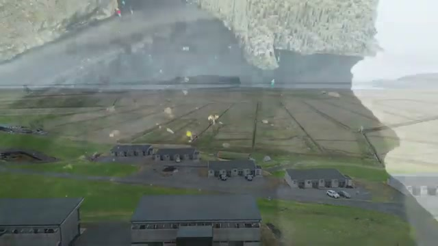

## Day 2: Black Sand Beach & Glacier Lagoon

Start with **Reynisfjara black sand beach, just down the road** — basalt columns, sea stacks, and a very moody shoreline.

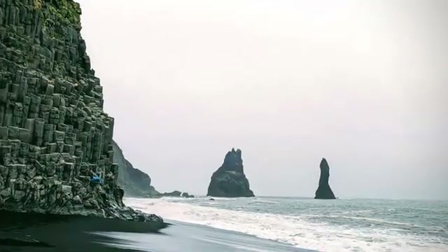

Then the long drive east to **Jokulsarlon glacier lagoon** the next morning — icebergs drifting in a lagoon, utterly out-of-this-world landscapes.

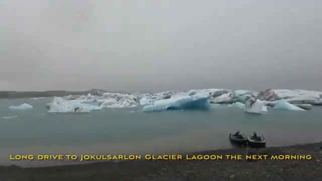

**Now head back west along the Ring Road**, stopping at **Dyrholaey for cliff-top views** over the black beaches.

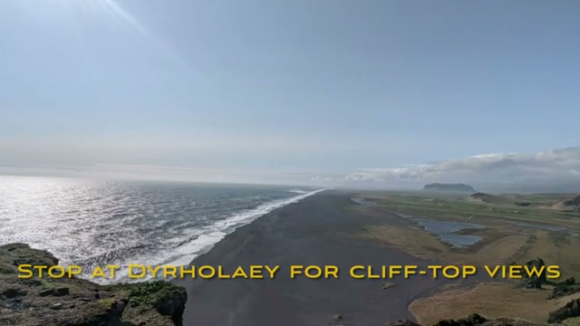

**Go deeper:** [South Iceland sightseeing — Dyrholaey & Reynisfjara black sand beach](https://youtu.be/6yZbZC_SbVc)

**Spend the night at an Airbnb near the Secret Lagoon**, in the Fludir area of the Golden Circle.

## Day 3: The Golden Circle

**Next morning, head out to the Golden Circle** — drive all the way to Fludir and work the loop from there.

**Start at Thingvellir National Park** — *this is where the continental plates meet*, and you can literally walk between North America and Europe.

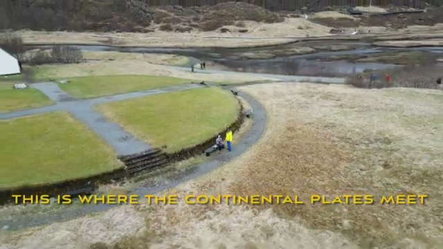

**Go deeper:** [Thingvellir National Park — Golden Circle, Mid-Atlantic Ridge](https://youtu.be/IvSKNeB5Ylg)

**Next, head to Geysir** — if you've been to Yellowstone's geysers, the original is still worth seeing.

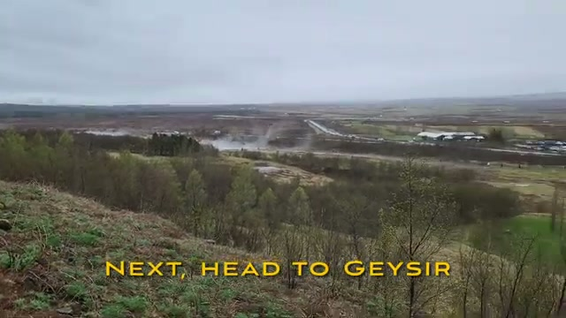

**Save the best for last: Gullfoss**, the mighty two-tiered falls — Iceland's most famous waterfall, and the highlight of the day.

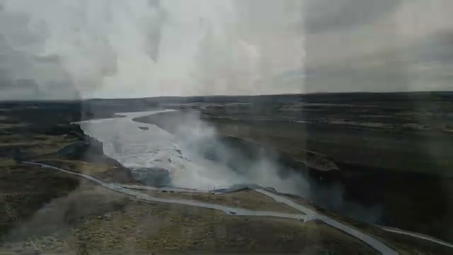

**Go deeper:** [The majestic Gullfoss — Iceland's most famous waterfall in 4K](https://youtu.be/p4h7aQ_lSU4)

**End the day with a soothing hot bath** at the **Secret Lagoon** — Iceland's oldest natural pool.

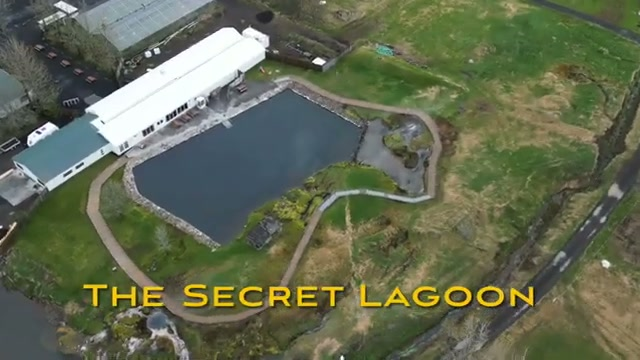

**Go deeper:** [Secret Lagoon — Golden Circle hot springs, know before you go](https://youtu.be/pGwb9vMBWWs)

## Day 4: Perlan & Reykjavik

On your last morning, **see the ice cave and show at Perlan** in Reykjavik, then **stop by downtown Reykjavik on the way to the airport** — Hallgrimskirkja and the waterfront are an easy final stroll before you fly.

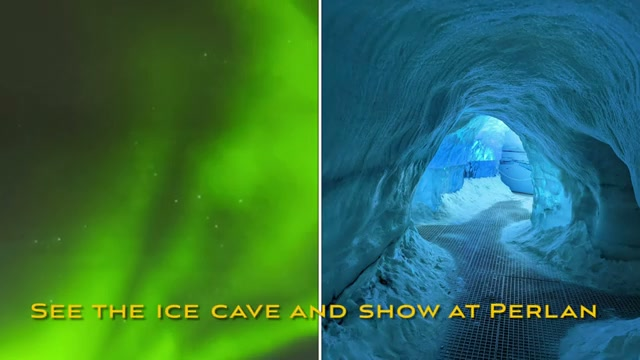

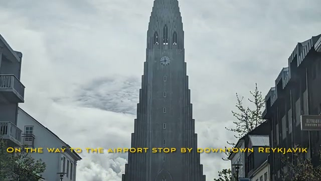

## Verdict

Three nights is tight, but this loop hits Iceland's greatest hits without feeling rushed: waterfalls, black beaches, a glacier lagoon, geysers, and a hot spring to finish. Rent the car, skip Reykjavik on arrival, and save it for the last day.
