

We spent 8 days recently in Kyoto — plus Tokyo — without the JR Pass. At ¥50,000 for a 7-day standard pass, the math just doesn't work for most short-term tourists anymore. Here's the exact system we used instead: Suica on the iPhone for all local transit, the SmartEX app for bullet trains, and a physical ICOCA card for our child.

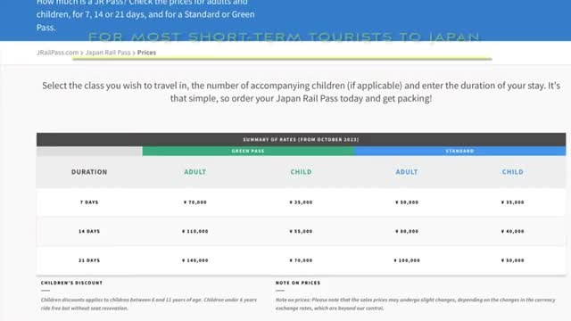

## Why we skipped the JR Pass

The JR Pass used to be the default answer for Japan trip planning, but the price hike changed everything. For most short-term tourists doing the classic Kyoto–Tokyo route, buying individual tickets as you go now comes out cheaper than the pass. We ran the numbers for our 8 days and didn't come close to justifying ¥50,000 per adult — so we skipped it entirely and booked everything ourselves.

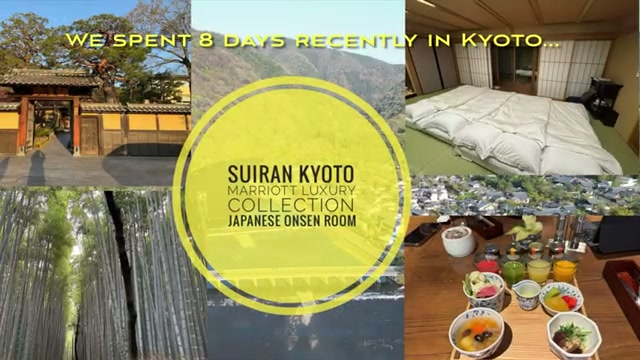

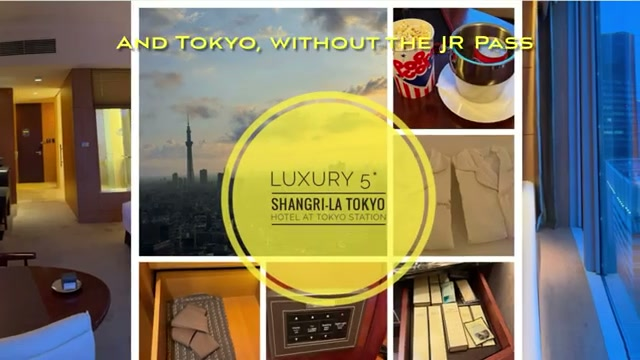

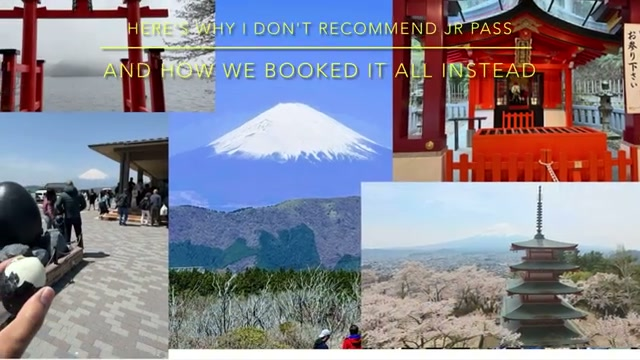

## Suica on iPhone: easiest if you have an iPhone

The single biggest simplification: put your transit card in Apple Wallet before you even land. On iPhone, go to Wallet → Add → Transit Card → Japan, and you'll see the three main IC cards: Suica, ICOCA, and PASMO. Any of the three should work fine for trains, subways, buses, and even convenience store purchases across Japan — they're interchangeable for a tourist.

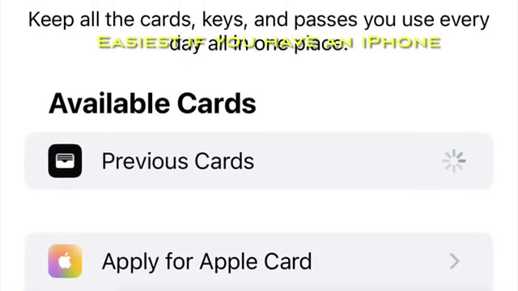

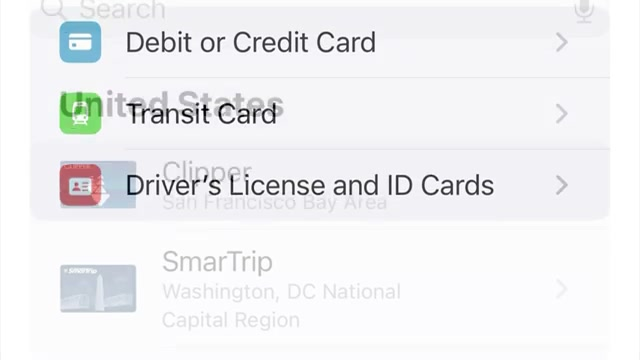

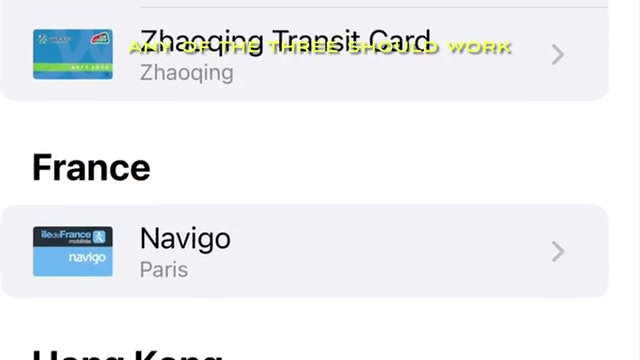

We picked Suica. Setup takes a couple of minutes, and topping up is painless — no problem topping up with a Visa credit card, which hasn't always been the case with foreign cards in Japan.

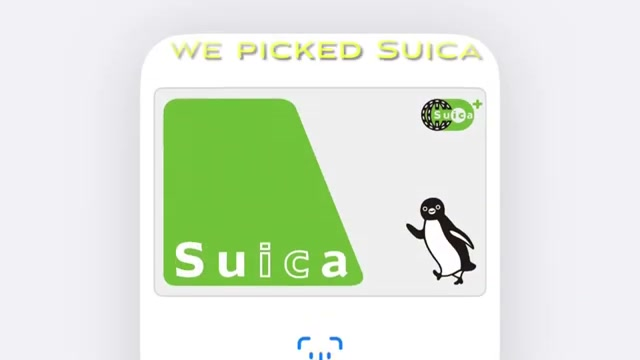

## Kids need a physical card: children's ICOCA

One exception to the all-digital setup: children can't use a phone-based IC card for child fares. We picked up a physical ICOCA for the child in our family — children's ICOCA cards ride at half price, but you must buy them in person and present the child's passport. Look for JR-WEST ICOCA service areas, Midori-no-madoguchi ticket offices, or Green ticket vending machines with operator support.

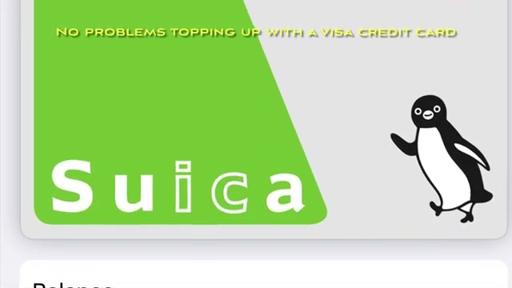

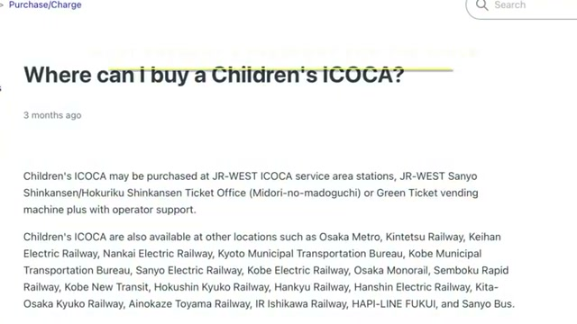

## Shinkansen: get the SmartEX app

For bullet trains, get the SmartEX app — it's how you buy Shinkansen tickets on your iPhone, pick exact trains, and reserve seats. This is the piece that replaces the "just hop on with the pass" convenience, and honestly the reserved-seat experience is better.

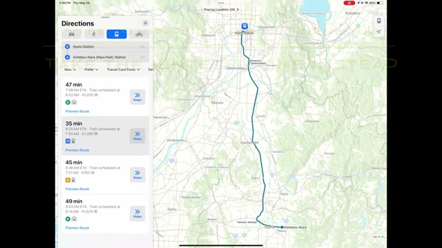

Two things to know. First, if you're traveling with oversized baggage, you **must** pick reserved seats — and specifically seats with the oversized baggage area. Baggage goes behind your seat in the last row (look for the rows marked with the oversized baggage compartment, e.g. 16A–16E or 18A–18C depending on the train).

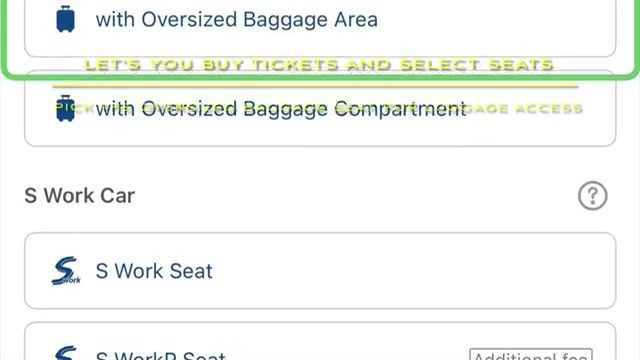

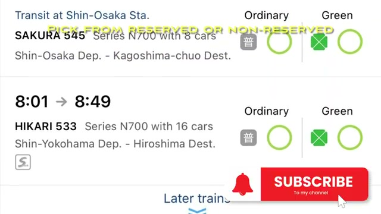

Second, link it all together: in SmartEX you can designate an IC card number to your ticket, so your Suica becomes the ticket for boarding — tap in with the phone, no paper ticket needed.

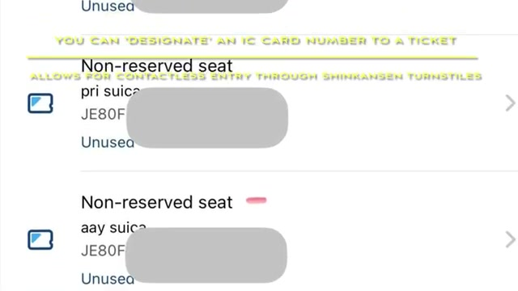

## Tokyo local transit: don't default to JR

Within Tokyo, the JR Pass mindset ("take JR for everything") will send you on slower routes. Example: getting from Tokyo Station to Shinjuku, the Marunouchi subway line is quickest — not JR. Check the actual fastest route rather than filtering for JR lines, now that you're paying per ride anyway.

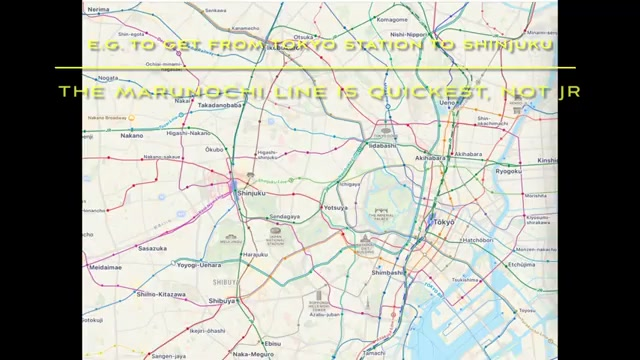

## Wrapping up

That's the whole system: skip the ¥50,000 JR Pass, put Suica in your iPhone's wallet for all local transit, use SmartEX for the Shinkansen (reserving seats with oversized baggage space when you need it), and grab a physical children's ICOCA with the kid's passport for half-price child fares. It covered 8 days across Kyoto and Tokyo with zero friction.

