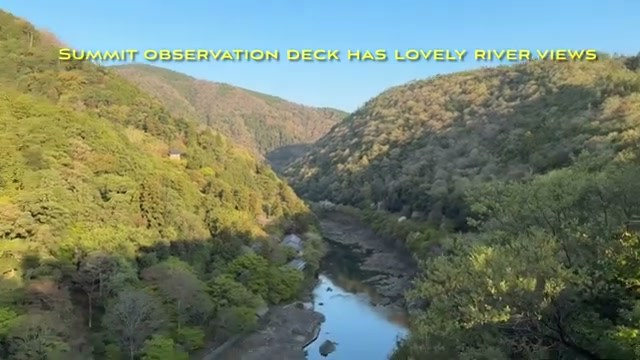
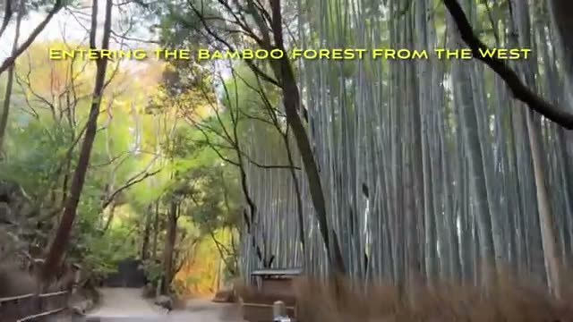
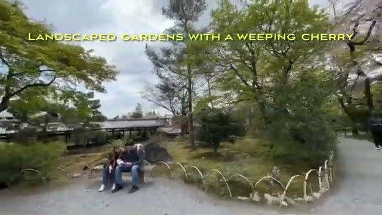
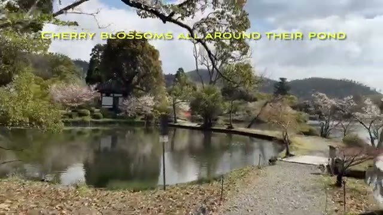
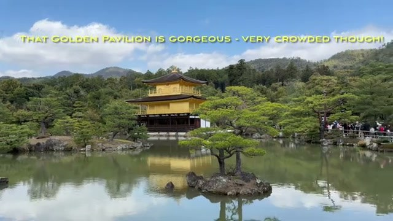
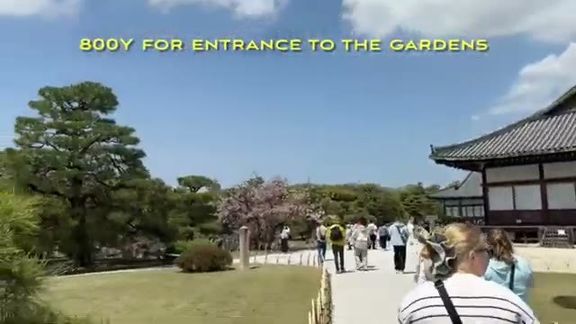
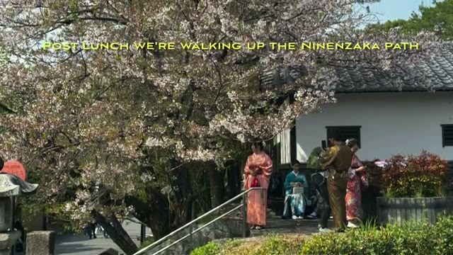
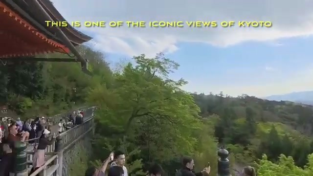
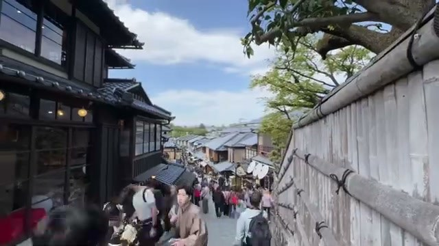
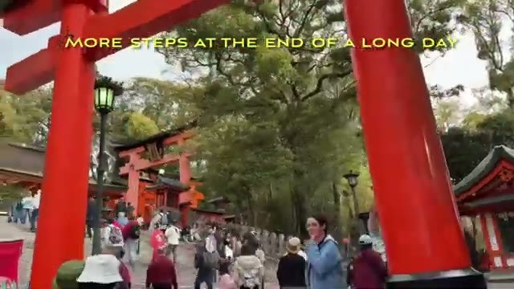

One very full day in Kyoto, done right: an early start in Arashiyama, the big-name temples, a castle before lunch, the old streets of Higashiyama, and Fushimi Inari at 5pm to close it out. We did it during cherry blossom season with a private car and driver, which made the packed schedule painless.



## Morning: Arashiyama

Start before breakfast with a walk through Arashiyama. Head up to the summit observation deck first — lovely river views, and you'll have it mostly to yourself that early.

Then enter the bamboo forest from the west. Even with the inevitable photo shoots, it remains one of Kyoto's prized experiences. Monks street-sweeping in the early morning add to the atmosphere.

Walk over to Tenryu-ji Temple nearby — a beautiful Zen temple. The gardens admission is 500¥, and the landscaped gardens with the weeping cherry are worth every yen.

## Daikaku-ji Temple

A short drive to Daikaku-ji, a Shingon Buddhist temple originally built in the 800s. At 9:30am there were no crowds — just beautiful grounds, cherry blossoms all around the pond, and the Shingyo pagoda gorgeous in the morning sun.

## Kinkaku-ji (Golden Pavilion)

Drive over to Kinkaku-ji and aim to arrive by 10:30am. Admission is 500¥ — and remember to carry loads of cash, since many temple admissions are cash-only. The Golden Pavilion is gorgeous, but be warned: very crowded, even mid-morning. Line up to ring the gong while you're there.

## Nijo Castle

One last attraction before lunch: Nijo Castle. It's a large complex with a moat and multiple palaces — 800¥ for entrance to the gardens, and the grounds were full of sakura when we visited.

## Afternoon: Ninenzaka & Kiyomizu-dera

After lunch, walk up the Ninenzaka path. It's a pedestrian area from that point on, and the most famous street in Kyoto was bustling — people in kimono, shops, and cherry blossoms overhead.

Head up the alleys to Kiyomizu-dera. The approach was packed but gorgeous in the afternoon sun. This part of the complex is open to all and had sakura everywhere. The main hall sits on the hillside with its large viewing platform — founded in 780, this is one of the iconic views of Kyoto. Don't miss a sip from the famous springs (high-tech UV sterilizing after each turn), and note the entire complex sits in a hillside forest.

Catch a glimpse of the Yasaka Pagoda on the way through the old streets.

## Finale: Fushimi Inari at 5pm

Our final attraction at 5pm: Fushimi Inari Taisha Shrine, with its famous pathway of a thousand torii gates. Be prepared for slow-moving crowds — and more steps at the end of a long day — but despite the overcrowding, it's a unique experience.

That wraps up a sakura-filled day of temple-hopping — back at the Suiran Hotel in Arashiyama.

## Practical tips

- **Private car with driver** made this schedule possible — no train logistics between far-flung stops.
- **Start before breakfast** in Arashiyama to beat the crowds at the bamboo grove.
- **Carry cash.** Temple admissions (500¥–800¥) are often cash-only.
- **Arrive at Kinkaku-ji by 10:30am** — it only gets more crowded from there.

## Go deeper

- [Sakura in Kyoto — One Day Sightseeing Tour with Private Car](https://youtu.be/X9pA0KD6YpU)
- [Himeji Castle — UNESCO Day Trip from Kyoto](https://youtu.be/fPi0PS4nCHg)
