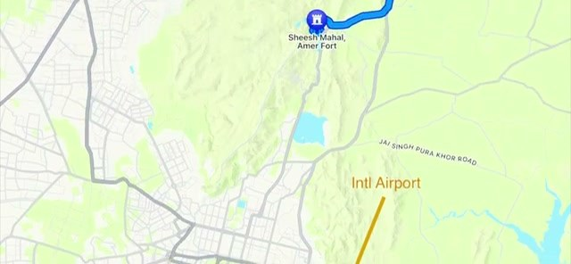
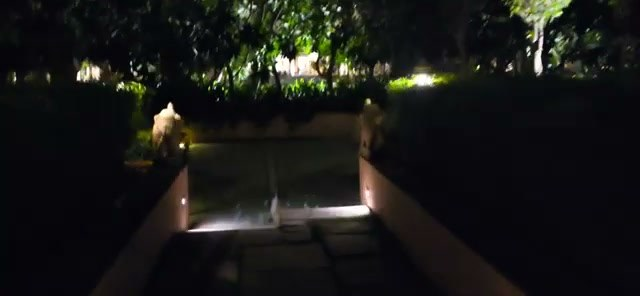
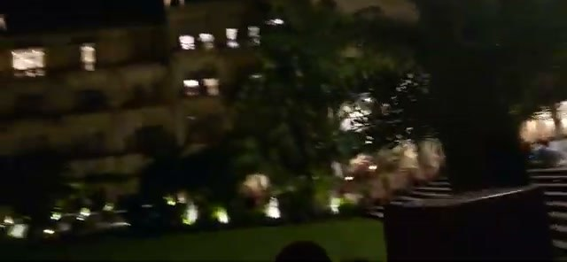
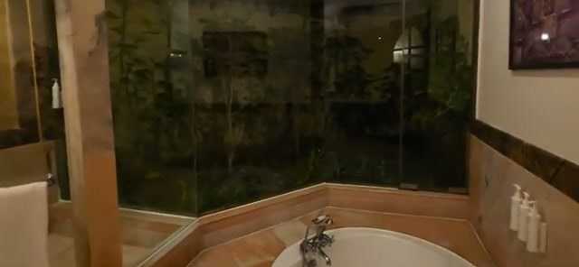
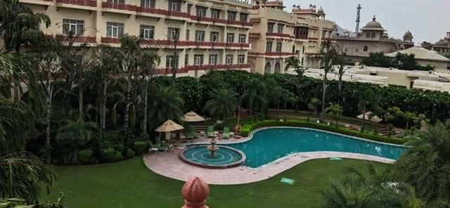
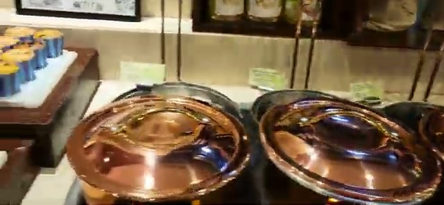
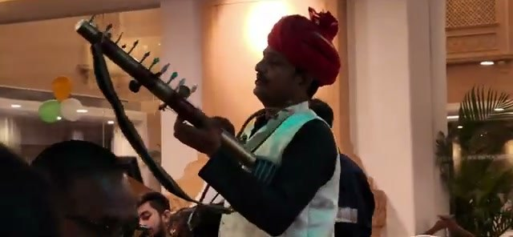
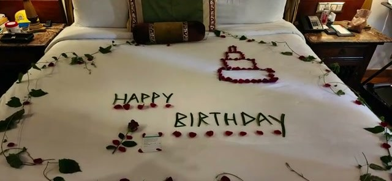
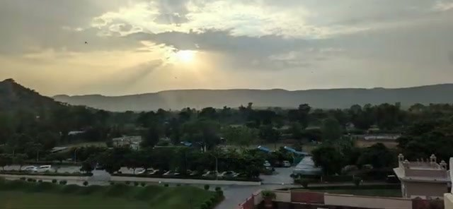



Le Méridien Jaipur Resort & Spa sits in Kukas, north of Jaipur — a resort cluster near Amer Fort that also includes Fairmont and Taj properties. It's a 5-star Marriott-flagged resort, and the video covers a short stay that started with a nice surprise: a Marriott Bonvoy Platinum Elite upgrade to a villa. Here's what the stay looked like.

## Location: Kukas, north of the city

The hotel is in the Kukas area, north of Jaipur city. Per the video's map, it's about a 28-minute drive to Amer Fort (Sheesh Mahal) — close enough to base a fort visit from the hotel — and the map also shows Jaipur International Airport to the south.

## The Bonvoy Platinum upgrade: a villa

As a Bonvoy Platinum Elite member, the stay was upgraded to a villa. Villas sit on the ground floor toward the back of the property, and there's plenty of open space throughout the resort — the night shots show long lit walkways through landscaped grounds.

The villas are very spacious, with four-poster beds — and they come with a back yard, which is a rare perk for a hotel room.

## Bathroom with a "forest" feel

The bathroom is massive, and the video's own caption calls it out: a "forest" feel, with greenery visible through the glass around the tub area. It's an unusual, memorable bathroom design — more spa-retreat than standard hotel bath.

## Pool area in the center of the resort

The pool sits in the middle of the resort, ringed by the main building and palm trees — a proper resort courtyard setup. This was the daytime highlight of the property in the video.

## Breakfast: the standout

Breakfast gets the strongest praise in the video — a "fabulous breakfast spread." The plated food includes an omelette with puri and chutney, and the buffet runs to copper chafing dishes and a tea station.

And breakfast comes with live entertainment — a traditional musician performing in the restaurant. That's a level of morning atmosphere most hotel breakfasts don't attempt.

## They go out of their way for special occasions

The stay coincided with a birthday, and the hotel decorated the bed with a "Happy Birthday" arrangement of petals and leaves — cake design included. It's the kind of gesture that costs the hotel little and lands well with guests.

## Verdict

Le Méridien Jaipur Kukas is a solid 5-star base for the Amer Fort side of Jaipur — roughly half an hour from the fort, in a resort belt with plenty of open space. The villa upgrade made this stay: ground-floor villa, four-poster bed, back yard, and a genuinely distinctive forest-feel bathroom. Breakfast is the other high point, with a strong spread and live music. If you're a Bonvoy member heading to Jaipur for the forts, this is an easy property to say yes to — especially if the upgrade fairy visits.

