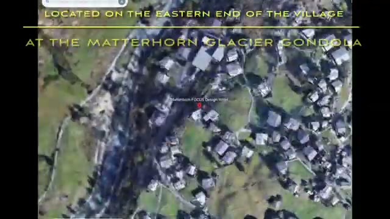
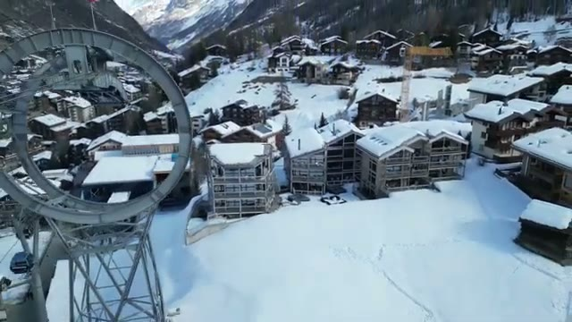
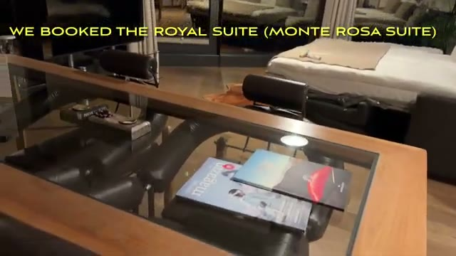
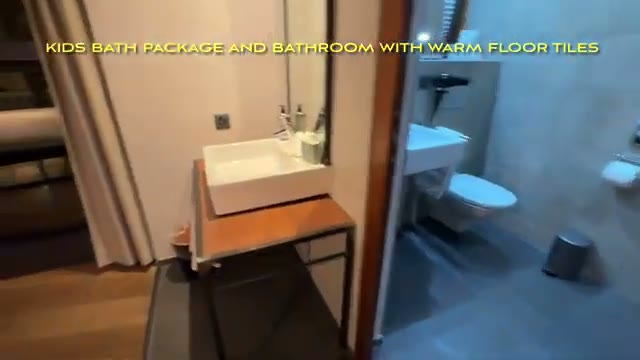
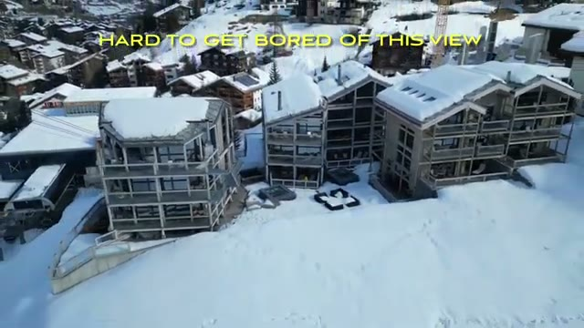
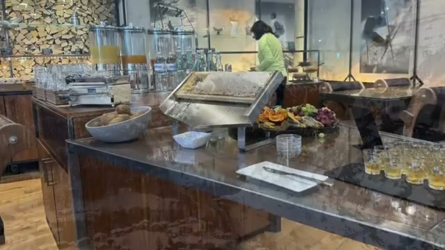
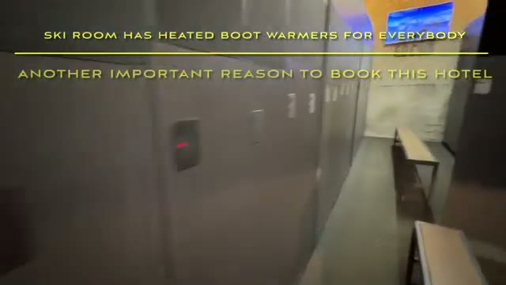
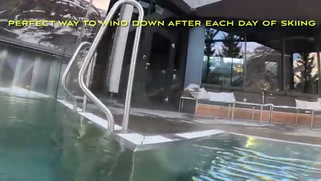
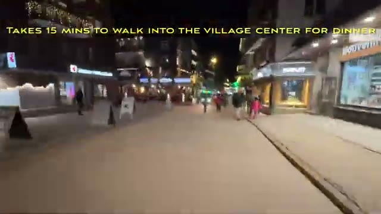

*Visited February 2025 • Zermatt, Switzerland*

You can watch our full hotel tour and experience here:



Zermatt is one of the most iconic ski destinations in the Alps, with breathtaking views of the Matterhorn and access to some of the best skiing in Europe. On our recent winter trip, we stayed at **Matterhorn FOCUS Design Hotel**, a 4-star superior property that blends modern alpine design, incredible mountain views, and a relaxing spa experience.

If you’re planning a ski vacation in Zermatt and want somewhere stylish, comfortable, and convenient to the lifts, this hotel is definitely worth considering.

---

## Arrival in Zermatt

One of the unique aspects of visiting Zermatt is that the village is **car-free**. Visitors typically arrive by train, and electric taxis or hotel transfers take you to your accommodation.

*The hotel sits on the eastern end of the village, right by the Matterhorn Glacier gondola.*

After arriving at the hotel, the first thing that stood out was the **architecture and design**. The property has a contemporary alpine style with large glass windows, warm wood accents, and terraces that frame the surrounding mountains.

*Snow-covered village rooftops with the gondola infrastructure nearby.*

And of course, if you’re lucky with the weather, you’ll immediately spot the **Matterhorn** towering above the village.

*The Matterhorn, seen from the gondola on the way up toward Klein Matterhorn.*

---

## Our Suite

We stayed in a **suite with a private terrace**, which gave us beautiful views of the mountains and village.

Highlights of the room included:

* Spacious layout with separate seating area
* Floor-to-ceiling windows letting in plenty of natural light
* Modern alpine décor with wood and stone elements
* A large bathroom with soaking tub and shower
* Private balcony/terrace with mountain views

*The Royal Suite (Monte Rosa Suite) — spacious seating area with the bedroom beyond.*

*Bathroom with vessel sink — the hotel also offers a kids' bath package.*

After a day on the slopes, it’s hard to beat returning to a warm, comfortable room with views like this.

*Hard to get bored of this view — the terrace looks out over the village rooftops.*

---

## Breakfast

Breakfast at the hotel was a great way to start the day before heading out to ski.

The buffet included:

* Fresh breads and pastries
* Eggs and hot dishes
* Meats and cheeses
* Fruit and yogurt
* Coffee, tea, and juices

*The breakfast spread — fresh and generous before a day on the mountain.*

---

## Ski Room & Gondola Access

For a ski vacation, convenience is everything, and this hotel does a good job here.

The **ski room** is well organized with:

* Individual lockers per room
* Boot warmers

*The ski room — heated boot warmers for everybody, another good reason to book this hotel.*

From the hotel, it’s just a **short walk to the Klein Matterhorn gondola**, making it easy to get on the mountain quickly in the morning.

*Riding the Matterhorn Express — the hotel gondola connects toward Riffelberg (switch at Furi).*

Zermatt’s ski area connects to **Cervinia in Italy**, offering a massive ski domain with stunning alpine scenery.

---

## Pool & Spa

One of the standout features of Matterhorn FOCUS is the **heated outdoor pool**.

Swimming in a warm pool while surrounded by snowy mountains is a pretty special experience.

The spa area also includes:

* Sauna
* Steam room
* Relaxation areas

*The heated outdoor pool — a perfect way to wind down after each day of skiing.*

It’s the perfect place to unwind after a long day skiing.

---

## Dinner in Zermatt

Zermatt is packed with excellent restaurants, from traditional Swiss mountain huts to upscale dining.

Some local specialties worth trying include:

* **Fondue**
* **Rösti**
* Swiss chocolate desserts

There are plenty of great dining options within walking distance of the hotel.

*The village center at night — about a 15-minute walk from the hotel for dinner.*

---

## Final Thoughts

Overall, **Matterhorn FOCUS Design Hotel** is an excellent base for a luxury ski vacation in Zermatt.

**What we loved:**

* Stylish modern alpine design
* Spacious rooms and suites
* Heated outdoor pool with mountain views
* Convenient access to the lifts
* Great breakfast and relaxing spa area

If you’re looking for a comfortable and stylish hotel for a winter trip to Zermatt, this property offers a great balance of **location, design, and relaxation**.

---

*Have you been to Zermatt? Let us know your favorite ski destinations in the Alps!*
