

Neos is an Italian budget airline — and as the video puts it, they don't have a business class. What they have instead is "Premium": effectively a premium-economy cabin. We flew it from Milan Malpensa Terminal 1 to New York JFK Terminal 1 on a Boeing 787, and here's what the experience was actually like.

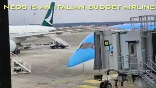

## What "Premium" gets you on the ground

At MXP, Premium includes fast track through security and lounge access. One thing to know: for USA-bound gates there's only one lounge option, and it was very crowded on a Saturday.

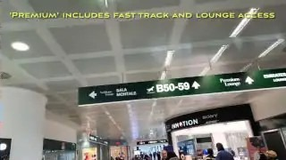

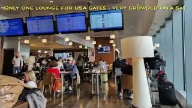

Also note the lounge is *after* exit passport control, so budget your time: leave room for passport control and don't get stuck shopping in duty free beforehand.

Boarding comes with priority for Premium/Group 1 (gate B55 on our flight). Boarding itself wasn't perfectly smooth — we were stuck on the jet bridge for a bit while the queue moved.

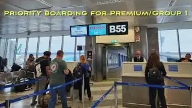

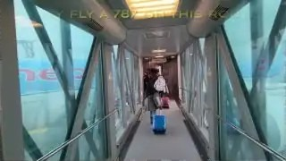

## The 787 premium cabin: 2-3-2, legroom, and a screen surprise

The aircraft is a Boeing 787, and the Premium cabin is laid out 2-3-2. First impressions were good — there's lots of legroom.

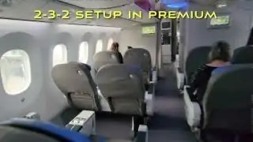

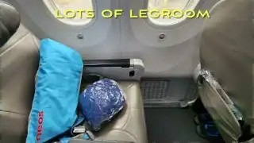

One quirk: there are no seatback monitors. The entertainment screens pull out of the armrests instead. They hand out cheap disposable earbuds — nothing fancy, but they do the job. There's also a small, basic amenity kit. And the best perk of the whole flight: free Wi-Fi included for the entire flight, via a voucher card handed out on board.

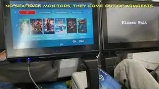

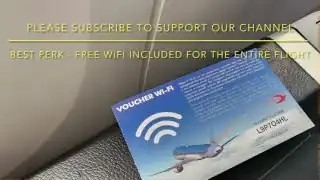

## Food and drink: honest verdicts

Drinks started before takeoff with prosecco or orange juice. One caveat for the long haul: no complimentary soda — just juices and wines.

The meal service began with a salmon starter, though there were no options for vegetarians or kids. For the entree, the chicken option was served (they had pasta for the vegetarians).

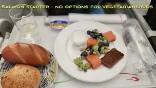

A cheese platter followed, and then the verdict the video doesn't sugarcoat: dessert was the only good part of the meal. Coffee came after dessert — served with creamer, not fresh milk. A small snack was served before landing.

## Seat comfort: levers, leg rest, real recline

The seats have levers for both recline and the leg rest, and the recline is genuinely decent — a good amount to actually get some rest on the overnight crossing.

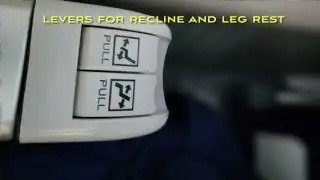

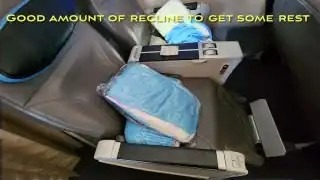

## Bottom line

On-time arrival into JFK, and the video's verdict: "I'd fly them again at premium economy prices." That sums it up — Neos Premium isn't business class and doesn't pretend to be, but as a premium-economy product with lounge access, free Wi-Fi, and a comfortable seat, it's a fair deal at the right price.

