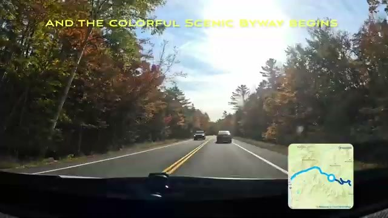
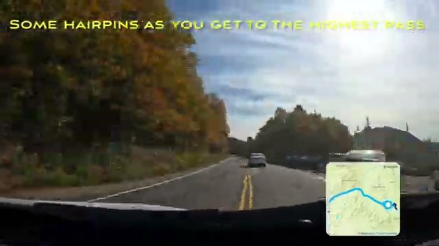
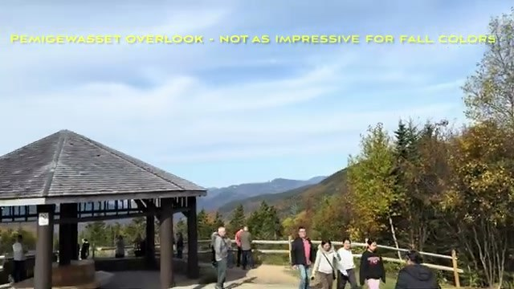
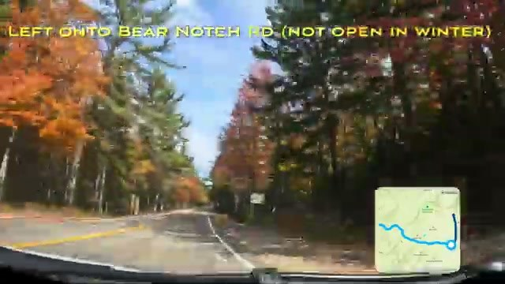
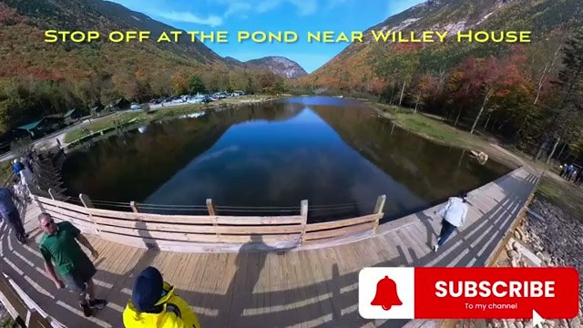
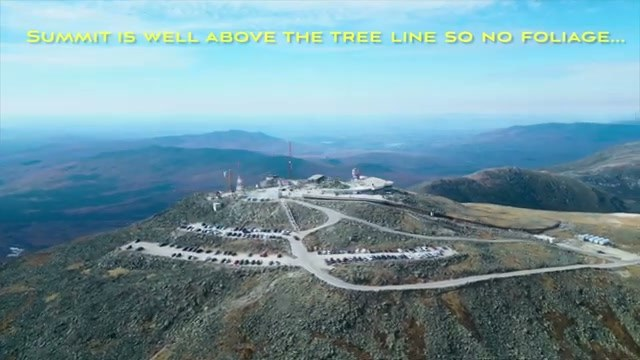
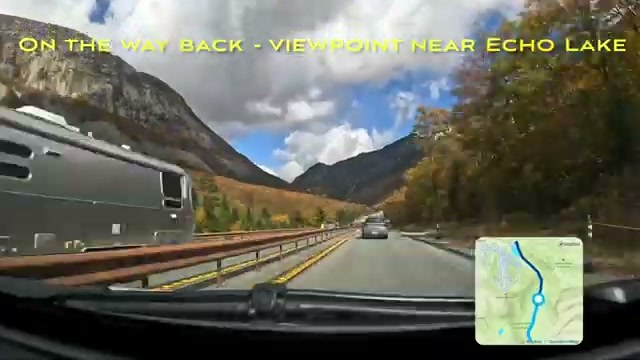
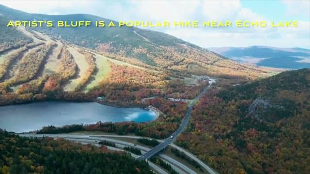
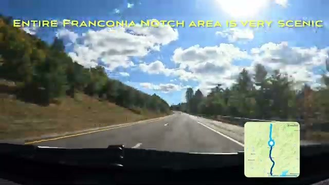

Northern New Hampshire is popular for fall foliage for a reason. This is the most scenic driving loop we found: it starts north of the Lakes Region, runs the Kancamagus Scenic Byway over the highest pass, drops down through Crawford Notch, detours up Mt. Washington, and comes back through Franconia Notch.



## Kancamagus Scenic Byway

The colorful scenic byway begins east of Lincoln. There are some hairpins as you climb to the highest pass — drive it in daylight and take your time.

Stop at the Pemigewasset Overlook — though honestly it's not as impressive for fall colors. The real payoff is half a mile further, where you get the full beauty of the White Mountain National Forest.

## Making the loop: Bear Notch Road

Continue down the highway to make a loop — turn left onto Bear Notch Road. Note: it's not open in winter, so this is a fair-weather route.

## Willey House pond

Stop off at the pond near the Willey House site in Crawford Notch. It's a quick, easy stop with classic White Mountains reflections.

## Mt. Washington

Book in advance if you want to go up Mt. Washington. One honest note: the summit is well above the tree line, so there's no foliage up there — but the views and the experience are worth it on their own.

## Echo Lake & Artist's Bluff

On the way back, stop at the viewpoint near Echo Lake. Artist's Bluff is a popular hike near Echo Lake and one of the best vantage points of the trip.

## Franconia Notch

The entire Franconia Notch area is very scenic — a fitting finale to the loop.

## Practical tips

- **Bear Notch Road is closed in winter** — this loop is a late-spring through fall drive.
- **Book Mt. Washington in advance** — summit access (auto road or cog railway) sells out on peak foliage weekends.
- **Don't skip the half-mile-past-Pemigewasset viewpoint** — it's better than the overlook itself.
- **Drive the Kancamagus in daylight** — hairpins and leaf-peeper traffic need your full attention.

## Go deeper

- [Beginner's Guide to Mt. Washington, New Hampshire — Cog Railway & Fall Foliage](https://youtu.be/aUMmNSEIL5Y)
