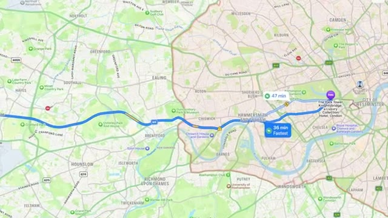
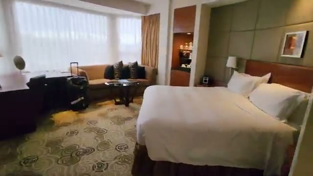
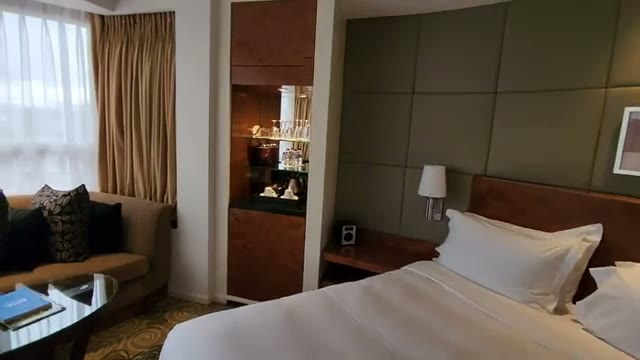
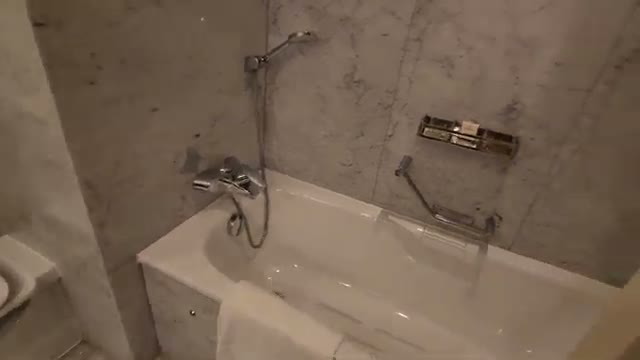
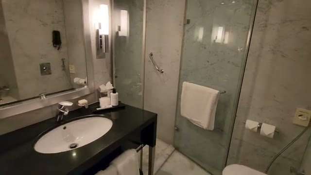
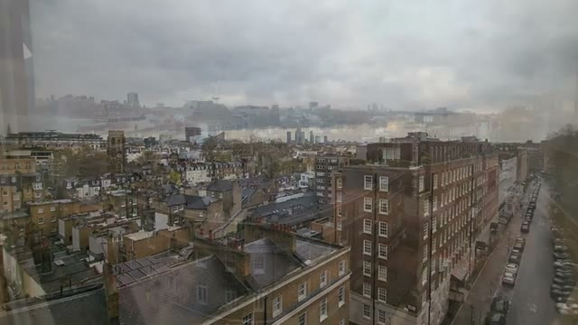
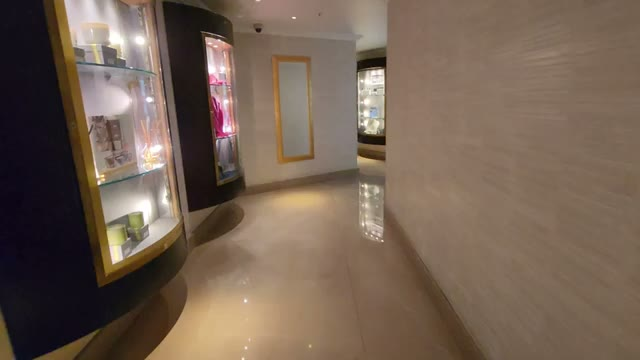



The Park Tower Knightsbridge is a Marriott Luxury Collection hotel in London's Knightsbridge — minutes from Harrods and Harvey Nichols. That's a heavyweight address. But as this short stay shows, the experience inside the room didn't quite live up to the "Luxury Collection" branding. Here's what the video found.

## Location: the strong point

Location is the hotel's best argument. It's right in Knightsbridge — minutes on foot from Harrods and Harvey Nichols — and there's a back exit that lets you cut across to Hyde Park (the walk to the park takes about six minutes; you can also go through the lobby to reach it).

## The "Executive" room

The video's room was booked as an "Executive" room — in air quotes. Executive rooms are on floors 6–12, and the tour covers a spacious-enough layout: a king bed with a padded headboard wall, a sofa seating area by the window, a work desk, and a minibar cabinet.

## Bathroom: bathtub plus shower

The bathroom has a marble-finish bathtub, a separate glass-enclosed shower, a sink with a large mirror, and — credit where due — the hotel has moved to refillable toiletry bottles rather than single-use plastics.

## The honest criticisms

Here's where the "not-so-luxury" in the title comes from — three small but telling misses:

- **Only one British-style outlet by the bedside.** Charging two phones overnight means a fight.
- **No coffee maker or pods.** Just a water heater with instant coffee packets — well below what you'd expect at a Luxury Collection price point.
- **No outlets on the desk either.** Trying to work at the desk with a laptop becomes a cable scavenger hunt.

These are exactly the details a true luxury hotel gets right.

## The views save it

The room's redeeming feature: genuinely good views. Higher floors look out over London's rooftops — better than the average London hotel — and there's a nice sunrise over the city if you're awake for it.

## Public spaces

The lobby areas include a lounge with club chairs and soft lighting, retail display cabinets along the hallways, and corridors that range from warm wood-paneled to quite dark.

## Verdict

The Park Tower Knightsbridge gets the essentials of location right — Knightsbridge, Harrods, Hyde Park, all within easy reach — and the upper-floor views are genuinely good. But for a hotel wearing the Marriott Luxury Collection badge, the room details underwhelm: one bedside outlet, no coffee maker, no desk outlets. Book it for the address and the view; don't come expecting a true luxury in-room experience.
