*Visited April 2025 • Hakone, Japan*

You can watch our full hotel tour and experience here:



## Overview

On our recent trip to Japan, we stayed at RakutenSTAY Fujimi Terrace in Hakone — a luxury apartment-style property right on the shores of Lake Ashi. We booked a 2-bedroom apartment for our family, and the views over the lake toward Mt. Fuji are, as the name promises ("Fujimi" = Fuji-view), the main attraction.

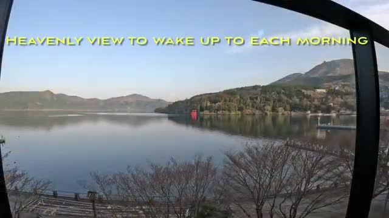

This review breaks down what worked—and what didn't.

---

## 🖼️ The View — ★★★★★

Terrific Fuji-san views over the lake are the headline here. Waking up to a calm Lake Ashi with the red torii gate of Hakone Shrine visible in the distance is, in the video's own words, a "heavenly view to wake up to each morning." The large dining/living area opens onto a big balcony with outdoor seating, so you're never far from the water.

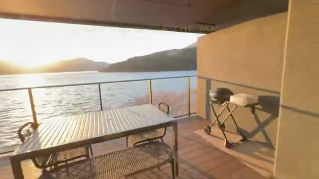

If you're booking here, book for the view — it's the property's single best feature.

---

## 🛏️ The Apartment — ★★★★☆

The unit is a proper 2-bedroom apartment with room for 6–8 guests, which makes it a great fit for families or two couples traveling together. The living/dining area is large, and the apartment is notably high-tech, with lots of controls for lighting and climate — plus a projector and screen in the living room for movie nights.

One quirk worth knowing: the bedrooms have no windows, so the bright lake views live entirely in the shared spaces. Not a dealbreaker, but worth knowing if a bright bedroom matters to you.

---

## 🍳 Kitchen & Dining — ★★★★☆

The full kitchen is well set up for self-catering, stocked with complimentary drinks and coffee pods. But note: there is no on-site restaurant.

* Full kitchen with fridge, range hood, microwave, and coffee setup
* Complimentary drinks and coffee pods
* No restaurant on the property — plan to self-cater or eat out

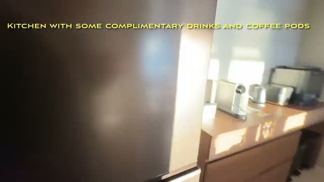

The practical answer is the 7-Eleven a block away — you'll be relying on it for breakfast supplies and snacks, so factor that in.

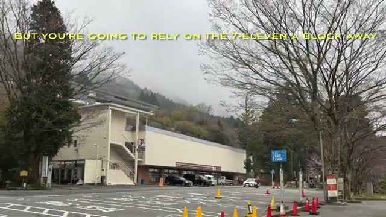

---

## ♨️ Private Onsen & Sauna — ★★★★★

The other main feature, and the reason to choose this property over a standard Hakone hotel room: your own terrace onsen. The private hot-spring tub comes with an outdoor shower and opens straight onto the lake view.

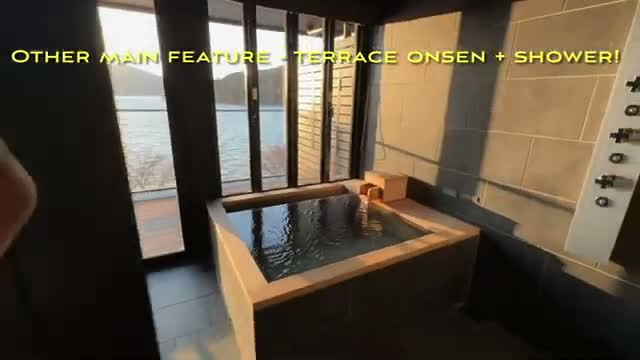

The onsen hot-spring tub also has an accompanying sauna — and a uniquely Japanese touch: a hot-spring foot bath right on the balcony.

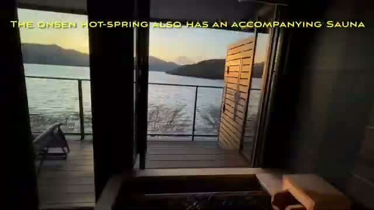

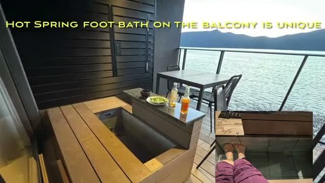

This hot tub is genuinely great to come back to every evening after a day of sightseeing — it's the experience that defines the stay.

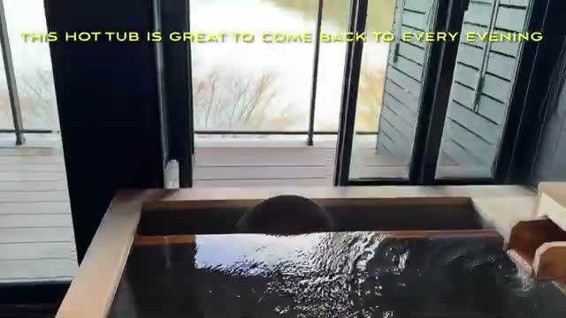

---

## 🧺 Practical Perks — ★★★★☆

A few thoughtful inclusions that make the apartment genuinely livable for longer or family stays:

* Laundry room with a combo washer/dryer
* Two detached toilets with Toto bidets, plus a second toilet and shower
* Water purifier in the laundry area

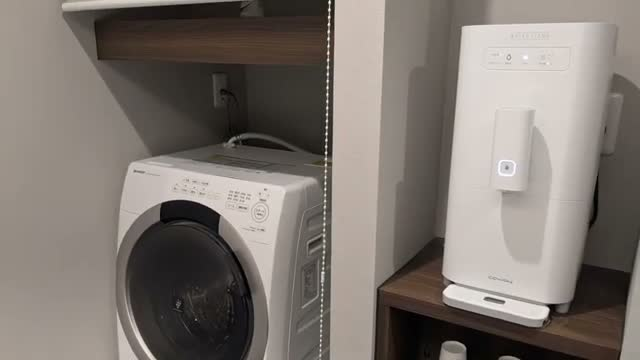

---

## 🚢 Exploring Hakone — ★★★★★

The location earns its keep. The pirate ship sightseeing cruises on Lake Ashi are popular, and the dock is just a block away — the ship drops you off at the Hakone Ropeway, which is a smart loop for a day out.

From the ropeway, Owakudani's sulfur hot springs are the stop to make: volcanic steam vents, and the famous black boiled eggs.

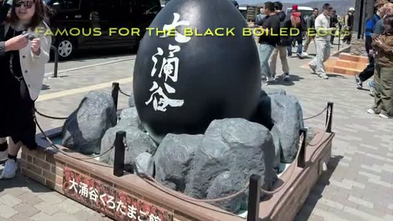

Back at lake level, the Hakone Shrine and its torii gate standing in the water is about a 15-minute walk away. And if you're visiting during sakura season, consider upgrading to first class on the pirate ship cruise.

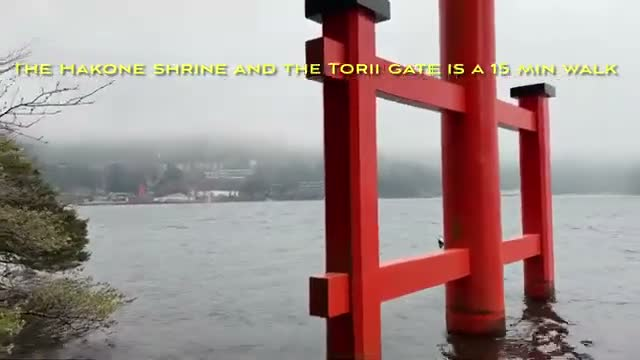

---

## ⚖️ Final Verdict

A terrific family base in Hakone: an apartment with real space, a private onsen and sauna with lake views, and the lake's best sights within easy reach. The trade-offs — windowless bedrooms and no restaurant — are easy to accept at this format.

### Ratings:

* **View:** 5★
* **Private Onsen & Sauna:** 5★
* **Apartment & Space:** 4★
* **Kitchen & Self-Catering:** 4★
* **Practical Perks:** 4★

### Bottom Line

A perfect option in Hakone — especially if you have a car.

---

## 🎥 Video Review

If you'd like to see the experience visually, check out our full walkthrough on YouTube (linked above).

---

*For more luxury travel reviews, follow along on our journey.*
