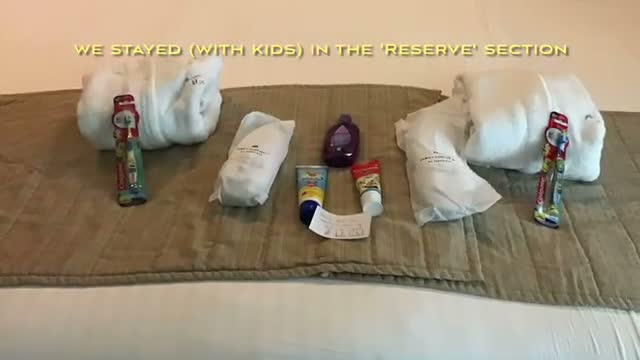
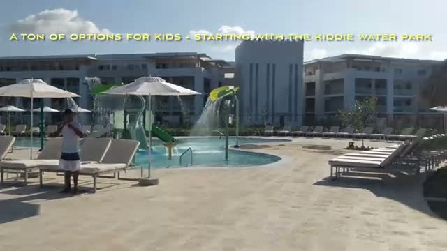
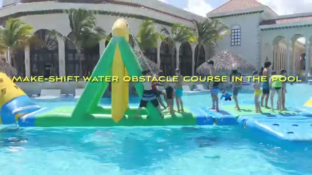
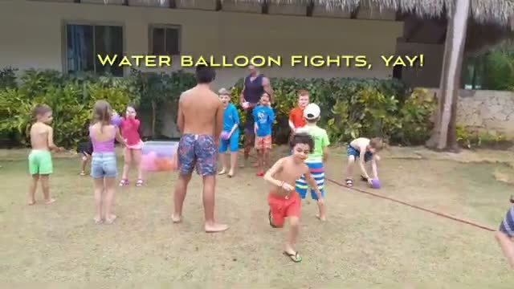
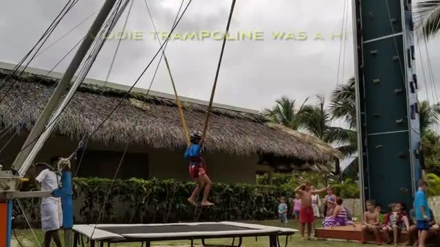
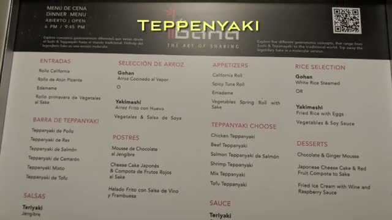



We took a family vacation at The Reserve at Paradisus Punta Cana in the Dominican Republic — an all-inclusive where everything is geared toward families with kids. Paradisus is a massive resort complex in Punta Cana, and the Reserve section is its family-focused corner. Here is what our stay looked like, from the beach to the kiddie water park to the nightly acrobat shows.

The complex is big enough that they run golf carts to help guests get around — the central terraces and plazas stay lively well into the night.

## The Reserve Section: Set Up for Kids

We stayed, with kids, in the Reserve section. From the start it is clear this part of the resort is designed for families — our room came with kids' toiletries laid out on the bed: little toothbrushes, bath products, and extras for the youngest travelers.

## A Ton of Options for Kids: The Kiddie Water Park

The headline act for younger kids is the kiddie water park — a shallow splash area with small slides, spray features, and tipping buckets, ringed by loungers and umbrellas. Ours could have spent the whole trip here.

## The Pool: Inflatable Obstacle Course

The pool had its own draw: a make-shift inflatable water obstacle course floating in the main pool — climbing triangles, balance beams, and a slide — that drew a constant crowd of kids racing through it.

## Kids' Activities: Water Balloon Fights and Climbing

Beyond the water, the resort runs organized kids' activities through the day. One afternoon brought water balloon fights on the lawn — pure chaos, huge hit with the kids — and there is a climbing tower for the more adventurous.

## Nightly Entertainment: Stage Shows and Acrobats

Nights at Paradisus are genuinely entertaining. There are lots of nightly entertainment options — stage shows with dancers and costume acts — and the standout was the Cirque du Soleil-style acrobatics: aerial hoop and acrobat performances staged in the resort's lit colonnade, drawing big crowds.

## Dinner: Reservable Restaurants and Teppanyaki

Dinner here is reservable — there are multiple à la carte dinner options around the resort. The crowd favorite for our family was teppanyaki: the chef cooks the whole meal on the grill in front of you, and the menu runs through chicken, beef, salmon, shrimp, and tofu options with fried rice, appetizers like California rolls, and desserts.

## The Verdict

The Reserve at Paradisus Punta Cana is a family all-inclusive that earns its name: a kiddie water park and inflatable pool course for the days, organized kids' activities like water balloon fights, and at night, genuinely impressive Cirque-style acrobatics plus reservable dinners like teppanyaki. It is built for families with kids — and on that promise, it delivers.

*Watch the full video tour: [Reserve at Paradisus Punta Cana All Inclusive - Family Vacation Review](https://youtu.be/oWBcnOnWbwY)*
