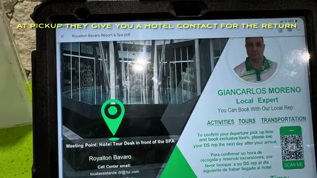
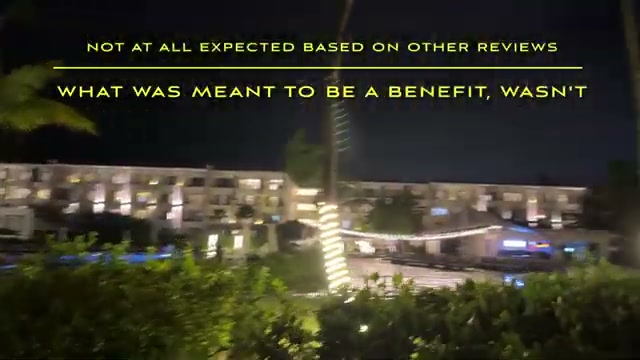
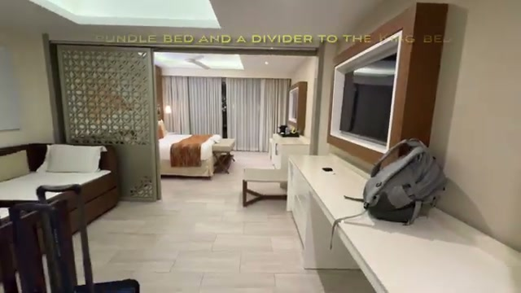
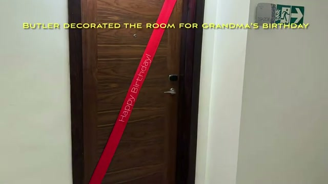
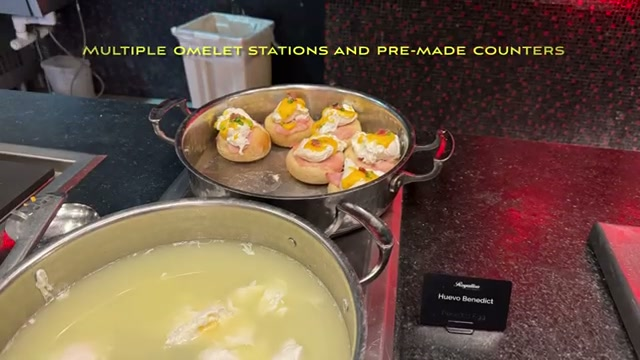
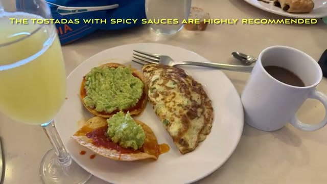
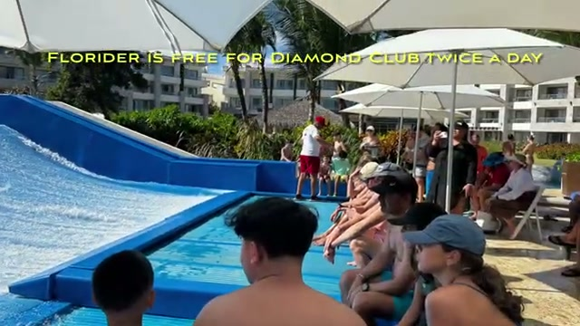
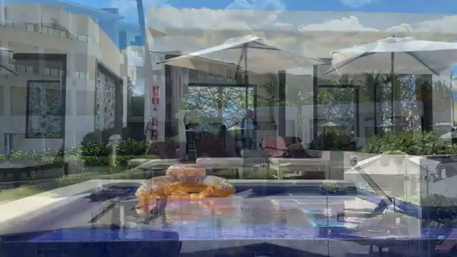
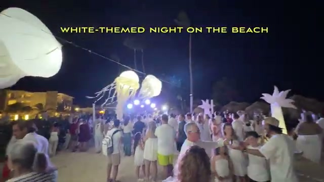
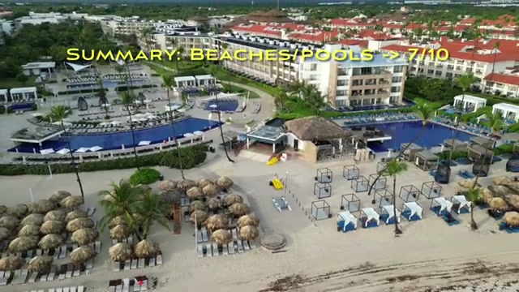



We visited **Royalton Bavaro Punta Cana** over **Christmas 2025**, one of the busiest times of the year. This review covers everything from arrival experience to dining, beaches, activities, and whether **Diamond Club** is worth it.

Royalton Bavaro shares facilities with **Royalton Splash** and **Royalton Punta Cana**, which adds both variety and crowding depending on the time of year.

## Arrival Experience (Christmas Eve)

We flew **JetBlue from JFK Terminal 5** on a busy Christmas Eve and arrived late in the evening.

- Airport and transfer process was smooth overall
- Long immigration lines at PUJ
- Resort arrival was crowded due to holiday rush

**Tip:** At pickup they give you a hotel contact for the return — keep that number handy.

## Check-In (Diamond Club)

- Transported via golf cart to Diamond Club reception
- Check-in on Christmas Eve was **chaotic and disorganized**
- Only one person checking in — minimal staffing
- Long waits despite premium tier

As the video puts it: *"Not at all expected based on other reviews — what was meant to be a benefit, wasn't."* Diamond Club helps, but peak holiday timing matters more.

## Room: Family Ocean View Suite

- Spacious layout suitable for families — trundle bed plus a divider to the king bed
- Separate tub and shower with opaque dividers
- Mini-fridge with soda, juice, and beer; minibar snacks and coffee
- Bedside outlets and USB chargers
- Decent ocean view

One quirk worth knowing: the air conditioning was **impossible to control — freeze or turn off**.

**Highlight:** Our butler decorated the room for grandma's birthday, which was a thoughtful and memorable touch.

## Weather & First Impressions

- Some rainy mornings during the stay
- The ocean view was still beautiful regardless

## Christmas Day at the Resort

- Santa made an appearance in the lobby
- Festive decorations and themed desserts
- Strong holiday atmosphere throughout the property

## Dining Review

### Oceanside (Diamond Club Breakfast)

- Exclusive to Diamond Club
- Small with few options — not impressive
- We actually preferred it for **lunch rather than breakfast**
- **Pizza tip:** Only good when fresh — otherwise skip. One spot is literally called Pizza Grill but never has any pizza.

### Gourmet Marche (Main Buffet)

Best overall dining option at the resort.

- Large selection with multiple stations
- Multiple omelette stations and pre-made counters
- Fresh pastries and lots of variety
- The tostadas are a must-try with the spicy sauces

**Dinner highlights:**

- Pasta and grill stations
- Nightly themed nights — one night was Asian & Indian, another was Mexican
- Special Christmas desserts

### Other Dining Options

**Diamond Club Lounge**

- Light snacks and drinks throughout the day
- Not a full meal replacement

**Poolside Grill**

- Most consistent lunch spot
- Taco salad and buffalo wings were solid

**Food Trucks**

- Two options on property
- Good for quick bites

**Lazy River Grill**

- Small setup
- No pizza available here

**Coffee Shop (Main Lobby)**

- Great for coffee and desserts
- Plenty of sweet treats, plus ice cream

### Specialty Restaurants

**Grazie Italian**

- Reservation arranged by butler
- Surprisingly good pizzas

**Zen Teppanyaki**

- Long wait before food
- Excellent, entertaining chef — participation required
- **Best dinner experience of the trip**

### Room Service

- Included with stay
- **Extremely slow delivery times**

## Beaches

- Noticeable seaweed during our stay
- Water itself was clear
- Neighboring Royalton Punta Cana beach showed erosion

**Important:** Beach chairs were claimed early — often by **8 AM**. And if you walk north half a mile up the beach, conditions change — worth exploring.

Despite drawbacks, we still enjoyed beach time.

## Pools & Activities

### Main Pool

- Aqua Zumba most days
- One day they even had a swimming troupe
- Lively atmosphere

### Lazy River

- Relaxing experience
- Bring your own float for the best experience

### FlowRider Surfing

- Free for Diamond Club guests
- Limited time slots:
  - 9:00–10:00 AM
  - 2:00–3:00 PM

## Cabana Experience

We booked a **poolside cabana for one day**:

- Included dedicated butler service
- Food and drinks delivered
- Access tied to a 90-minute presentation

Worth it if you value comfort and convenience.

## Additional Activities

- Mini golf — a challenging course but good family fun (book via kids club)
- Tennis and pickleball courts
- Free entry to **Royalton Splash Water Park** for Diamond Club guests

**Shuttle schedule:**

- 10:00 AM (recommended)
- 1:00 PM

## Entertainment

- Nightly shows near Gourmet Marche, including a white-themed night on the beach
- Consistently engaging and well-produced

One of the strongest aspects of the resort.

## Final Ratings

| Category | Rating |
| --- | --- |
| Beaches & Pools | 7.5/10 |
| Dining | 6.5/10 |
| Entertainment | 9/10 |

## Final Thoughts

**What we liked:**

- Excellent entertainment
- Large variety of activities
- Strong buffet (Gourmet Marche)
- Family-friendly environment

**What could be better:**

- Check-in experience during peak times
- Inconsistent food quality outside buffet
- Beach maintenance (seaweed)
- Slow room service

## Is Diamond Club Worth It?

**Yes, but with conditions:**

Worth it for:

- Butler service
- Exclusive areas
- FlowRider access
- Easier reservations
- Free entry to Royalton Splash Water Park

Less impactful during:

- Peak holiday crowds (like Christmas)

## Who Should Stay Here?

- Families looking for an active all-inclusive resort
- Travelers who prioritize entertainment and activities
- Marriott Bonvoy loyalists

## Have Questions?

Drop them in the comments on our YouTube channel!

*Watch the full video tour: [Royalton Bavaro Punta Cana Luxury All Inclusive — Diamond Club](https://youtu.be/xOq5-LuCFC4)*
