

We spent Christmas 2022 at Royalton Splash Punta Cana in the Dominican Republic — a big, lively all-inclusive that is built around one thing: keeping the whole family entertained. Here is what the resort looks like, from the beach to the water park to the evening shows.

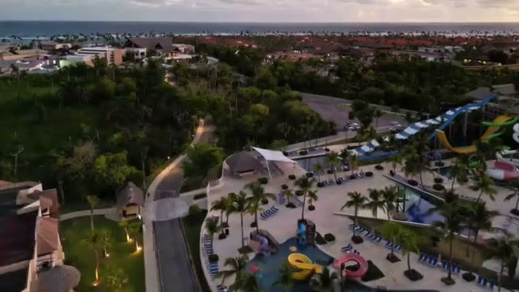

## Two Resorts in One

Royalton Splash sits next to Royalton Punta Cana, and the two share the beachfront. The setup is simple: Royalton Punta Cana has the beach, and the water park is in Royalton Splash.

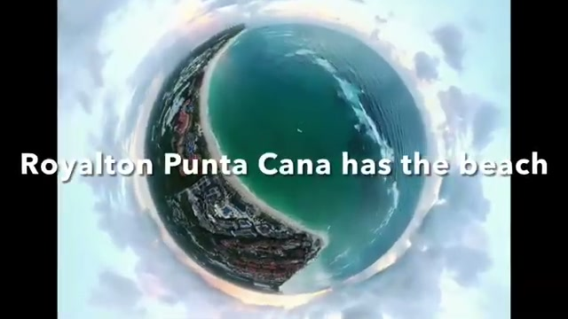

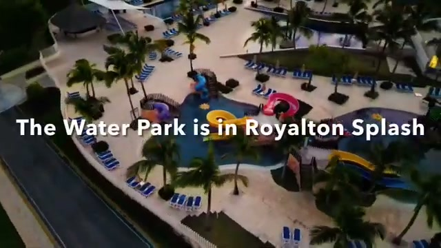

## The Beach: Fun, but Not Calm

The beach is beautiful — wide, white sand, turquoise water — but it is a fun beach, not a calm one. The surf runs strong here, so it is better for playing in the waves than for floating peacefully.

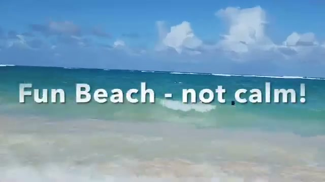

## The Pool: Foam Parties

The main pool is the social heart of the resort. During our stay they threw a pool foam party — music, foam cannons, and a packed pool. If you like a lively pool scene, this is it.

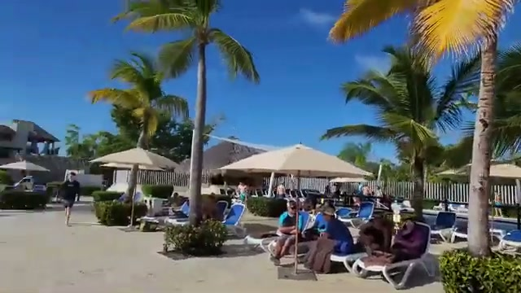

## The Water Park

The water park is the main reason to pick this resort over its quieter neighbors. There are big slides — including a tall yellow raft slide the kids rode again and again — plus a wave pool for bobbing around.

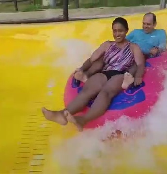

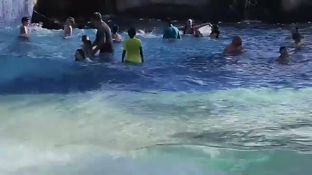

## Evening Entertainment

Nights bring stage shows for the kids — during our Christmas stay there was a Minions show — followed by evening entertainment for the adults, with a DJ and sing-along screens.

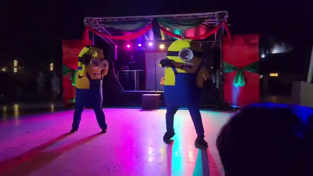

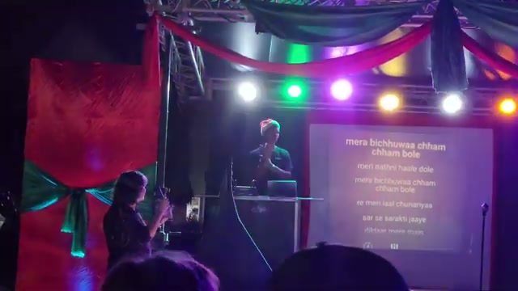

## Food: Plan Ahead for Dinner

Breakfast was solid, with made-to-order plates like eggs with guacamole and fresh toppings.

One practical tip: for the à la carte restaurants, make reservations — or line up at 6pm. Bella Cucina, the Italian restaurant, drew a crowd every evening.

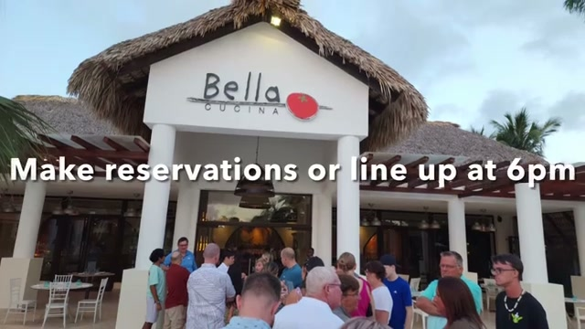

## Kids Club

The kids club runs organized activities through the day — trampolines, games, and supervised play that gave the adults a break.

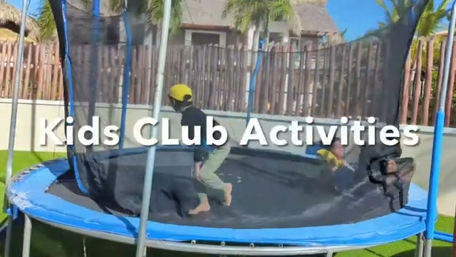

## The Verdict

Royalton Splash is a high-energy family resort: a real water park, a party atmosphere at the pool, a lively (if rough) beach, and plenty of evening entertainment. It is not the place for a quiet couples' getaway — but for a family Christmas with kids who want slides, foam, and shows, it delivers exactly what it promises.

*Watch the full video tour: [Royalton Splash Punta Cana — Beach, Water Park, Pool, Entertainment — Christmas 2022](https://youtu.be/3R8pep8qV8I)*
