

We spent Christmas week at Royalton Splash Riviera Cancun — the newer Marriott all-inclusive sitting right next door to the older Royalton Riviera Cancun. The video's verdict is right in the title: great pool and water park, average service. Here is the full walkthrough, from check-in to the beach to the slides.

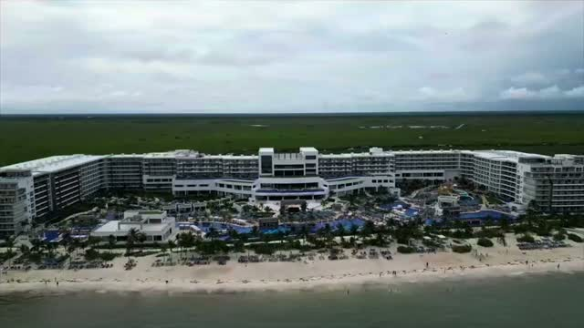

## Location: Five Minutes from the Airport

The location is a genuine plus: about a five-minute drive from the Cancun airport, and the video notes the stay was bookable for 336,000 Marriott points. It sits just down the beach from Dreams Natura Resort.

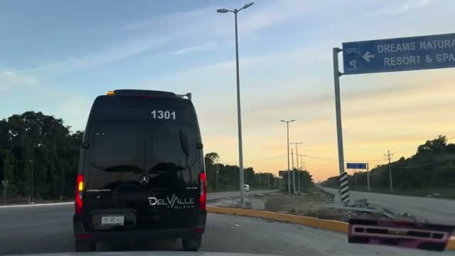

## Check-In: Slick Lobby, Slow Process

The reception area looks slick, but check-in takes a while — there is no personalized seated check-in with a welcome drink. And as a Marriott Platinum guest during Christmas week, there was no upgrade.

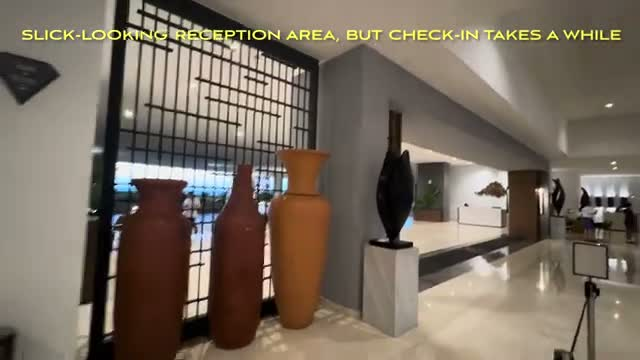

## The Room: Far from Everything

We were put in Building 12, the furthest from reception — a long walk. The room itself is fine, but the service details grate: the minibar is included, yet you have to flag down a guy with his cart for refills, and they don't do a great job restocking water and coffee.

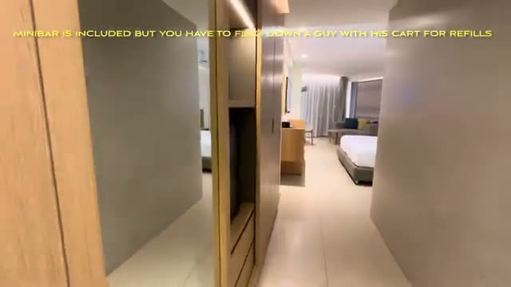

## The Beach: Calm but Murky

The beach is calm thanks to an offshore barrier, but the water is not the clear turquoise you picture in the Caribbean — it is murky, with some seaweed at the shore (clean once you walk in). They do run a tractor to clear the beach occasionally. Drink service on the beach is spotty, so tip.

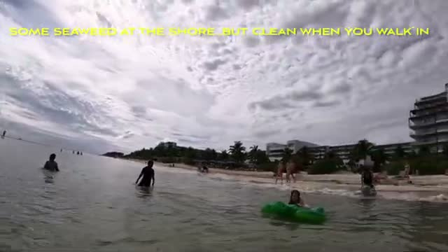

## The Pool: The Highlight

The huge main pool is comfortably warm and has a swim-up bar — it is the social heart of the resort. One catch: the only hot tubs are reserved for Diamond guests.

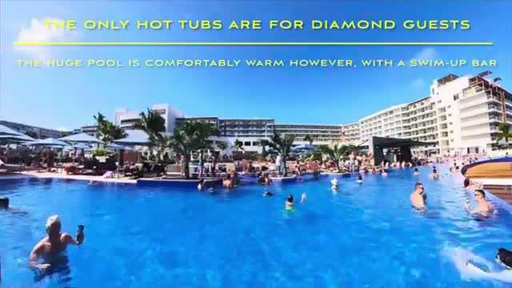

## The Water Park: The Main Attraction

The water park is the reason to book here — plenty of thrills, with big slides packed into the corner of the property.

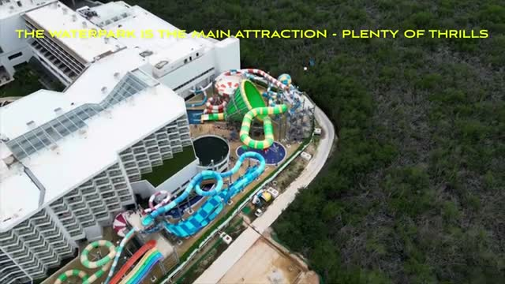

Minimum height is 1.2m, but the slides are quite challenging for younger ones.

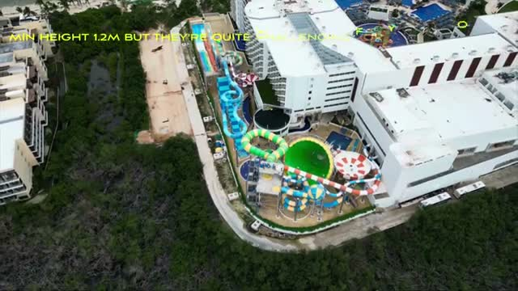

## Sports: Tennis and Pickleball

There is one tennis court and one pickleball court, bookable on the app — first come, first served after 6pm.

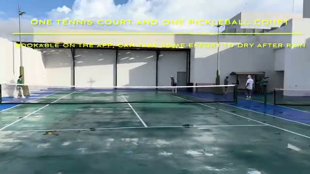

## Food: Buffet, Room Service, and À La Cartes

The buffet didn't win us over — the stir fry station was the preferred pick. Room service runs on a limited menu, and the order note quoted a 75–85 minute delivery time.

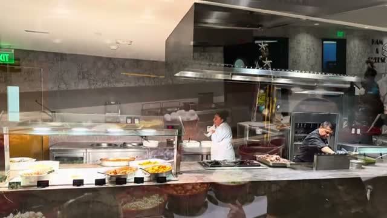

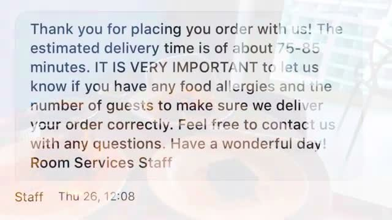

There is an Italian restaurant option for sit-down lunch, a Grazie to-go counter for pizza pickup near the water park (they kept running out of cheese), and desserts including a chocolate flan that was really a mousse — the tiramisu was the safer choice.

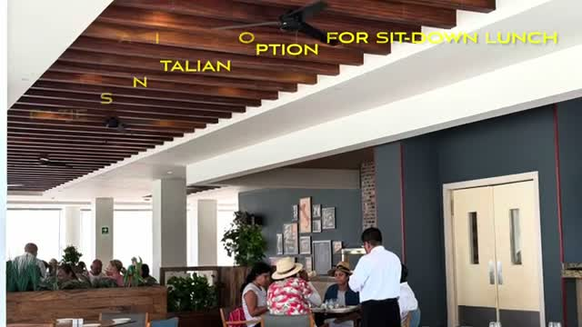

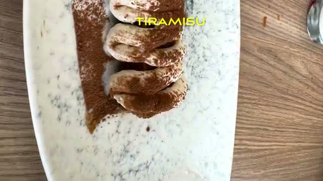

## Bars: Smoking Cocktails

The bar program has some theater — we tried a smoking old fashioned, and the caramelized apple with rosemary smoke is the signature-style pour.

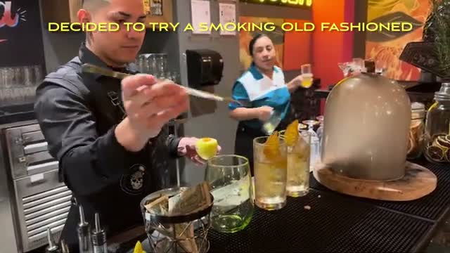

## Evening Entertainment: If You Can Call It That

Nightly entertainment runs on the main stage by the water park, but it didn't impress — the video's caption says it best: "if you can call it that."

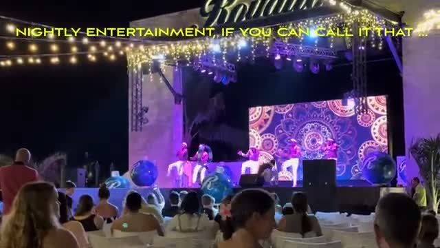

## The Verdict

Royalton Splash Riviera Cancun delivers exactly what its title promises: a great pool and water park in a convenient, points-bookable package — with average service throughout. The beach is the weak link (murky, seaweed at the shore), the rooms are far from the action, and service touches like minibar refills and room-service timing lag. But for a family that lives in the pool and on the slides, the core product is strong.

*Watch the full video tour: [Royalton Splash Riviera Cancun - Marriott All Inclusive. Great Pool & Water Park. Average service.](https://youtu.be/u5Eg_gyiwiw)*
