# St James's Club & Villas, Antigua: Two Gorgeous Beaches, Subpar Food



We spent Christmas week at St James's Club & Villas, an all-inclusive on the southern end of Antigua in St Paul's, booked as a hotel plus airport transfer package through Costco Travel. The verdict is right there in the title: phenomenal beaches and terrific tennis, but the food never got above mediocre. Here's how the week went, stop by stop.

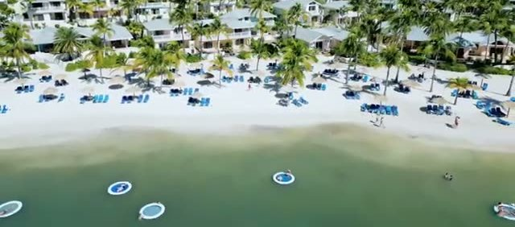

## Getting there

We flew JetBlue out of JFK on Christmas Eve - a crowded airport, but a smooth arrival into sun-kissed Antigua. The airport itself was clean and empty on arrival, and since the Costco Travel booking included pick-up and drop-off, getting to the resort was painless: a drive past the Viv Richards Stadium, then down the hill into the resort.

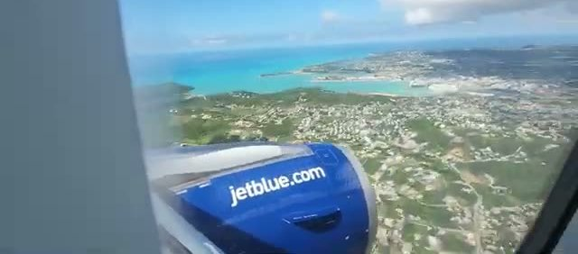

## The resort and the rooms

The resort is spread out, with beachfront rooms on the ocean side, an activities desk, a kids club, and reception all connected by palm-lined paths. Our balcony looked straight out over the beach - the kind of view that makes you forgive a lot.

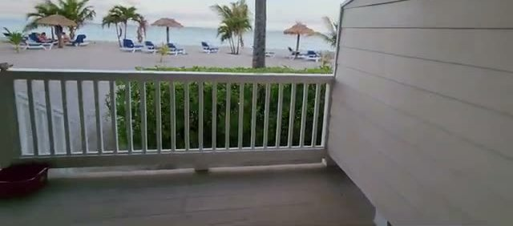

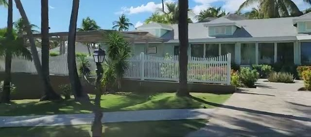

## The two beaches

The highlights of the resort are unquestionably the beaches - two of them, one on each side.

**Mamora Bay** is the calm one: white sand, no waves, and ideal for kayaking, paddleboarding, and other still-water activities. We spent most of our beach time here.

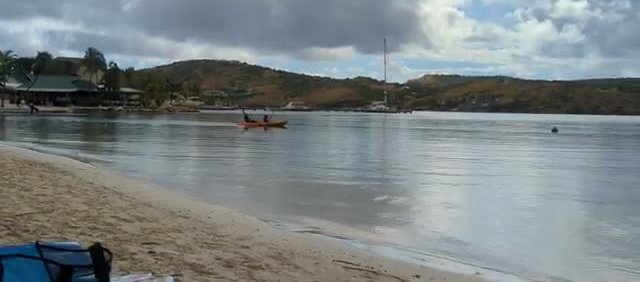

**Coco Beach** is the ocean side: a gorgeous long stretch with minimal waves, though with some seaweed along the shore.

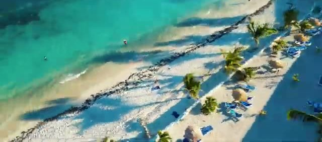

## The food

The all-inclusive dining was the weak link. The resort has several restaurants: **11/Eleven and Coco** (open for lunch and dinner), **Rainbow Garden** (the better pick for breakfast, with a big buffet spread), and **Docksider**, which has a casual vibe on most nights.

One night they set up dining on the beach, and another night was a barbecue-style cookout with alcoholic jello shots served out of a canoe - fun in concept. But the food itself was consistently underwhelming. The turkey burger at lunch was fine; the piri-piri chicken was dry and overcooked. "Subpar food" is exactly what it was.

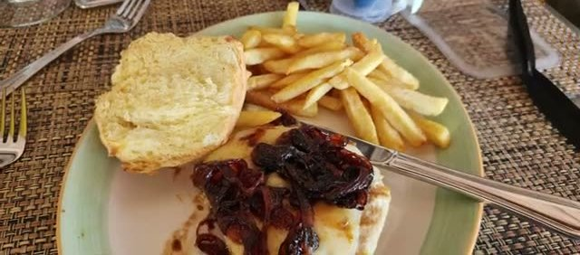

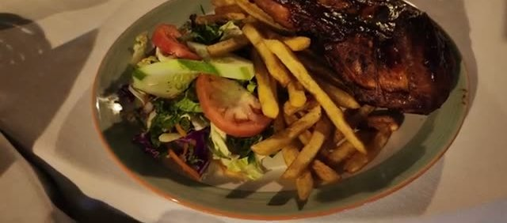

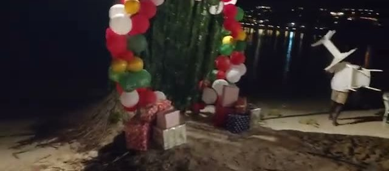

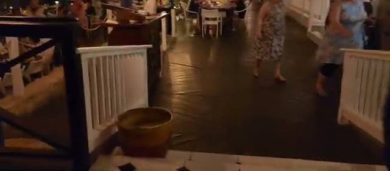

## Activities and oddities

There's a small **tortoise sanctuary** tucked into the grounds - easy to miss, worth the detour.

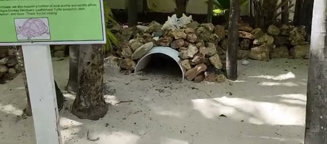

One afternoon we spotted **Jeff Bezos's sailing yacht Koru** gliding past off the coast - hard to miss a sailboat that size. Christmas Day brought Santa arriving by boat, with treats for the kids on the beach. Evenings had their own entertainment, including a magician one night. The Pink Panther jeep is one of the island tours you can book from the resort.

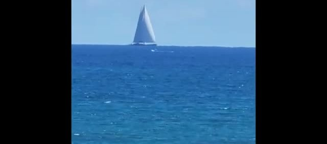

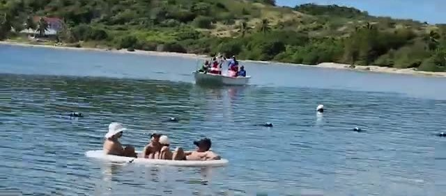

## Tennis

The tennis was genuinely terrific: multiple courts with artificial turf, aerial views don't do them justice. The only complaint was that the tennis equipment wasn't in great shape - bring your own racquet if you're serious.

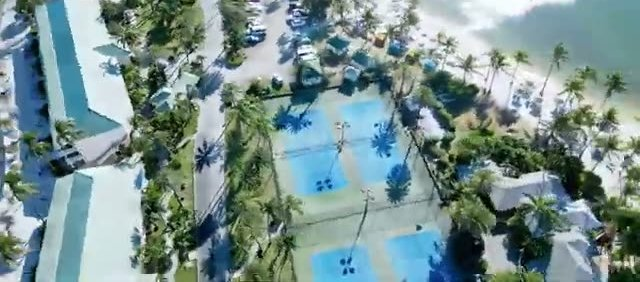

## Heading home

On the way out we cleared immigration at ANU and spent the wait in the Executive Lounge, which has a lovely outdoor terrace. Then a sunset takeoff and goodbye to paradise.

## Practical notes

- **Booked via:** Costco Travel, hotel plus airport transfer package (pick-up/drop-off included).
- **Beaches:** Mamora Bay (calm, white sand, great for kayaking and paddleboarding) and Coco Beach (ocean side, gorgeous, some seaweed).
- **Rooms:** Beachfront rooms are on the ocean side; our balcony faced the beach.
- **Food:** All-inclusive, but set expectations low - Rainbow Garden for breakfast, Docksider for casual dinners.
- **Tennis:** Terrific artificial-turf courts; bring your own equipment.
- **Bottom line:** Phenomenal beaches, good tennis, subpar food.
