*Visited April 2025 • Arashiyama, Kyoto, Japan*

You can watch our full hotel tour and experience here:



## Overview

On our spring trip to Kyoto, we stayed at **Suiran, a Luxury Collection Hotel** — Marriott's traditional Japanese-style property in the Arashiyama district, on the western side of the city.

We arrived on the Haruka Express from Kansai Airport (KIX) — about a 40-minute journey to this green corner of Kyoto. Suiran is a very intimate hotel built in traditional Japanese architecture, and it felt like a world apart from the city's busier districts.

---

## 📍 Arrival & Check-In — ★★★★★

The hotel's traditional wooden gate sets the tone from the moment you arrive.

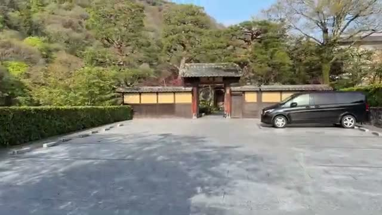

You pass by the cafe and wind through the gardens to reach reception — the walk itself is part of the experience, with manicured greenery and quiet paths everywhere. Check-in and check-out felt personalized rather than transactional.

---

## 🏨 Room 101 — Kyotsukikoto Japanese-Style Guest Room — ★★★★★

We stayed in **Room 101, the Kyotsukikoto Japanese-style guest room** — notably the **only room in the hotel that can accommodate up to 6 guests**, which makes it a strong pick for families or groups.

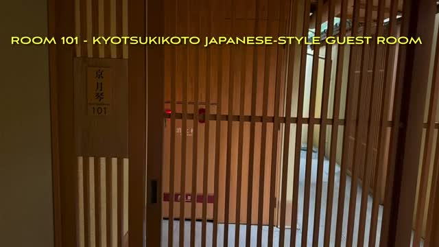

The room centers on a large tatami space with a **large, low dining table** that serves as the daytime living area.

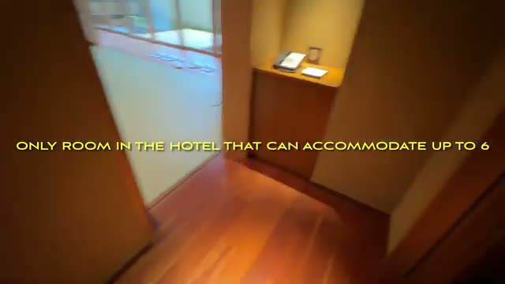

In true ryokan fashion, the futons come out in the evening — you **pick a daily time for them to make the beds**, and the staff convert the room while you're out.

The coffee/tea mini-bar was well stocked, with proper Japanese tea sets.

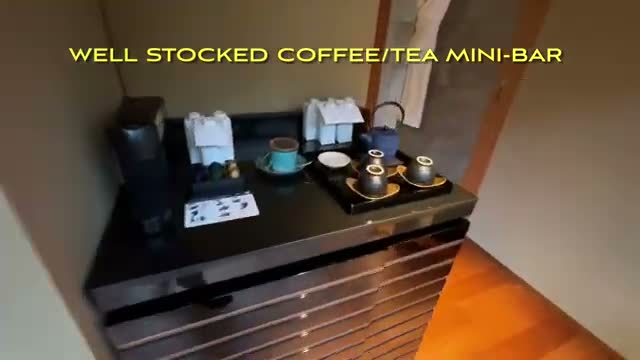

---

## ♨️ In-Room Hot Spring Bath — ★★★★★

The standout feature of this room: it is **one of the few rooms in the hotel with an in-room partially-open hot spring bath**.

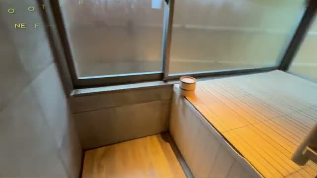

Having a private onsen right in the room — with a window that opens to the outside air — is the kind of luxury that's genuinely hard to find. This alone justifies the room choice.

---

## 🚿 Bathroom — ★★★★☆

The bathroom was well stocked with luxurious extras.

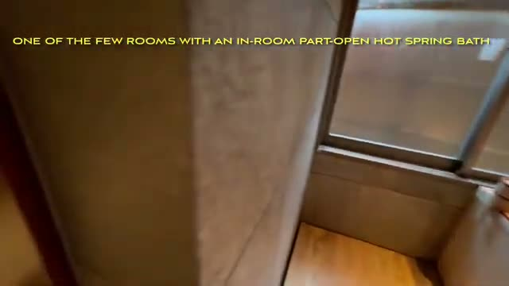

Everything from the marble vanity to the Suiran-branded amenities felt thoughtfully done.

---

## 🥂 Cafe — Complimentary Champagne Hour — ★★★★☆

From **5–7 PM, the cafe serves complimentary champagne** — a lovely pre-dinner ritual.

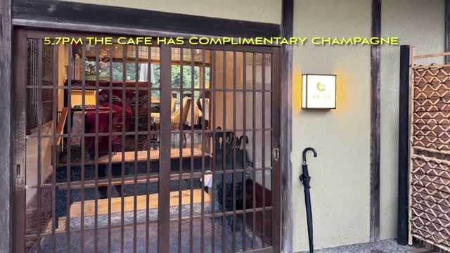

It comes with fancy canapes, so the hour feels properly indulgent rather than like an afterthought.

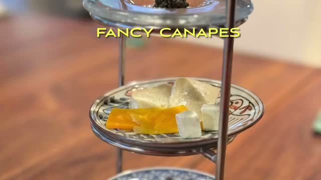

---

## 🍳 Breakfast — ★★★★☆

Breakfast arrives with an appetizer and juice spread — fresh juices, fruit, and small Japanese dishes.

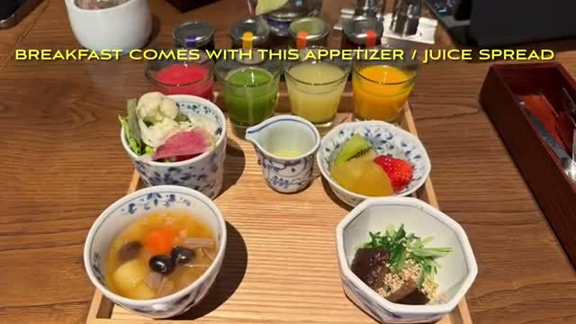

We picked the Western-style breakfast, which was **complimentary for Platinums** — a nice Marriott status perk.

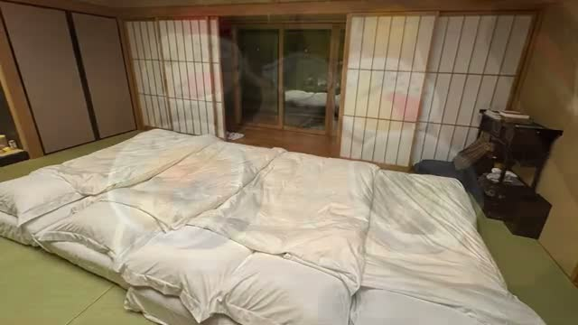

The pancakes and waffles were excellent — and somewhat surprisingly, we weren't charged for the 3rd person onwards.

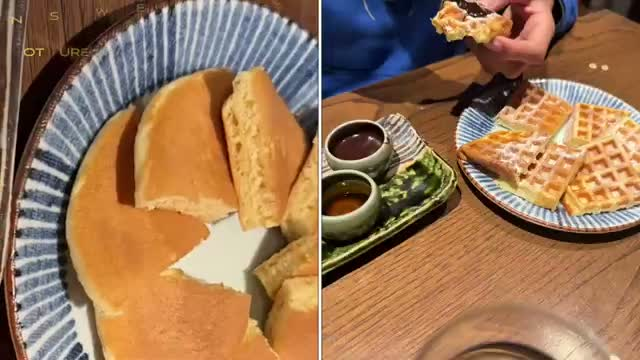

There's also an à la carte menu if the set options don't appeal — the avocado toast looked great.

---

## 🌙 Location & Atmosphere — ★★★★★

The setting is **extremely quiet and peaceful** — at night, the garden and moonlit trees make the hotel feel completely secluded.

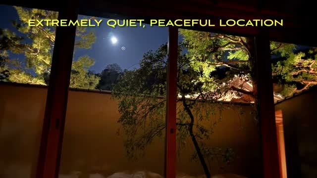

For getting around Arashiyama, the location is hard to beat:

* **Togetsu Bridge** and the river are right nearby
* A **short hike through the park leads to the famous bamboo grove** — get there early, by 8 AM, to avoid the crowds

* **Tenryu-ji Temple is a 5-minute walk away**

---

## ⚖️ Final Verdict

Suiran is a rare combination: a genuine traditional Japanese ryokan experience with the polish and perks of the Marriott Luxury Collection.

### Ratings:

* **Location:** 5★
* **Room:** 5★
* **In-Room Onsen:** 5★
* **Breakfast:** 4★
* **Cafe / Champagne Hour:** 4★
* **Atmosphere:** 5★

### Bottom Line

We would **absolutely stay here again**.

If you're visiting Kyoto and want Arashiyama's temples, bamboo groves, and river scenery wrapped in a serene, traditional stay — with a private hot spring bath in your room — Suiran is very hard to beat.

---

## 🎥 Video Review

If you'd like to see the room, the onsen, and the Arashiyama surroundings visually, check out our full walkthrough on YouTube (linked above).

---

*For more luxury travel reviews, follow along on our journey.*
