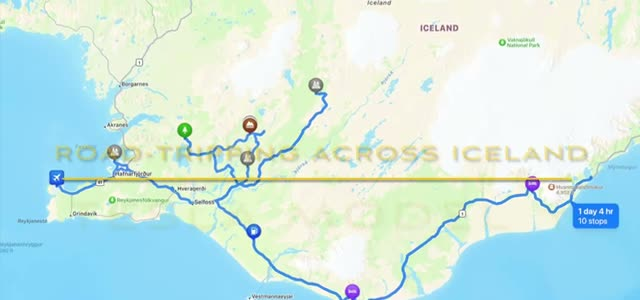
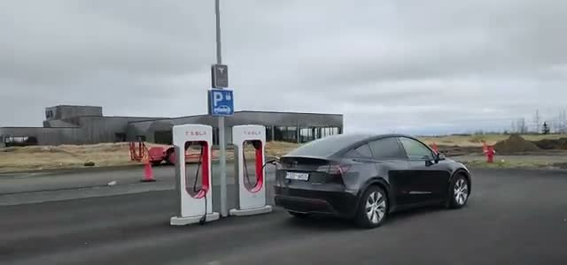
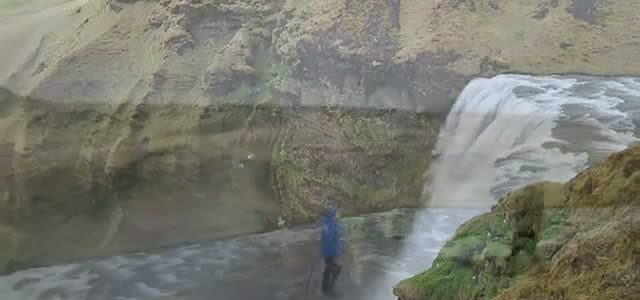
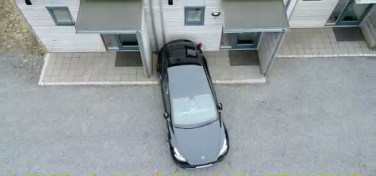
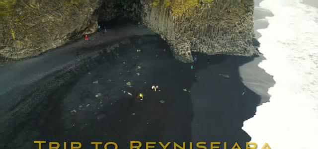
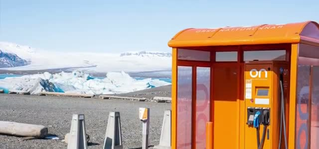
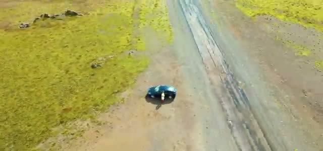
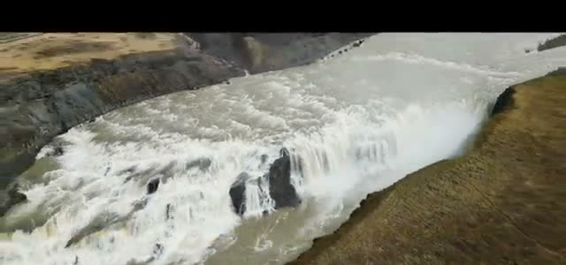
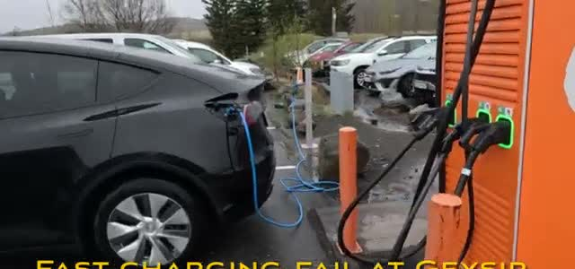
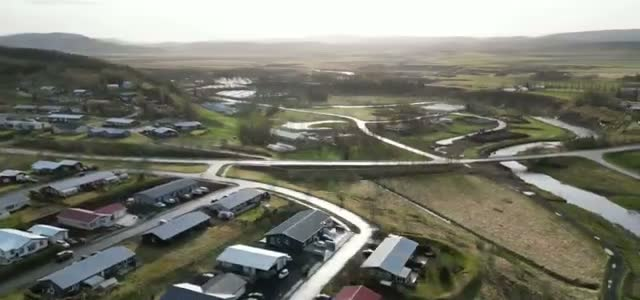



We rented a Tesla Model Y from Europcar for a scenic road trip across Iceland — Ring Road driving, waterfalls, black-sand beaches, and a crash course in keeping an EV charged where the weather changes every twenty minutes. The route covered the south coast and back, roughly a day and four hours of driving with ten stops. Here's the trip, charger by charger.

## The rental: a black Model Y from Europcar

The trip starts at the Europcar lot — a black Tesla Model Y, which would be home for the next several days. "We rented the Tesla from Europcar" is the whole premise of the video: an EV, not a gas SUV, for a full Iceland road trip.

## Tesla Superchargers all along the Ring Road

The first charging lesson lands early: there are Superchargers all along the Ring Road. The video's first stop is a Supercharger at a gas station in Hvolsvöllur, with the Model Y plugged in and topping up while the trip gets underway. If you're driving a Tesla in Iceland, the backbone of your charging plan is already built.

## A pizza stop worth the caption

Not everything is about electrons. The video calls out an "Excellent pizza here!" at Björk Restaurant & Bar — the kind of roadside food stop that earns its own caption. Then it's back on the road: "Continuing on to Seljalandsfoss."

## Seljalandsfoss

Next stop: Seljalandsfoss, the waterfall you can walk behind. Even in moody weather it's one of the south coast's essential stops, and it sits right on the driving route.

## Level 1 charging overnight

The slow-charging strategy: plug the Model Y into a regular outlet at the overnight stay and let Level 1 charging do its thing while you sleep. The drone shot shows the car parked outside the lodging, cable in, for the night. It's slow — but when the car sits for eight-plus hours, slow is fine.

## Reynisfjara black sand beach

Daylight hours are for sightseeing. The trip continues to Reynisfjara, the famous black-sand beach near Vik with its basalt columns and pounding surf — one of the most photographed spots on the south coast.

## ON chargers at the tourist stops

Iceland's other charging network is ON — the bright orange fast chargers that show up at gas stations and, notably, at many tourist places. This one sits with a glacier lagoon full of icebergs behind it. Two practical tips from the video: there are ON charging stations at many tourist places, and it's highly recommended to install the ON charging app before you need it.

## Detour on Rt 208/209 on the way back

On the return leg, the route takes a detour on Rt 208/209 — gravel highland-edge roads through wide-open mossy terrain, the Model Y raising dust on the dirt. This is the scenic, slow part of the trip: empty roads, big landscapes, and the car well outside the paved Ring Road.

## Gullfoss, then a charging fail at Geysir

The Golden Circle leg includes a stop at the magnificent Gullfoss — the great two-tiered waterfall, seen here from the drone. But the charging story takes a turn at Geysir: "Fast charging fail at Geysir." The Model Y is plugged into the orange ON charger and it simply doesn't work — the one real charging failure of the trip.

The fallback: "Level 1 slowww overnight charging in the cold." Back to the wall outlet, overnight, in a small town — slow charging in cold weather, but it gets the job done.

## Back in Reykjavík: Hallgrímskirkja

The trip wraps up in Reykjavík with a stop at the "epic church in the center of town" — Hallgrímskirkja, its basalt-column-inspired tower unmistakable against the sky.

## Returning the car

The Model Y goes back to the Europcar lot near the airport — a short walk or shuttle back to the terminal, and the trip is done.

## Verdict: EV road-tripping in Iceland works

Charging a Tesla across Iceland turned out to be very doable: Superchargers line the Ring Road, ON's orange chargers cover the tourist stops (install the ON app), and Level 1 overnight charging fills the gaps — even if it's slowwww in the cold. The one honest blemish: a fast-charging fail at Geysir, a reminder to always have a backup plan. Rent the EV, plan around the chargers, and the south coast is yours.
